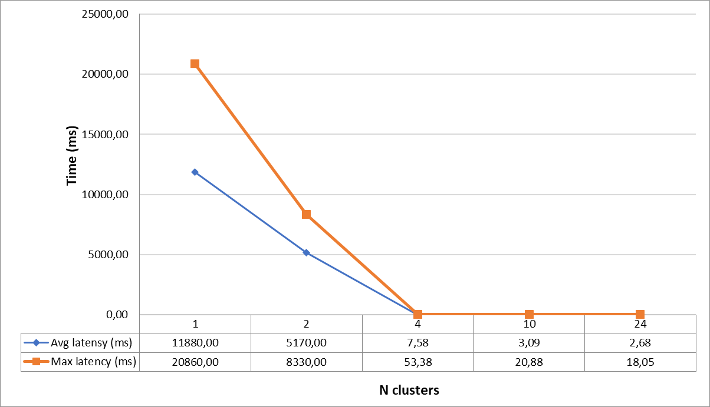
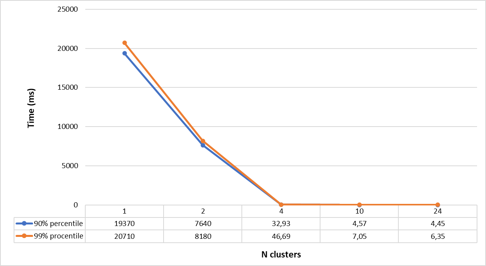

Сервер, wrk и async-profiler запускались через wsl
------------------------------------------------------------------------------------------------------------------------
**Параметр flushThresholdBytes в dao равен 1 МБ.
Размер очереди в Executor для обработки запросов равен 100.
Алгоритмов распределения данных между узлами - consistent hashing (hash space = 3600, virtual nodes number = 100).**

Для начала проведем нагрузочное тестирование с такими же параметрами, как и в случае реализации с 1 узлом,
без шардирования для кластера с 2 узлами (все результаты работы wrk представлены ниже):
    - Длительность 60 секунд;
    - Число потоков 64;
    - Число соединений 64;
    - Rate 5000 для PUT запросов и 2500 для GET;

Однако, сервер не выдерживает данный rate для PUT запросов. 
Для PUT запросов Requests/sec составляет 2840.41 при rate 5000, для GET запросов выдерживает, но время запроса 
вырастает в разы относительно реализации с 1 узлом, которая выдерживает спокойно 10000 PUT запросов в секунду и
18236 PUT запросов максимально (при rate = 20000). Связано это с тем, что для выполнения некоторых запросов,
не относящихся к текущему узлу требуется дополнительный поход по сети на другой узел кластера отвечающий за
определенный ключ, что увеличивает трафик внутри сети и негативно сказывается на максимально допустимом числе запросов
в секунду от клиента. Таким образом при шардировании даже с 2 узлами в кластере сервис не выдерживает нагрузку в более
чем 2800 Requests/sec (при rate = 4000), а при большем числе узлов данный показатель будет еще ниже 
так как будет больше запросов по сети в другие узлы из-за того, что меньше ключей будут попадать на обработку 
непосредственно в рамках опрашиваемого узла. Также возрастает latency для PUT запросов и GET запросов при небольшой
заполненности базы данных, так как поход по сети занимает больше времени чем выполнение, например чем upsert 
непосредственно в рамках одного узла. Значит ли это, что шардирование снизило производительность?
Для "легких" запросов, например PUT или GET при небольшом размере базы данных - да, так как время для похода 
по сети в нужный узел туда/обратно перевешивает время для выполнения бизнес-логики запроса. Но если время для 
выполнения бизнес-логики запроса сопоставимо с временем похода по сети или больше его, то шардирование 
уменьшит время ответа на запрос. В то же время при шардировании снизиться максимально доступное количество Requests/sec.
Для того чтобы это доказать вставим 1_000_000 записей, PUT запросами на 1 узел вида: ключ ("k" + 0..1000000) 
и значение ("v".repeat(100) + 0..1000000), общим размером 161МБ, чтобы логика GET запроса требовала большего времени
выполнения и будем отправлять GET запросы на 1 узел в 64 потока и 64 соединения с rate 1000 в течение 1 минуты.
Проведем данный эксперимент для числа узлов 1, 2, 4, 10, 24.
Результаты представлены в виде графиков зависимости среднего и максимального времени запроса в зависимости от числа
узлов в кластере  и 90% и 99% процентилей 
в зависимости от числа узлов в кластере .
Как видно из графиков, при 1 единственном узле показатели как на первом, так и на втором графике наихудшие и составляют
несколько десятков тысяч миллисекунд, что конечно, неприемлемо. При 2 узлах показатели уже лучше в 2-2.5 раза, 
но все еще тысячи миллисекунд. Зато при 4 узлах все показатели улучшились в сотни раз и время запроса уже измеряется
в десятках миллисекунд, что в первую очередь связано с тем, что при 1 и 2 узлах данные читаются честно из диска, так как
суммарный размер ключей в dao на одном узле превышает размер page cache - моем случае 72МБ, а при 4, 10 и 24 узлах
данные в него помещаются и идет чтение условно из памяти. Поэтому и происходит такой прирост в скорости. Если отбросить
тот факт, что данные могут читаться из памяти, то с ростом числа узлов в 2 раза уменьшается в примерно 2 раза время
необходимое на выполнение метода get в dao, что и логично так как обработать придется в примерно 2 раза меньше данных. 
При 10 и 24 узлах в кластере показатели как по среднему и максимальному времени, так и по персентилям 
можно считать нормальными - несколько миллисекунд. Отличий по времени на кластере из 10 и 24 узлов 
практически нет, что свидетельствует о том, что дальнейшее увеличение числа узлов в кластере при данной конфигурации
нецелесообразно. Также на профилях видно, что при 1 узле метод get в dao занимает 92%, а при 24 узлах только 22%.
Соответственно, чем больше у нас данных, тем больше узлов желательно иметь, чтобы время для выполнения
логики запроса было меньше путем уменьшения количества записей на 1 узле, и с ростом числа узлов процент метода get 
в dao в профилях CPU будет меньше. Хотелось бы отметить, что даже при 24 узлах все данные читались с диска. 
Таким образом, шардирование позволяет нашему сервису работать с большим количеством данных, чем если бы у нас был 
только 1 узел в сервисе, однако если запрос "легковесный", то время, необходимое для похода по сети в другой узел 
будет замедлять его обработку относительно того, если все происходило в рамках только 1 узла.
Также было найдено значение объема данных при котором время обработки GET запроса при кластере из 2-х узлов будет
приблизительно равным времени обработки такого же запроса на 1 узле: методом дихотомии перебираем число вставляемых
записей вида ключ ("k" + 0..1000000) и значение ("v".repeat(100) + 0..1000000) и каждый раз нагружаем оба случая
сервисов(с 1 и 2 узлами). Таким образом было найдено значение в 325000 записей указанного вида, что соответствует 52Мб.
При 1 узле среднее время составило 2.42ms, 90.000% - 3.64ms, 99.000% - 5.58ms.
При 2 узлах среднее время составило 2.48ms, 90.000% - 4.09ms, 99.000% - 6.83ms.
Видно, что при 2-х узлах показатели почти сопоставимы с 1 узлом. При большем числе узлов данные показатели будут еще
лучше. Таким образом, в моем случае, при объеме данных более 50-60МБ сервис с 1 узлом начинает проигрывать кластеру даже
на 2 узлах по времени для GET запросов.

**Результаты профилирования.**
Будем профилировать кластер на 24 узлах c заполненной базой в 1_000_000 записей (будет влиять только на GET запросы)
вида ключ ("k" + 0..1000000) и значение ("v".repeat(100) + 0..1000000), для того чтобы рассмотреть случай, 
когда доля запросов по сети больше, так как профилирование того, что происходит при 1 узле было представлено 
в предыдущем этапе.

CPU:
    PUT запросы:
      7.78% - запись ответа клиенту в сокет
      6.97% - выполнение метода proceed(), то есть обработка запроса из них 3.25% асинхронная отправка запроса на
        другой узел, 2.98% - получение ответа от другого узла (CompletableFuture.get()), 
        0.19% - upsert в dao, 0.55% - создание итогового Response. 
      7.39% - обработка в HttpClient ожидающих подписок делегатов, которые асинхронно получают данные из 
        входящего потока, в нашем случае ожидание получение ответов от проксируемого узла.
        (jdk.internal.net.http.Http1AsyncReceiver.handlePendingDelegate)
      2.89% - проверка на то, следует ли запрашивать дополнительные данные из Http1TubeSubscriber
        (jdk.internal.net.http.Http1AsyncReceiver.checkRequestMore), то есть от проксируемого узла. 
      2.59% - попытка получение ответа от проксируемого узла
        (jdk.internal.net.http.Http1Response$HeadersReader.tryAsyncReceive)
      8.56% - проверка на то, следует ли запрашивать дополнительные данные от опрашиваемого узла
        (jdk.internal.net.http.SocketTube$InternalWriteSubscriber.requestMore)
      7.69% - ассинхронная отправка ответа из проксируемого узла
        (jdk.internal.net.http.MultiExchange.lambda$responseAsync) 
      14.51% - ожидание взятия задачи из очереди в requestExecutor 
        (java.util.concurrent.ThreadPoolExecutor.getTask)
      8.61% - чтение из клиентского сокета
      3.32% - обработка соединений, готовых к работе в рамках сервиса (one.nio.net.NativeSelector.select)
      6.46% - обработка соединений, готовых к работе в рамках HttpClient, который проксирует запросы на другие узлы
        (sun.nio.ch.SelectorImpl.select) 
      5.24% - ожидание задач в Executor-е HttpClient
        (java.util.concurrent.ForkJoinPool.scan) и (java.util.concurrent.ForkJoinPool.awaitWork)
      5.04% - accept в HttpClient
        (jdk.internal.net.http.HttpClientImpl$SelectorManager$$Lambda$258.0x0000000800d71aa0.accept)
      Остальное - запуск потоков в Executor-ах и JIT
    GET запросы:
      7.9% - запись ответа клиенту в сокет
      20.13% - выполнение метода proceed(), то есть обработка запроса из них 3.44% асинхронная отправка запроса на
          другой узел, 2.35% - получение ответа от другого узла (CompletableFuture.get()),
          13.62% - get в dao.
      1.69% - проверка на то, следует ли запрашивать дополнительные данные из Http1TubeSubscriber
          (jdk.internal.net.http.Http1AsyncReceiver.checkRequestMore), то есть от проксируемого узла.
      7.63% - попытка получение ответа от проксируемого узла
          (jdk.internal.net.http.Http1Response$HeadersReader.tryAsyncReceive)
      4.82% - проверка на то, следует ли запрашивать дополнительные данные от опрашиваемого узла
          (jdk.internal.net.http.SocketTube$InternalWriteSubscriber.requestMore)
      7.59% - ассинхронная отправка ответа из проксируемого узла
          (jdk.internal.net.http.MultiExchange.lambda$responseAsync)
      15.19% - ожидание взятия задачи из очереди в requestExecutor
          (java.util.concurrent.ThreadPoolExecutor.getTask)
      6.57% - чтение из клиентского сокета
      2.71% - обработка соединений, готовых к работе в рамках сервиса (one.nio.net.NativeSelector.select)
      4.82% - обработка соединений, готовых к работе в рамках HttpClient, который проксирует запросы на другие узлы
          (sun.nio.ch.SelectorImpl.select)
      4.52% - ожидание задач в Executor-е HttpClient
          (java.util.concurrent.ForkJoinPool.scan) и (java.util.concurrent.ForkJoinPool.awaitWork)
      3.86% - accept в HttpClient
          (jdk.internal.net.http.HttpClientImpl$SelectorManager$$Lambda$258.0x0000000800d71aa0.accept)
      Остальное - запуск потоков в Executor-ах и JIT
Alloc:
    PUT запросы:
      55% - one.nio.http.HttpSession.processRead, это - парсинг самого запроса: параметры, тело, path, header; чтение
      и парсинг HttpBuffer в строковое представление с помощью one.nio.util.Utf8.toAsciiString.
      4% - перевод ответа Response в массив байт для его отправки
      5% - аллокация массива байт и строки при one.nio.http.Response.<init> и самой переменной типа Response в handlePut
      1.7% - аллокации при отправке запроса проксируемому узлу в HttpClient
      6% на перевод вставляемого value в строку в методе handlePut из DemoService
      2% - создание BaseEntry для вставки в dao
      1.5% - создание переменной Response
      1.5% - создание лока в при взятии задачи из Executor
      1.5% - получение еntry c url узла из мапы с virtualNodes 
      13.86% - для отправки ответа клиенту внутри requestExecutor 
        (main.service.common.ServiceUtils.sendResponse)
      1.7% - для отправки запроса проксируемому узлу
      2% -для получения запроса из проксируемого узлу
      4.64% - для отправки ответа из проксируемого узла
      Остальное - аллокации в Executor-ах
    GET запросы:
      36% - one.nio.http.HttpSession.processRead, это - парсинг самого запроса: параметры, тело, path, header; чтение
        и парсинг HttpBuffer в строковое представление с помощью one.nio.util.Utf8.toAsciiString.
      50% - get в dao (поробнее в отчете к stage 1)
      1.69% - для отправки запроса проксируемому узлу
      4.64% - для отправки ответа из проксируемого узла
      0.68% - для получения запроса из проксируемого узлу
      0.68% - main.service.common.ServiceUtils.sendResponse для отправки ответа клиенту
      0.48% - java.util.concurrent.LinkedBlockingQueue.take из очереди в requestExecutor
      Остальное - аллокации в Executor-ах
Lock:
    PUT запросы:
      23.47% - лок во время получения запроса в проксируемом узле
        (jdk.internal.net.http.Http1AsyncReceiver.checkRequestMore и 
        jdk.internal.net.http.Http1AsyncReceiver.handlePendingDelegate)
      15.5% - лок в ComletableFuture для ответа из проксируемого узла
        (jdk.internal.net.http.Exchange.responseAsync)
      23.55% и 9.78% - локи для jdk.internal.net.http.HttpClientImpl$SelectorManager (больше в профиле ничего нет, но
        судя по имплементации SelectorManager - это synchronize блоки внутри него).
      23.08% - select в HttpClientImpl$SelectorManager
        (sun.nio.ch.SelectorImpl.select)
      1.69% - one.nio.net.Session.process
      1% - java.util.concurrent.LinkedBlockingQueue.take:13 из очереди в requestExecutor
      0.48% - java.util.concurrent.ArrayBlockingQueue.offer во время one.nio.http.HttpSession.processHttpBuffer
    GET запросы:
      30.55% - лок во время получения запроса в проксируемом узле
        (jdk.internal.net.http.Http1AsyncReceiver.checkRequestMore и
        jdk.internal.net.http.Http1Response$BodyReader.tryAsyncReceive:10)
      19.22% - лок в ComletableFuture для ответа из проксируемого узла
        (jdk.internal.net.http.Exchange.responseAsync)
      26.79% и 4.40% - локи для jdk.internal.net.http.HttpClientImpl$SelectorManager (больше в профиле ничего нет, но
        судя по имплементации SelectorManager - это synchronize блоки внутри него).
      14.38% - select в HttpClientImpl$SelectorManager
        (sun.nio.ch.SelectorImpl.select)
      4.4% - one.nio.net.Session.process
      1.54% - main.service.common.ServiceUtils.sendResponse для отправки ответа клиенту
      1% - java.util.concurrent.LinkedBlockingQueue.take из очереди в requestExecutor
      0.5% - java.util.concurrent.ArrayBlockingQueue.offer во время one.nio.http.HttpSession.processHttpBuffer

Как видно из результатов профилирования, большая часть времени работы CPU уходит на проксирование запроса по http 
на другой узел и обратно - около 80% для PUT и 60% для GET, также при этом происходят более 90% локов, но аллокаций
при этом почти не добавляется (до 10%). Таким образом, можно оптимизировать передачу данных между узлами кластера
заменив http протокол на другой, более эффективный, например, RPC. Также около 15% CPU уходит на метод
take для взятия задачи из очереди в requestExecutor, это связано с тем, что присутствует конкуренция между потоками,
так как каждый HttpClient содержит в себе executor, то есть 24 потока минимум, при 1 потоке в таком executor-е + потоки 
в requestExecutor, что много больше ядер на моем устройстве, которых только 4. Но так как каждый кластер в реальности
будет на отдельной машине, то данная проблема исчезнет. 
Была сделана оптимизация по вынесению обработки проксируемых запросов в отдельный executor, чтобы разгрузить основных
воркеров. Размер этого executor больше основного по причине того что большую часть времени потоки в нем ожидают 
ответа от проксируемого узла в методе CompletableFuture.get(). Рассмотрим PUT запросы. В итоге максимально допустимый 
rate вырос с 2800 до 5800, а показатели для latency улучшились примерно в 2 раза. На профилях видно, что
практически ничего не изменилось, разве что процент метода take в профиле cpu вырос с 13% до 17%, что с учетом уже
названных улучшений не имеет значения.


Распределение 1_000_000 записей (161МБ) по 24 узлам:
В идеальном случае на 1 узле должно храниться 161 / 24 = 6.7МБ. 
Как видим, распределение довольно равномерно и каждый узел читает данные с диска, а не с памяти.

6.1M    server10567624460859990632
8.1M    server10603453504541520012
3.8M    server13036228766533186675
4.0M    server13543122636954311239
9.3M    server13721634419853709806
3.6M    server15532617078674632588
6.7M    server17823438838195313489
3.1M    server18108171540678358925
3.8M    server1879981755695876687
6.1M    server2632580646721824527
5.3M    server2728776434896730966
8.6M    server2882017194304187924
13M     server4844918297235652759
9.8M    server4928491241309110506
7.7M    server5114765170722736924
8.8M    server5720441194818026000
7.3M    server6209820148186432245
4.8M    server7265228443741206639
5.4M    server8133605312758039846
6.6M    server8179082209930476195
7.3M    server8479704976706002753
13M     server8723448290999833182
5.2M    server9531596670412268534
5.0M    server9840675973783583638


single node PUT, rate = 10000
```
./wrk -d 60 -t 64 -c 64 -R 10000 -L -s ./wrk-scripts/stage1_PUT.lua http://localhost:20000
Running 1m test @ http://localhost:20000
  64 threads and 64 connections
  Thread calibration: mean lat.: 8.493ms, rate sampling interval: 46ms
  Thread calibration: mean lat.: 7.594ms, rate sampling interval: 21ms
  Thread calibration: mean lat.: 6.637ms, rate sampling interval: 26ms
  Thread calibration: mean lat.: 4.787ms, rate sampling interval: 19ms
  Thread calibration: mean lat.: 5.029ms, rate sampling interval: 23ms
  Thread calibration: mean lat.: 8.135ms, rate sampling interval: 24ms
  Thread calibration: mean lat.: 6.652ms, rate sampling interval: 28ms
  Thread calibration: mean lat.: 6.027ms, rate sampling interval: 26ms
  Thread calibration: mean lat.: 7.731ms, rate sampling interval: 40ms
  Thread calibration: mean lat.: 4.410ms, rate sampling interval: 18ms
  Thread calibration: mean lat.: 8.509ms, rate sampling interval: 59ms
  Thread calibration: mean lat.: 5.111ms, rate sampling interval: 17ms
  Thread calibration: mean lat.: 8.231ms, rate sampling interval: 35ms
  Thread calibration: mean lat.: 4.086ms, rate sampling interval: 16ms
  Thread calibration: mean lat.: 4.478ms, rate sampling interval: 21ms
  Thread calibration: mean lat.: 4.561ms, rate sampling interval: 15ms
  Thread calibration: mean lat.: 6.511ms, rate sampling interval: 28ms
  Thread calibration: mean lat.: 7.228ms, rate sampling interval: 25ms
  Thread calibration: mean lat.: 10.629ms, rate sampling interval: 48ms
  Thread calibration: mean lat.: 6.769ms, rate sampling interval: 39ms
  Thread calibration: mean lat.: 6.495ms, rate sampling interval: 22ms
  Thread calibration: mean lat.: 8.309ms, rate sampling interval: 35ms
  Thread calibration: mean lat.: 7.481ms, rate sampling interval: 23ms
  Thread calibration: mean lat.: 8.180ms, rate sampling interval: 44ms
  Thread calibration: mean lat.: 5.139ms, rate sampling interval: 19ms
  Thread calibration: mean lat.: 5.811ms, rate sampling interval: 18ms
  Thread calibration: mean lat.: 6.931ms, rate sampling interval: 22ms
  Thread calibration: mean lat.: 5.943ms, rate sampling interval: 28ms
  Thread calibration: mean lat.: 7.261ms, rate sampling interval: 30ms
  Thread calibration: mean lat.: 6.472ms, rate sampling interval: 21ms
  Thread calibration: mean lat.: 6.946ms, rate sampling interval: 22ms
  Thread calibration: mean lat.: 4.593ms, rate sampling interval: 15ms
  Thread calibration: mean lat.: 5.909ms, rate sampling interval: 22ms
  Thread calibration: mean lat.: 4.759ms, rate sampling interval: 22ms
  Thread calibration: mean lat.: 7.072ms, rate sampling interval: 31ms
  Thread calibration: mean lat.: 4.469ms, rate sampling interval: 19ms
  Thread calibration: mean lat.: 5.509ms, rate sampling interval: 24ms
  Thread calibration: mean lat.: 4.883ms, rate sampling interval: 18ms
  Thread calibration: mean lat.: 5.169ms, rate sampling interval: 21ms
  Thread calibration: mean lat.: 8.165ms, rate sampling interval: 50ms
  Thread calibration: mean lat.: 3.428ms, rate sampling interval: 14ms
  Thread calibration: mean lat.: 6.240ms, rate sampling interval: 22ms
  Thread calibration: mean lat.: 5.753ms, rate sampling interval: 27ms
  Thread calibration: mean lat.: 5.946ms, rate sampling interval: 21ms
  Thread calibration: mean lat.: 8.659ms, rate sampling interval: 43ms
  Thread calibration: mean lat.: 6.557ms, rate sampling interval: 42ms
  Thread calibration: mean lat.: 3.938ms, rate sampling interval: 15ms
  Thread calibration: mean lat.: 5.084ms, rate sampling interval: 21ms
  Thread calibration: mean lat.: 5.665ms, rate sampling interval: 18ms
  Thread calibration: mean lat.: 5.812ms, rate sampling interval: 23ms
  Thread calibration: mean lat.: 5.872ms, rate sampling interval: 21ms
  Thread calibration: mean lat.: 3.831ms, rate sampling interval: 18ms
  Thread calibration: mean lat.: 4.981ms, rate sampling interval: 22ms
  Thread calibration: mean lat.: 8.566ms, rate sampling interval: 43ms
  Thread calibration: mean lat.: 4.810ms, rate sampling interval: 19ms
  Thread calibration: mean lat.: 7.730ms, rate sampling interval: 30ms
  Thread calibration: mean lat.: 4.835ms, rate sampling interval: 19ms
  Thread calibration: mean lat.: 8.418ms, rate sampling interval: 30ms
  Thread calibration: mean lat.: 6.601ms, rate sampling interval: 23ms
  Thread calibration: mean lat.: 8.606ms, rate sampling interval: 53ms
  Thread calibration: mean lat.: 8.699ms, rate sampling interval: 35ms
  Thread calibration: mean lat.: 3.834ms, rate sampling interval: 15ms
  Thread calibration: mean lat.: 7.630ms, rate sampling interval: 34ms
  Thread calibration: mean lat.: 5.138ms, rate sampling interval: 19ms
  Thread Stats   Avg      Stdev     Max   +/- Stdev
    Latency     1.23ms    1.90ms  65.44ms   99.03%
    Req/Sec   159.57     21.92   409.00     71.61%
  Latency Distribution (HdrHistogram - Recorded Latency)
 50.000%    1.09ms
 75.000%    1.36ms
 90.000%    1.59ms
 99.000%    2.99ms
 99.900%   34.78ms
 99.990%   53.73ms
 99.999%   61.25ms
100.000%   65.47ms

  Detailed Percentile spectrum:
       Value   Percentile   TotalCount 1/(1-Percentile)

       0.168     0.000000            1         1.00
       0.621     0.100000        50203         1.11
       0.759     0.200000       100160         1.25
       0.876     0.300000       150027         1.43
       0.986     0.400000       200322         1.67
       1.092     0.500000       250340         2.00
       1.144     0.550000       275003         2.22
       1.197     0.600000       300105         2.50
       1.250     0.650000       325396         2.86
       1.303     0.700000       350409         3.33
       1.358     0.750000       375346         4.00
       1.387     0.775000       387791         4.44
       1.418     0.800000       400036         5.00
       1.452     0.825000       412622         5.71
       1.490     0.850000       424953         6.67
       1.534     0.875000       437443         8.00
       1.560     0.887500       443865         8.89
       1.587     0.900000       450011        10.00
       1.619     0.912500       456266        11.43
       1.656     0.925000       462479        13.33
       1.703     0.937500       468774        16.00
       1.730     0.943750       471881        17.78
       1.761     0.950000       474980        20.00
       1.798     0.956250       478096        22.86
       1.843     0.962500       481202        26.67
       1.901     0.968750       484321        32.00
       1.938     0.971875       485860        35.56
       1.985     0.975000       487434        40.00
       2.046     0.978125       488988        45.71
       2.127     0.981250       490553        53.33
       2.257     0.984375       492115        64.00
       2.359     0.985938       492889        71.11
       2.507     0.987500       493673        80.00
       2.757     0.989062       494455        91.43
       3.231     0.990625       495233       106.67
       4.073     0.992188       496015       128.00
       4.735     0.992969       496405       142.22
       5.679     0.993750       496796       160.00
       7.331     0.994531       497187       182.86
       9.623     0.995313       497577       213.33
      12.743     0.996094       497967       256.00
      14.815     0.996484       498162       284.44
      17.391     0.996875       498358       320.00
      20.207     0.997266       498553       365.71
      23.295     0.997656       498748       426.67
      26.399     0.998047       498943       512.00
      28.143     0.998242       499042       568.89
      29.775     0.998437       499138       640.00
      31.599     0.998633       499236       731.43
      33.279     0.998828       499335       853.33
      35.039     0.999023       499431      1024.00
      36.063     0.999121       499481      1137.78
      37.279     0.999219       499529      1280.00
      38.431     0.999316       499578      1462.86
      39.967     0.999414       499628      1706.67
      41.599     0.999512       499675      2048.00
      42.751     0.999561       499700      2275.56
      43.615     0.999609       499724      2560.00
      44.447     0.999658       499749      2925.71
      45.695     0.999707       499775      3413.33
      46.783     0.999756       499797      4096.00
      47.743     0.999780       499810      4551.11
      48.767     0.999805       499822      5120.00
      50.047     0.999829       499834      5851.43
      51.455     0.999854       499846      6826.67
      52.831     0.999878       499858      8192.00
      53.439     0.999890       499865      9102.22
      54.111     0.999902       499871     10240.00
      54.911     0.999915       499877     11702.86
      55.167     0.999927       499884     13653.33
      55.583     0.999939       499889     16384.00
      56.447     0.999945       499892     18204.44
      56.735     0.999951       499896     20480.00
      57.663     0.999957       499898     23405.71
      58.367     0.999963       499901     27306.67
      59.039     0.999969       499904     32768.00
      59.135     0.999973       499906     36408.89
      59.391     0.999976       499907     40960.00
      60.031     0.999979       499909     46811.43
      60.287     0.999982       499910     54613.33
      60.831     0.999985       499912     65536.00
      60.895     0.999986       499913     72817.78
      60.895     0.999988       499913     81920.00
      61.247     0.999989       499914     93622.86
      61.471     0.999991       499915    109226.67
      63.039     0.999992       499916    131072.00
      63.039     0.999993       499916    145635.56
      63.039     0.999994       499916    163840.00
      64.191     0.999995       499917    187245.71
      64.191     0.999995       499917    218453.33
      64.287     0.999996       499918    262144.00
      64.287     0.999997       499918    291271.11
      64.287     0.999997       499918    327680.00
      64.287     0.999997       499918    374491.43
      64.287     0.999998       499918    436906.67
      65.471     0.999998       499919    524288.00
      65.471     1.000000       499919          inf
#[Mean    =        1.232, StdDeviation   =        1.898]
#[Max     =       65.440, Total count    =       499919]
#[Buckets =           27, SubBuckets     =         2048]
----------------------------------------------------------
  599893 requests in 1.00m, 38.33MB read
Requests/sec:  10003.21
Transfer/sec:    654.51KB
```

single node PUT, rate = 20000
```
./wrk -d 60 -t 64 -c 64 -R 20000 -L -s ./wrk-scripts/stage1_PUT.lua http://localhost:20000
Running 1m test @ http://localhost:20000
  64 threads and 64 connections
  Thread calibration: mean lat.: 1.205ms, rate sampling interval: 10ms
  Thread calibration: mean lat.: 1.239ms, rate sampling interval: 10ms
  Thread calibration: mean lat.: 1.218ms, rate sampling interval: 10ms
  Thread calibration: mean lat.: 1.214ms, rate sampling interval: 10ms
  Thread calibration: mean lat.: 1.274ms, rate sampling interval: 10ms
  Thread calibration: mean lat.: 1.203ms, rate sampling interval: 10ms
  Thread calibration: mean lat.: 1.174ms, rate sampling interval: 10ms
  Thread calibration: mean lat.: 1.187ms, rate sampling interval: 10ms
  Thread calibration: mean lat.: 1.268ms, rate sampling interval: 10ms
  Thread calibration: mean lat.: 1.243ms, rate sampling interval: 10ms
  Thread calibration: mean lat.: 1.204ms, rate sampling interval: 10ms
  Thread calibration: mean lat.: 1.262ms, rate sampling interval: 10ms
  Thread calibration: mean lat.: 1.256ms, rate sampling interval: 10ms
  Thread calibration: mean lat.: 1.247ms, rate sampling interval: 10ms
  Thread calibration: mean lat.: 1.213ms, rate sampling interval: 10ms
  Thread calibration: mean lat.: 1.213ms, rate sampling interval: 10ms
  Thread calibration: mean lat.: 1.290ms, rate sampling interval: 10ms
  Thread calibration: mean lat.: 1.170ms, rate sampling interval: 10ms
  Thread calibration: mean lat.: 1.219ms, rate sampling interval: 10ms
  Thread calibration: mean lat.: 1.216ms, rate sampling interval: 10ms
  Thread calibration: mean lat.: 1.214ms, rate sampling interval: 10ms
  Thread calibration: mean lat.: 1.297ms, rate sampling interval: 10ms
  Thread calibration: mean lat.: 1.216ms, rate sampling interval: 10ms
  Thread calibration: mean lat.: 1.212ms, rate sampling interval: 10ms
  Thread calibration: mean lat.: 1.222ms, rate sampling interval: 10ms
  Thread calibration: mean lat.: 1.220ms, rate sampling interval: 10ms
  Thread calibration: mean lat.: 1.210ms, rate sampling interval: 10ms
  Thread calibration: mean lat.: 1.192ms, rate sampling interval: 10ms
  Thread calibration: mean lat.: 1.211ms, rate sampling interval: 10ms
  Thread calibration: mean lat.: 1.225ms, rate sampling interval: 10ms
  Thread calibration: mean lat.: 1.270ms, rate sampling interval: 10ms
  Thread calibration: mean lat.: 1.298ms, rate sampling interval: 10ms
  Thread calibration: mean lat.: 1.252ms, rate sampling interval: 10ms
  Thread calibration: mean lat.: 1.198ms, rate sampling interval: 10ms
  Thread calibration: mean lat.: 1.253ms, rate sampling interval: 10ms
  Thread calibration: mean lat.: 1.243ms, rate sampling interval: 10ms
  Thread calibration: mean lat.: 1.209ms, rate sampling interval: 10ms
  Thread calibration: mean lat.: 1.280ms, rate sampling interval: 10ms
  Thread calibration: mean lat.: 1.253ms, rate sampling interval: 10ms
  Thread calibration: mean lat.: 1.220ms, rate sampling interval: 10ms
  Thread calibration: mean lat.: 1.220ms, rate sampling interval: 10ms
  Thread calibration: mean lat.: 1.223ms, rate sampling interval: 10ms
  Thread calibration: mean lat.: 1.279ms, rate sampling interval: 10ms
  Thread calibration: mean lat.: 1.206ms, rate sampling interval: 10ms
  Thread calibration: mean lat.: 1.193ms, rate sampling interval: 10ms
  Thread calibration: mean lat.: 1.258ms, rate sampling interval: 10ms
  Thread calibration: mean lat.: 1.205ms, rate sampling interval: 10ms
  Thread calibration: mean lat.: 1.181ms, rate sampling interval: 10ms
  Thread calibration: mean lat.: 1.199ms, rate sampling interval: 10ms
  Thread calibration: mean lat.: 1.170ms, rate sampling interval: 10ms
  Thread calibration: mean lat.: 1.217ms, rate sampling interval: 10ms
  Thread calibration: mean lat.: 1.168ms, rate sampling interval: 10ms
  Thread calibration: mean lat.: 1.286ms, rate sampling interval: 10ms
  Thread calibration: mean lat.: 1.219ms, rate sampling interval: 10ms
  Thread calibration: mean lat.: 1.265ms, rate sampling interval: 10ms
  Thread calibration: mean lat.: 1.240ms, rate sampling interval: 10ms
  Thread calibration: mean lat.: 1.213ms, rate sampling interval: 10ms
  Thread calibration: mean lat.: 1.207ms, rate sampling interval: 10ms
  Thread calibration: mean lat.: 1.239ms, rate sampling interval: 10ms
  Thread calibration: mean lat.: 1.238ms, rate sampling interval: 10ms
  Thread calibration: mean lat.: 1.177ms, rate sampling interval: 10ms
  Thread calibration: mean lat.: 1.205ms, rate sampling interval: 10ms
  Thread calibration: mean lat.: 1.194ms, rate sampling interval: 10ms
  Thread calibration: mean lat.: 1.260ms, rate sampling interval: 10ms
  Thread Stats   Avg      Stdev     Max   +/- Stdev
    Latency     2.46s     1.64s    5.90s    56.16%
    Req/Sec   294.75     55.53     2.11k    73.54%
  Latency Distribution (HdrHistogram - Recorded Latency)
 50.000%    2.33s
 75.000%    3.90s
 90.000%    4.78s
 99.000%    5.60s
 99.900%    5.79s
 99.990%    5.84s
 99.999%    5.89s
100.000%    5.90s

  Detailed Percentile spectrum:
       Value   Percentile   TotalCount 1/(1-Percentile)

       0.139     0.000000            1         1.00
     332.799     0.100000        89375         1.11
     717.823     0.200000       178724         1.25
    1272.831     0.300000       268079         1.43
    1772.543     0.400000       357505         1.67
    2326.527     0.500000       446752         2.00
    2619.391     0.550000       491771         2.22
    2912.255     0.600000       536107         2.50
    3262.463     0.650000       580865         2.86
    3559.423     0.700000       625657         3.33
    3899.391     0.750000       670269         4.00
    4063.231     0.775000       692651         4.44
    4210.687     0.800000       715338         5.00
    4349.951     0.825000       737471         5.71
    4493.311     0.850000       760126         6.67
    4620.287     0.875000       781844         8.00
    4698.111     0.887500       793019         8.89
    4775.935     0.900000       804304        10.00
    4866.047     0.912500       815735        11.43
    4964.351     0.925000       826844        13.33
    5058.559     0.937500       837663        16.00
    5115.903     0.943750       843563        17.78
    5165.055     0.950000       849033        20.00
    5222.399     0.956250       854740        22.86
    5283.839     0.962500       860182        26.67
    5345.279     0.968750       865672        32.00
    5378.047     0.971875       868537        35.56
    5410.815     0.975000       871479        40.00
    5439.487     0.978125       874065        45.71
    5476.351     0.981250       876802        53.33
    5517.311     0.984375       879591        64.00
    5541.887     0.985938       881119        71.11
    5562.367     0.987500       882669        80.00
    5582.847     0.989062       883917        91.43
    5603.327     0.990625       885229       106.67
    5627.903     0.992188       886546       128.00
    5644.287     0.992969       887365       142.22
    5660.671     0.993750       888073       160.00
    5672.959     0.994531       888736       182.86
    5685.247     0.995313       889458       213.33
    5701.631     0.996094       890007       256.00
    5709.823     0.996484       890427       284.44
    5718.015     0.996875       890742       320.00
    5726.207     0.997266       891139       365.71
    5734.399     0.997656       891471       426.67
    5746.687     0.998047       891751       512.00
    5754.879     0.998242       891960       568.89
    5763.071     0.998437       892127       640.00
    5771.263     0.998633       892334       731.43
    5779.455     0.998828       892463       853.33
    5787.647     0.999023       892668      1024.00
    5791.743     0.999121       892752      1137.78
    5795.839     0.999219       892832      1280.00
    5799.935     0.999316       892917      1462.86
    5804.031     0.999414       892981      1706.67
    5812.223     0.999512       893087      2048.00
    5816.319     0.999561       893165      2275.56
    5816.319     0.999609       893165      2560.00
    5820.415     0.999658       893239      2925.71
    5820.415     0.999707       893239      3413.33
    5824.511     0.999756       893278      4096.00
    5828.607     0.999780       893303      4551.11
    5832.703     0.999805       893340      5120.00
    5832.703     0.999829       893340      5851.43
    5836.799     0.999854       893354      6826.67
    5840.895     0.999878       893381      8192.00
    5844.991     0.999890       893403      9102.22
    5844.991     0.999902       893403     10240.00
    5849.087     0.999915       893427     11702.86
    5849.087     0.999927       893427     13653.33
    5853.183     0.999939       893443     16384.00
    5853.183     0.999945       893443     18204.44
    5853.183     0.999951       893443     20480.00
    5857.279     0.999957       893449     23405.71
    5861.375     0.999963       893455     27306.67
    5865.471     0.999969       893457     32768.00
    5877.759     0.999973       893460     36408.89
    5885.951     0.999976       893463     40960.00
    5890.047     0.999979       893471     46811.43
    5890.047     0.999982       893471     54613.33
    5890.047     0.999985       893471     65536.00
    5890.047     0.999986       893471     72817.78
    5894.143     0.999988       893475     81920.00
    5894.143     0.999989       893475     93622.86
    5894.143     0.999991       893475    109226.67
    5898.239     0.999992       893478    131072.00
    5898.239     0.999993       893478    145635.56
    5898.239     0.999994       893478    163840.00
    5902.335     0.999995       893483    187245.71
    5902.335     1.000000       893483          inf
#[Mean    =     2463.683, StdDeviation   =     1642.670]
#[Max     =     5898.240, Total count    =       893483]
#[Buckets =           27, SubBuckets     =         2048]
----------------------------------------------------------
  1093235 requests in 1.00m, 69.85MB read
Requests/sec:  18236.83
Transfer/sec:      1.17MB
```

single node GET, 325_000 entities, rate = 1000
```
./wrk -d 60 -t 64 -c 64 -R 1000 -L -s ./wrk-scripts/stage1_GET.lua http://localhost:20000
Running 1m test @ http://localhost:20000
  64 threads and 64 connections
  Thread calibration: mean lat.: 8.988ms, rate sampling interval: 10ms
  Thread calibration: mean lat.: 9.326ms, rate sampling interval: 10ms
  Thread calibration: mean lat.: 9.544ms, rate sampling interval: 10ms
  Thread calibration: mean lat.: 10.859ms, rate sampling interval: 15ms
  Thread calibration: mean lat.: 10.399ms, rate sampling interval: 12ms
  Thread calibration: mean lat.: 12.333ms, rate sampling interval: 14ms
  Thread calibration: mean lat.: 10.374ms, rate sampling interval: 13ms
  Thread calibration: mean lat.: 10.976ms, rate sampling interval: 14ms
  Thread calibration: mean lat.: 9.315ms, rate sampling interval: 10ms
  Thread calibration: mean lat.: 9.124ms, rate sampling interval: 10ms
  Thread calibration: mean lat.: 9.079ms, rate sampling interval: 10ms
  Thread calibration: mean lat.: 9.317ms, rate sampling interval: 10ms
  Thread calibration: mean lat.: 9.020ms, rate sampling interval: 10ms
  Thread calibration: mean lat.: 9.419ms, rate sampling interval: 10ms
  Thread calibration: mean lat.: 9.542ms, rate sampling interval: 10ms
  Thread calibration: mean lat.: 9.626ms, rate sampling interval: 10ms
  Thread calibration: mean lat.: 9.478ms, rate sampling interval: 10ms
  Thread calibration: mean lat.: 9.536ms, rate sampling interval: 10ms
  Thread calibration: mean lat.: 9.496ms, rate sampling interval: 10ms
  Thread calibration: mean lat.: 9.480ms, rate sampling interval: 10ms
  Thread calibration: mean lat.: 9.486ms, rate sampling interval: 10ms
  Thread calibration: mean lat.: 9.589ms, rate sampling interval: 10ms
  Thread calibration: mean lat.: 9.604ms, rate sampling interval: 10ms
  Thread calibration: mean lat.: 9.891ms, rate sampling interval: 10ms
  Thread calibration: mean lat.: 9.789ms, rate sampling interval: 10ms
  Thread calibration: mean lat.: 9.872ms, rate sampling interval: 10ms
  Thread calibration: mean lat.: 9.949ms, rate sampling interval: 10ms
  Thread calibration: mean lat.: 9.684ms, rate sampling interval: 10ms
  Thread calibration: mean lat.: 9.838ms, rate sampling interval: 10ms
  Thread calibration: mean lat.: 10.405ms, rate sampling interval: 10ms
  Thread calibration: mean lat.: 9.854ms, rate sampling interval: 10ms
  Thread calibration: mean lat.: 10.217ms, rate sampling interval: 10ms
  Thread calibration: mean lat.: 10.216ms, rate sampling interval: 10ms
  Thread calibration: mean lat.: 10.066ms, rate sampling interval: 10ms
  Thread calibration: mean lat.: 9.685ms, rate sampling interval: 10ms
  Thread calibration: mean lat.: 9.288ms, rate sampling interval: 10ms
  Thread calibration: mean lat.: 8.893ms, rate sampling interval: 10ms
  Thread calibration: mean lat.: 8.891ms, rate sampling interval: 10ms
  Thread calibration: mean lat.: 8.768ms, rate sampling interval: 10ms
  Thread calibration: mean lat.: 9.065ms, rate sampling interval: 10ms
  Thread calibration: mean lat.: 9.224ms, rate sampling interval: 10ms
  Thread calibration: mean lat.: 9.505ms, rate sampling interval: 10ms
  Thread calibration: mean lat.: 9.854ms, rate sampling interval: 10ms
  Thread calibration: mean lat.: 9.523ms, rate sampling interval: 10ms
  Thread calibration: mean lat.: 10.403ms, rate sampling interval: 10ms
  Thread calibration: mean lat.: 9.894ms, rate sampling interval: 10ms
  Thread calibration: mean lat.: 10.346ms, rate sampling interval: 10ms
  Thread calibration: mean lat.: 10.261ms, rate sampling interval: 10ms
  Thread calibration: mean lat.: 10.085ms, rate sampling interval: 10ms
  Thread calibration: mean lat.: 10.105ms, rate sampling interval: 10ms
  Thread calibration: mean lat.: 10.094ms, rate sampling interval: 10ms
  Thread calibration: mean lat.: 10.738ms, rate sampling interval: 10ms
  Thread calibration: mean lat.: 8.938ms, rate sampling interval: 10ms
  Thread calibration: mean lat.: 9.424ms, rate sampling interval: 10ms
  Thread calibration: mean lat.: 9.523ms, rate sampling interval: 10ms
  Thread calibration: mean lat.: 9.012ms, rate sampling interval: 10ms
  Thread calibration: mean lat.: 9.725ms, rate sampling interval: 10ms
  Thread calibration: mean lat.: 10.310ms, rate sampling interval: 11ms
  Thread calibration: mean lat.: 9.895ms, rate sampling interval: 10ms
  Thread calibration: mean lat.: 11.148ms, rate sampling interval: 13ms
  Thread calibration: mean lat.: 11.156ms, rate sampling interval: 13ms
  Thread calibration: mean lat.: 11.813ms, rate sampling interval: 14ms
  Thread calibration: mean lat.: 11.852ms, rate sampling interval: 15ms
  Thread calibration: mean lat.: 11.344ms, rate sampling interval: 15ms
  Thread Stats   Avg      Stdev     Max   +/- Stdev
    Latency     2.42ms    0.96ms  10.70ms   73.50%
    Req/Sec    16.37     36.88   111.00     83.28%
  Latency Distribution (HdrHistogram - Recorded Latency)
 50.000%    2.26ms
 75.000%    2.89ms
 90.000%    3.64ms
 99.000%    5.58ms
 99.900%    7.56ms
 99.990%    9.91ms
 99.999%   10.71ms
100.000%   10.71ms

  Detailed Percentile spectrum:
       Value   Percentile   TotalCount 1/(1-Percentile)

       0.611     0.000000            1         1.00
       1.375     0.100000         5008         1.11
       1.646     0.200000        10001         1.25
       1.865     0.300000        14998         1.43
       2.063     0.400000        20010         1.67
       2.259     0.500000        24982         2.00
       2.363     0.550000        27488         2.22
       2.477     0.600000        29992         2.50
       2.597     0.650000        32469         2.86
       2.733     0.700000        34987         3.33
       2.889     0.750000        37467         4.00
       2.979     0.775000        38720         4.44
       3.081     0.800000        39989         5.00
       3.191     0.825000        41221         5.71
       3.313     0.850000        42464         6.67
       3.457     0.875000        43711         8.00
       3.549     0.887500        44338         8.89
       3.643     0.900000        44959        10.00
       3.747     0.912500        45584        11.43
       3.871     0.925000        46214        13.33
       4.023     0.937500        46839        16.00
       4.107     0.943750        47155        17.78
       4.215     0.950000        47465        20.00
       4.331     0.956250        47771        22.86
       4.487     0.962500        48087        26.67
       4.651     0.968750        48399        32.00
       4.743     0.971875        48553        35.56
       4.851     0.975000        48708        40.00
       4.951     0.978125        48862        45.71
       5.091     0.981250        49020        53.33
       5.219     0.984375        49178        64.00
       5.299     0.985938        49251        71.11
       5.407     0.987500        49332        80.00
       5.507     0.989062        49407        91.43
       5.631     0.990625        49484       106.67
       5.775     0.992188        49564       128.00
       5.835     0.992969        49601       142.22
       5.931     0.993750        49640       160.00
       6.039     0.994531        49683       182.86
       6.155     0.995313        49719       213.33
       6.295     0.996094        49759       256.00
       6.387     0.996484        49778       284.44
       6.499     0.996875        49796       320.00
       6.619     0.997266        49817       365.71
       6.819     0.997656        49836       426.67
       7.003     0.998047        49855       512.00
       7.135     0.998242        49865       568.89
       7.267     0.998437        49874       640.00
       7.355     0.998633        49884       731.43
       7.439     0.998828        49894       853.33
       7.571     0.999023        49904      1024.00
       7.623     0.999121        49909      1137.78
       7.767     0.999219        49913      1280.00
       8.007     0.999316        49919      1462.86
       8.303     0.999414        49923      1706.67
       8.423     0.999512        49928      2048.00
       8.559     0.999561        49931      2275.56
       8.671     0.999609        49933      2560.00
       8.727     0.999658        49935      2925.71
       9.207     0.999707        49938      3413.33
       9.231     0.999756        49940      4096.00
       9.367     0.999780        49942      4551.11
       9.447     0.999805        49943      5120.00
       9.519     0.999829        49944      5851.43
       9.623     0.999854        49945      6826.67
       9.911     0.999878        49947      8192.00
       9.911     0.999890        49947      9102.22
       9.919     0.999902        49949     10240.00
       9.919     0.999915        49949     11702.86
       9.919     0.999927        49949     13653.33
       9.919     0.999939        49949     16384.00
       9.991     0.999945        49950     18204.44
       9.991     0.999951        49950     20480.00
       9.991     0.999957        49950     23405.71
      10.071     0.999963        49951     27306.67
      10.071     0.999969        49951     32768.00
      10.071     0.999973        49951     36408.89
      10.071     0.999976        49951     40960.00
      10.071     0.999979        49951     46811.43
      10.711     0.999982        49952     54613.33
      10.711     1.000000        49952          inf
#[Mean    =        2.423, StdDeviation   =        0.965]
#[Max     =       10.704, Total count    =        49952]
#[Buckets =           27, SubBuckets     =         2048]
----------------------------------------------------------
  60032 requests in 1.00m, 9.55MB read
Requests/sec:   1000.95
Transfer/sec:    163.13KB
```

single node GET, 1_000_000 entities, rate = 1000
```
./wrk -d 60 -t 64 -c 64 -R 1000 -L -s ./wrk-scripts/stage1_GET.lua http://localhost:20000
Running 1m test @ http://localhost:20000
  64 threads and 64 connections
  Thread calibration: mean lat.: 1805.014ms, rate sampling interval: 4575ms
  Thread calibration: mean lat.: 1801.361ms, rate sampling interval: 4567ms
  Thread calibration: mean lat.: 1803.800ms, rate sampling interval: 4575ms
  Thread calibration: mean lat.: 1811.691ms, rate sampling interval: 4583ms
  Thread calibration: mean lat.: 1804.665ms, rate sampling interval: 4567ms
  Thread calibration: mean lat.: 1808.181ms, rate sampling interval: 4579ms
  Thread calibration: mean lat.: 1803.445ms, rate sampling interval: 4558ms
  Thread calibration: mean lat.: 1810.778ms, rate sampling interval: 4587ms
  Thread calibration: mean lat.: 1810.250ms, rate sampling interval: 4583ms
  Thread calibration: mean lat.: 1812.351ms, rate sampling interval: 4587ms
  Thread calibration: mean lat.: 1804.429ms, rate sampling interval: 4571ms
  Thread calibration: mean lat.: 1806.781ms, rate sampling interval: 4575ms
  Thread calibration: mean lat.: 1805.561ms, rate sampling interval: 4575ms
  Thread calibration: mean lat.: 1808.768ms, rate sampling interval: 4579ms
  Thread calibration: mean lat.: 1811.667ms, rate sampling interval: 4595ms
  Thread calibration: mean lat.: 1806.241ms, rate sampling interval: 4575ms
  Thread calibration: mean lat.: 1813.624ms, rate sampling interval: 4595ms
  Thread calibration: mean lat.: 1812.126ms, rate sampling interval: 4587ms
  Thread calibration: mean lat.: 1812.569ms, rate sampling interval: 4591ms
  Thread calibration: mean lat.: 1816.478ms, rate sampling interval: 4607ms
  Thread calibration: mean lat.: 1809.877ms, rate sampling interval: 4583ms
  Thread calibration: mean lat.: 1812.956ms, rate sampling interval: 4591ms
  Thread calibration: mean lat.: 1808.328ms, rate sampling interval: 4579ms
  Thread calibration: mean lat.: 1814.864ms, rate sampling interval: 4595ms
  Thread calibration: mean lat.: 1807.063ms, rate sampling interval: 4579ms
  Thread calibration: mean lat.: 1820.019ms, rate sampling interval: 4612ms
  Thread calibration: mean lat.: 1817.317ms, rate sampling interval: 4603ms
  Thread calibration: mean lat.: 1820.879ms, rate sampling interval: 4607ms
  Thread calibration: mean lat.: 1825.059ms, rate sampling interval: 4616ms
  Thread calibration: mean lat.: 1823.256ms, rate sampling interval: 4620ms
  Thread calibration: mean lat.: 1817.557ms, rate sampling interval: 4603ms
  Thread calibration: mean lat.: 1814.652ms, rate sampling interval: 4595ms
  Thread calibration: mean lat.: 1827.738ms, rate sampling interval: 4624ms
  Thread calibration: mean lat.: 1821.918ms, rate sampling interval: 4616ms
  Thread calibration: mean lat.: 1834.083ms, rate sampling interval: 4640ms
  Thread calibration: mean lat.: 1829.018ms, rate sampling interval: 4644ms
  Thread calibration: mean lat.: 1822.141ms, rate sampling interval: 4616ms
  Thread calibration: mean lat.: 1841.029ms, rate sampling interval: 4599ms
  Thread calibration: mean lat.: 1833.996ms, rate sampling interval: 4653ms
  Thread calibration: mean lat.: 1847.532ms, rate sampling interval: 4624ms
  Thread calibration: mean lat.: 1834.902ms, rate sampling interval: 4657ms
  Thread calibration: mean lat.: 1824.734ms, rate sampling interval: 4628ms
  Thread calibration: mean lat.: 1836.039ms, rate sampling interval: 4587ms
  Thread calibration: mean lat.: 1824.109ms, rate sampling interval: 4648ms
  Thread calibration: mean lat.: 1828.195ms, rate sampling interval: 4587ms
  Thread calibration: mean lat.: 1830.637ms, rate sampling interval: 4632ms
  Thread calibration: mean lat.: 1828.811ms, rate sampling interval: 4628ms
  Thread calibration: mean lat.: 1837.589ms, rate sampling interval: 4607ms
  Thread calibration: mean lat.: 1838.971ms, rate sampling interval: 4648ms
  Thread calibration: mean lat.: 1827.041ms, rate sampling interval: 4620ms
  Thread calibration: mean lat.: 1823.729ms, rate sampling interval: 4575ms
  Thread calibration: mean lat.: 1839.417ms, rate sampling interval: 4603ms
  Thread calibration: mean lat.: 1832.409ms, rate sampling interval: 4636ms
  Thread calibration: mean lat.: 1828.032ms, rate sampling interval: 4636ms
  Thread calibration: mean lat.: 1841.260ms, rate sampling interval: 4616ms
  Thread calibration: mean lat.: 1835.035ms, rate sampling interval: 4640ms
  Thread calibration: mean lat.: 1829.541ms, rate sampling interval: 4624ms
  Thread calibration: mean lat.: 1835.889ms, rate sampling interval: 4599ms
  Thread calibration: mean lat.: 1824.081ms, rate sampling interval: 4616ms
  Thread calibration: mean lat.: 1835.839ms, rate sampling interval: 4644ms
  Thread calibration: mean lat.: 1824.203ms, rate sampling interval: 4583ms
  Thread calibration: mean lat.: 1838.420ms, rate sampling interval: 4603ms
  Thread calibration: mean lat.: 1831.016ms, rate sampling interval: 4583ms
  Thread calibration: mean lat.: 1827.742ms, rate sampling interval: 4587ms
  Thread Stats   Avg      Stdev     Max   +/- Stdev
    Latency    11.88s     5.54s   20.86s    53.92%
    Req/Sec     9.44      0.54    10.00    100.00%
  Latency Distribution (HdrHistogram - Recorded Latency)
 50.000%   12.12s
 75.000%   16.89s
 90.000%   19.37s
 99.000%   20.71s
 99.900%   20.84s
 99.990%   20.86s
 99.999%   20.87s
100.000%   20.87s

  Detailed Percentile spectrum:
       Value   Percentile   TotalCount 1/(1-Percentile)

    2709.503     0.000000            2         1.00
    4300.799     0.100000         3183         1.11
    5763.071     0.200000         6367         1.25
    7696.383     0.300000         9553         1.43
    9953.279     0.400000        12725         1.67
   12115.967     0.500000        15913         2.00
   13139.967     0.550000        17507         2.22
   14123.007     0.600000        19093         2.50
   15081.471     0.650000        20693         2.86
   15990.783     0.700000        22291         3.33
   16891.903     0.750000        23879         4.00
   17317.887     0.775000        24660         4.44
   17760.255     0.800000        25472         5.00
   18169.855     0.825000        26252         5.71
   18579.455     0.850000        27042         6.67
   18989.055     0.875000        27863         8.00
   19185.663     0.887500        28264         8.89
   19365.887     0.900000        28633        10.00
   19562.495     0.912500        29033        11.43
   19759.103     0.925000        29443        13.33
   19939.327     0.937500        29834        16.00
   20037.631     0.943750        30050        17.78
   20119.551     0.950000        30225        20.00
   20217.855     0.956250        30436        22.86
   20316.159     0.962500        30635        26.67
   20414.463     0.968750        30832        32.00
   20463.615     0.971875        30948        35.56
   20496.383     0.975000        31020        40.00
   20545.535     0.978125        31137        45.71
   20594.687     0.981250        31236        53.33
   20643.839     0.984375        31343        64.00
   20660.223     0.985938        31392        71.11
   20676.607     0.987500        31420        80.00
   20709.375     0.989062        31494        91.43
   20725.759     0.990625        31527       106.67
   20758.527     0.992188        31596       128.00
   20758.527     0.992969        31596       142.22
   20774.911     0.993750        31641       160.00
   20774.911     0.994531        31641       182.86
   20791.295     0.995313        31672       213.33
   20807.679     0.996094        31714       256.00
   20807.679     0.996484        31714       284.44
   20807.679     0.996875        31714       320.00
   20824.063     0.997266        31749       365.71
   20824.063     0.997656        31749       426.67
   20840.447     0.998047        31785       512.00
   20840.447     0.998242        31785       568.89
   20840.447     0.998437        31785       640.00
   20840.447     0.998633        31785       731.43
   20840.447     0.998828        31785       853.33
   20840.447     0.999023        31785      1024.00
   20840.447     0.999121        31785      1137.78
   20856.831     0.999219        31809      1280.00
   20856.831     0.999316        31809      1462.86
   20856.831     0.999414        31809      1706.67
   20856.831     0.999512        31809      2048.00
   20856.831     0.999561        31809      2275.56
   20856.831     0.999609        31809      2560.00
   20856.831     0.999658        31809      2925.71
   20856.831     0.999707        31809      3413.33
   20856.831     0.999756        31809      4096.00
   20856.831     0.999780        31809      4551.11
   20856.831     0.999805        31809      5120.00
   20856.831     0.999829        31809      5851.43
   20856.831     0.999854        31809      6826.67
   20856.831     0.999878        31809      8192.00
   20856.831     0.999890        31809      9102.22
   20856.831     0.999902        31809     10240.00
   20873.215     0.999915        31812     11702.86
   20873.215     1.000000        31812          inf
#[Mean    =    11879.318, StdDeviation   =     5538.259]
#[Max     =    20856.832, Total count    =        31812]
#[Buckets =           27, SubBuckets     =         2048]
----------------------------------------------------------
  39169 requests in 1.00m, 6.23MB read
Requests/sec:    652.58
Transfer/sec:    106.31KB
```

2 cluster PUT, rate = 2000
```
./wrk -d 60 -t 64 -c 64 -R 2000 -L -s ./wrk-scripts/stage1_PUT.lua http://localhost:20000
Running 1m test @ http://localhost:20000
  64 threads and 64 connections
  Thread calibration: mean lat.: 1875.138ms, rate sampling interval: 4456ms
  Thread calibration: mean lat.: 1885.319ms, rate sampling interval: 4505ms
  Thread calibration: mean lat.: 1856.669ms, rate sampling interval: 4427ms
  Thread calibration: mean lat.: 1796.695ms, rate sampling interval: 4345ms
  Thread calibration: mean lat.: 1793.249ms, rate sampling interval: 4243ms
  Thread calibration: mean lat.: 1899.104ms, rate sampling interval: 4464ms
  Thread calibration: mean lat.: 1883.200ms, rate sampling interval: 4517ms
  Thread calibration: mean lat.: 1937.445ms, rate sampling interval: 4591ms
  Thread calibration: mean lat.: 1912.824ms, rate sampling interval: 4538ms
  Thread calibration: mean lat.: 1952.098ms, rate sampling interval: 4628ms
  Thread calibration: mean lat.: 1933.367ms, rate sampling interval: 4575ms
  Thread calibration: mean lat.: 1925.305ms, rate sampling interval: 4546ms
  Thread calibration: mean lat.: 1929.223ms, rate sampling interval: 4575ms
  Thread calibration: mean lat.: 1922.678ms, rate sampling interval: 4546ms
  Thread calibration: mean lat.: 1721.784ms, rate sampling interval: 4222ms
  Thread calibration: mean lat.: 1876.282ms, rate sampling interval: 4513ms
  Thread calibration: mean lat.: 1870.264ms, rate sampling interval: 4440ms
  Thread calibration: mean lat.: 1880.196ms, rate sampling interval: 4427ms
  Thread calibration: mean lat.: 1890.851ms, rate sampling interval: 4431ms
  Thread calibration: mean lat.: 1910.487ms, rate sampling interval: 4497ms
  Thread calibration: mean lat.: 1968.965ms, rate sampling interval: 4730ms
  Thread calibration: mean lat.: 1977.035ms, rate sampling interval: 4759ms
  Thread calibration: mean lat.: 1932.269ms, rate sampling interval: 4607ms
  Thread calibration: mean lat.: 1911.812ms, rate sampling interval: 4542ms
  Thread calibration: mean lat.: 1831.476ms, rate sampling interval: 4390ms
  Thread calibration: mean lat.: 1855.570ms, rate sampling interval: 4411ms
  Thread calibration: mean lat.: 1934.376ms, rate sampling interval: 4607ms
  Thread calibration: mean lat.: 1920.183ms, rate sampling interval: 4505ms
  Thread calibration: mean lat.: 1815.535ms, rate sampling interval: 4276ms
  Thread calibration: mean lat.: 1861.018ms, rate sampling interval: 4382ms
  Thread calibration: mean lat.: 1874.367ms, rate sampling interval: 4399ms
  Thread calibration: mean lat.: 1722.947ms, rate sampling interval: 4134ms
  Thread calibration: mean lat.: 1920.729ms, rate sampling interval: 4521ms
  Thread calibration: mean lat.: 1869.421ms, rate sampling interval: 4456ms
  Thread calibration: mean lat.: 1905.571ms, rate sampling interval: 4554ms
  Thread calibration: mean lat.: 1887.267ms, rate sampling interval: 4550ms
  Thread calibration: mean lat.: 2088.326ms, rate sampling interval: 5119ms
  Thread calibration: mean lat.: 1842.733ms, rate sampling interval: 4382ms
  Thread calibration: mean lat.: 1913.588ms, rate sampling interval: 4562ms
  Thread calibration: mean lat.: 1924.475ms, rate sampling interval: 4538ms
  Thread calibration: mean lat.: 1940.578ms, rate sampling interval: 4612ms
  Thread calibration: mean lat.: 1896.868ms, rate sampling interval: 4530ms
  Thread calibration: mean lat.: 1879.623ms, rate sampling interval: 4415ms
  Thread calibration: mean lat.: 1845.398ms, rate sampling interval: 4349ms
  Thread calibration: mean lat.: 1853.131ms, rate sampling interval: 4382ms
  Thread calibration: mean lat.: 1926.411ms, rate sampling interval: 4546ms
  Thread calibration: mean lat.: 1924.943ms, rate sampling interval: 4579ms
  Thread calibration: mean lat.: 1902.144ms, rate sampling interval: 4501ms
  Thread calibration: mean lat.: 1695.426ms, rate sampling interval: 4157ms
  Thread calibration: mean lat.: 1911.616ms, rate sampling interval: 4546ms
  Thread calibration: mean lat.: 1940.812ms, rate sampling interval: 4612ms
  Thread calibration: mean lat.: 1911.218ms, rate sampling interval: 4550ms
  Thread calibration: mean lat.: 1914.841ms, rate sampling interval: 4509ms
  Thread calibration: mean lat.: 1878.511ms, rate sampling interval: 4485ms
  Thread calibration: mean lat.: 1907.560ms, rate sampling interval: 4489ms
  Thread calibration: mean lat.: 1895.273ms, rate sampling interval: 4497ms
  Thread calibration: mean lat.: 1744.164ms, rate sampling interval: 4198ms
  Thread calibration: mean lat.: 1832.915ms, rate sampling interval: 4362ms
  Thread calibration: mean lat.: 1673.483ms, rate sampling interval: 4102ms
  Thread calibration: mean lat.: 1852.397ms, rate sampling interval: 4407ms
  Thread calibration: mean lat.: 1880.730ms, rate sampling interval: 4403ms
  Thread calibration: mean lat.: 1874.679ms, rate sampling interval: 4476ms
  Thread calibration: mean lat.: 1873.368ms, rate sampling interval: 4431ms
  Thread calibration: mean lat.: 1848.017ms, rate sampling interval: 4423ms
  Thread Stats   Avg      Stdev     Max   +/- Stdev
    Latency   451.42ms  844.07ms   3.14s    83.03%
    Req/Sec    32.30      3.53    43.00     87.90%
  Latency Distribution (HdrHistogram - Recorded Latency)
 50.000%    8.18ms
 75.000%  260.35ms
 90.000%    2.19s
 99.000%    2.72s
 99.900%    2.92s
 99.990%    3.10s
 99.999%    3.14s
100.000%    3.14s

  Detailed Percentile spectrum:
       Value   Percentile   TotalCount 1/(1-Percentile)

       0.172     0.000000            1         1.00
       1.075     0.100000        10455         1.11
       1.671     0.200000        20879         1.25
       2.629     0.300000        31320         1.43
       4.363     0.400000        41770         1.67
       8.183     0.500000        52192         2.00
      15.063     0.550000        57407         2.22
      26.735     0.600000        62627         2.50
      37.855     0.650000        67845         2.86
      74.111     0.700000        73063         3.33
     260.479     0.750000        78282         4.00
     528.383     0.775000        80891         4.44
     801.279     0.800000        83504         5.00
    1185.791     0.825000        86114         5.71
    1680.383     0.850000        88719         6.67
    1963.007     0.875000        91333         8.00
    2070.527     0.887500        92633         8.89
    2189.311     0.900000        93948        10.00
    2314.239     0.912500        95261        11.43
    2392.063     0.925000        96588        13.33
    2453.503     0.937500        97858        16.00
    2482.175     0.943750        98525        17.78
    2510.847     0.950000        99194        20.00
    2537.471     0.956250        99818        22.86
    2564.095     0.962500       100495        26.67
    2592.767     0.968750       101160        32.00
    2607.103     0.971875       101458        35.56
    2621.439     0.975000       101775        40.00
    2639.871     0.978125       102131        45.71
    2656.255     0.981250       102429        53.33
    2676.735     0.984375       102766        64.00
    2686.975     0.985938       102918        71.11
    2699.263     0.987500       103075        80.00
    2713.599     0.989062       103250        91.43
    2725.887     0.990625       103400       106.67
    2740.223     0.992188       103563       128.00
    2748.415     0.992969       103656       142.22
    2756.607     0.993750       103734       160.00
    2764.799     0.994531       103817       182.86
    2772.991     0.995313       103901       213.33
    2787.327     0.996094       103975       256.00
    2795.519     0.996484       104015       284.44
    2805.759     0.996875       104058       320.00
    2815.999     0.997266       104097       365.71
    2826.239     0.997656       104133       426.67
    2848.767     0.998047       104173       512.00
    2863.103     0.998242       104193       568.89
    2875.391     0.998437       104213       640.00
    2889.727     0.998633       104236       731.43
    2906.111     0.998828       104254       853.33
    2930.687     0.999023       104276      1024.00
    2940.927     0.999121       104285      1137.78
    2953.215     0.999219       104297      1280.00
    2965.503     0.999316       104304      1462.86
    2977.791     0.999414       104314      1706.67
    2996.223     0.999512       104328      2048.00
    3002.367     0.999561       104330      2275.56
    3014.655     0.999609       104336      2560.00
    3018.751     0.999658       104341      2925.71
    3024.895     0.999707       104345      3413.33
    3041.279     0.999756       104351      4096.00
    3053.567     0.999780       104353      4551.11
    3063.807     0.999805       104355      5120.00
    3078.143     0.999829       104358      5851.43
    3088.383     0.999854       104360      6826.67
    3098.623     0.999878       104363      8192.00
    3100.671     0.999890       104365      9102.22
    3100.671     0.999902       104365     10240.00
    3110.911     0.999915       104367     11702.86
    3121.151     0.999927       104368     13653.33
    3127.295     0.999939       104369     16384.00
    3131.391     0.999945       104370     18204.44
    3131.391     0.999951       104370     20480.00
    3137.535     0.999957       104371     23405.71
    3141.631     0.999963       104372     27306.67
    3141.631     0.999969       104372     32768.00
    3143.679     0.999973       104375     36408.89
    3143.679     1.000000       104375          inf
#[Mean    =      451.423, StdDeviation   =      844.071]
#[Max     =     3141.632, Total count    =       104375]
#[Buckets =           27, SubBuckets     =         2048]
----------------------------------------------------------
  120019 requests in 1.00m, 7.67MB read
Requests/sec:   2000.48
Transfer/sec:    130.89KB
```

2 cluster PUT, rate = 4000
```
./wrk -d 60 -t 64 -c 64 -R 4000 -L -s ./wrk-scripts/stage1_PUT.lua http://localhost:20000
Running 1m test @ http://localhost:20000
  64 threads and 64 connections
  Thread calibration: mean lat.: 695.915ms, rate sampling interval: 2111ms
  Thread calibration: mean lat.: 633.837ms, rate sampling interval: 2002ms
  Thread calibration: mean lat.: 756.941ms, rate sampling interval: 2273ms
  Thread calibration: mean lat.: 671.607ms, rate sampling interval: 2041ms
  Thread calibration: mean lat.: 646.764ms, rate sampling interval: 2007ms
  Thread calibration: mean lat.: 747.620ms, rate sampling interval: 2256ms
  Thread calibration: mean lat.: 614.245ms, rate sampling interval: 1976ms
  Thread calibration: mean lat.: 700.297ms, rate sampling interval: 2107ms
  Thread calibration: mean lat.: 758.351ms, rate sampling interval: 2291ms
  Thread calibration: mean lat.: 686.826ms, rate sampling interval: 2086ms
  Thread calibration: mean lat.: 656.953ms, rate sampling interval: 1991ms
  Thread calibration: mean lat.: 668.160ms, rate sampling interval: 2032ms
  Thread calibration: mean lat.: 762.460ms, rate sampling interval: 2295ms
  Thread calibration: mean lat.: 675.895ms, rate sampling interval: 2036ms
  Thread calibration: mean lat.: 694.783ms, rate sampling interval: 2092ms
  Thread calibration: mean lat.: 748.506ms, rate sampling interval: 2248ms
  Thread calibration: mean lat.: 691.453ms, rate sampling interval: 2087ms
  Thread calibration: mean lat.: 666.213ms, rate sampling interval: 2011ms
  Thread calibration: mean lat.: 686.651ms, rate sampling interval: 2061ms
  Thread calibration: mean lat.: 658.383ms, rate sampling interval: 2012ms
  Thread calibration: mean lat.: 669.138ms, rate sampling interval: 2060ms
  Thread calibration: mean lat.: 705.805ms, rate sampling interval: 2140ms
  Thread calibration: mean lat.: 747.175ms, rate sampling interval: 2240ms
  Thread calibration: mean lat.: 712.129ms, rate sampling interval: 2138ms
  Thread calibration: mean lat.: 638.883ms, rate sampling interval: 1997ms
  Thread calibration: mean lat.: 643.539ms, rate sampling interval: 2012ms
  Thread calibration: mean lat.: 606.219ms, rate sampling interval: 1948ms
  Thread calibration: mean lat.: 696.010ms, rate sampling interval: 2109ms
  Thread calibration: mean lat.: 759.447ms, rate sampling interval: 2289ms
  Thread calibration: mean lat.: 765.381ms, rate sampling interval: 2316ms
  Thread calibration: mean lat.: 648.350ms, rate sampling interval: 1986ms
  Thread calibration: mean lat.: 696.116ms, rate sampling interval: 2095ms
  Thread calibration: mean lat.: 765.608ms, rate sampling interval: 2297ms
  Thread calibration: mean lat.: 714.944ms, rate sampling interval: 2160ms
  Thread calibration: mean lat.: 692.315ms, rate sampling interval: 2062ms
  Thread calibration: mean lat.: 641.332ms, rate sampling interval: 1980ms
  Thread calibration: mean lat.: 771.962ms, rate sampling interval: 2338ms
  Thread calibration: mean lat.: 671.702ms, rate sampling interval: 2035ms
  Thread calibration: mean lat.: 674.362ms, rate sampling interval: 2037ms
  Thread calibration: mean lat.: 681.764ms, rate sampling interval: 2049ms
  Thread calibration: mean lat.: 655.584ms, rate sampling interval: 1981ms
  Thread calibration: mean lat.: 679.343ms, rate sampling interval: 2045ms
  Thread calibration: mean lat.: 619.519ms, rate sampling interval: 1941ms
  Thread calibration: mean lat.: 674.758ms, rate sampling interval: 2052ms
  Thread calibration: mean lat.: 784.858ms, rate sampling interval: 2363ms
  Thread calibration: mean lat.: 683.771ms, rate sampling interval: 2066ms
  Thread calibration: mean lat.: 640.563ms, rate sampling interval: 1961ms
  Thread calibration: mean lat.: 696.903ms, rate sampling interval: 2096ms
  Thread calibration: mean lat.: 708.605ms, rate sampling interval: 2121ms
  Thread calibration: mean lat.: 781.252ms, rate sampling interval: 2361ms
  Thread calibration: mean lat.: 820.043ms, rate sampling interval: 2437ms
  Thread calibration: mean lat.: 795.390ms, rate sampling interval: 2392ms
  Thread calibration: mean lat.: 718.090ms, rate sampling interval: 2160ms
  Thread calibration: mean lat.: 668.670ms, rate sampling interval: 2023ms
  Thread calibration: mean lat.: 664.139ms, rate sampling interval: 2001ms
  Thread calibration: mean lat.: 612.608ms, rate sampling interval: 1942ms
  Thread calibration: mean lat.: 772.029ms, rate sampling interval: 2340ms
  Thread calibration: mean lat.: 712.334ms, rate sampling interval: 2136ms
  Thread calibration: mean lat.: 676.288ms, rate sampling interval: 2037ms
  Thread calibration: mean lat.: 769.671ms, rate sampling interval: 2336ms
  Thread calibration: mean lat.: 698.810ms, rate sampling interval: 2117ms
  Thread calibration: mean lat.: 635.049ms, rate sampling interval: 1966ms
  Thread calibration: mean lat.: 610.762ms, rate sampling interval: 1931ms
  Thread calibration: mean lat.: 684.868ms, rate sampling interval: 2087ms
  Thread Stats   Avg      Stdev     Max   +/- Stdev
    Latency     8.61s     5.01s   17.76s    53.73%
    Req/Sec    41.64      4.82    59.00     89.49%
  Latency Distribution (HdrHistogram - Recorded Latency)
 50.000%    8.64s
 75.000%   12.92s
 90.000%   15.56s
 99.000%   17.24s
 99.900%   17.61s
 99.990%   17.73s
 99.999%   17.78s
100.000%   17.78s

  Detailed Percentile spectrum:
       Value   Percentile   TotalCount 1/(1-Percentile)

     988.671     0.000000            1         1.00
    1972.223     0.100000        13447         1.11
    3258.367     0.200000        26890         1.25
    4632.575     0.300000        40349         1.43
    6561.791     0.400000        53826         1.67
    8642.559     0.500000        67286         2.00
    9330.687     0.550000        73996         2.22
   10387.455     0.600000        80679         2.50
   11386.879     0.650000        87391         2.86
   12247.039     0.700000        94124         3.33
   12918.783     0.750000       100842         4.00
   13565.951     0.775000       104209         4.44
   13910.015     0.800000       107576         5.00
   14262.271     0.825000       110922         5.71
   14794.751     0.850000       114312         6.67
   15171.583     0.875000       117696         8.00
   15343.615     0.887500       119408         8.89
   15556.607     0.900000       121009        10.00
   15884.287     0.912500       122700        11.43
   16154.623     0.925000       124418        13.33
   16343.039     0.937500       126127        16.00
   16433.151     0.943750       126886        17.78
   16506.879     0.950000       127744        20.00
   16580.607     0.956250       128595        22.86
   16654.335     0.962500       129444        26.67
   16752.639     0.968750       130272        32.00
   16826.367     0.971875       130768        35.56
   16875.519     0.975000       131162        40.00
   16941.055     0.978125       131575        45.71
   17006.591     0.981250       131982        53.33
   17088.511     0.984375       132403        64.00
   17121.279     0.985938       132593        71.11
   17154.047     0.987500       132786        80.00
   17203.199     0.989062       133004        91.43
   17252.351     0.990625       133233       106.67
   17285.119     0.992188       133466       128.00
   17301.503     0.992969       133600       142.22
   17317.887     0.993750       133673       160.00
   17334.271     0.994531       133731       182.86
   17367.039     0.995313       133820       213.33
   17416.191     0.996094       133948       256.00
   17432.575     0.996484       133995       284.44
   17448.959     0.996875       134033       320.00
   17481.727     0.997266       134094       365.71
   17498.111     0.997656       134131       426.67
   17530.879     0.998047       134205       512.00
   17547.263     0.998242       134222       568.89
   17563.647     0.998437       134239       640.00
   17596.415     0.998633       134285       731.43
   17612.799     0.998828       134315       853.33
   17612.799     0.999023       134315      1024.00
   17629.183     0.999121       134341      1137.78
   17629.183     0.999219       134341      1280.00
   17645.567     0.999316       134372      1462.86
   17645.567     0.999414       134372      1706.67
   17661.951     0.999512       134394      2048.00
   17661.951     0.999561       134394      2275.56
   17661.951     0.999609       134394      2560.00
   17678.335     0.999658       134416      2925.71
   17678.335     0.999707       134416      3413.33
   17678.335     0.999756       134416      4096.00
   17678.335     0.999780       134416      4551.11
   17694.719     0.999805       134424      5120.00
   17694.719     0.999829       134424      5851.43
   17694.719     0.999854       134424      6826.67
   17711.103     0.999878       134428      8192.00
   17727.487     0.999890       134434      9102.22
   17727.487     0.999902       134434     10240.00
   17727.487     0.999915       134434     11702.86
   17727.487     0.999927       134434     13653.33
   17743.871     0.999939       134435     16384.00
   17760.255     0.999945       134440     18204.44
   17760.255     0.999951       134440     20480.00
   17760.255     0.999957       134440     23405.71
   17760.255     0.999963       134440     27306.67
   17760.255     0.999969       134440     32768.00
   17760.255     0.999973       134440     36408.89
   17760.255     0.999976       134440     40960.00
   17776.639     0.999979       134443     46811.43
   17776.639     1.000000       134443          inf
#[Mean    =     8612.018, StdDeviation   =     5012.421]
#[Max     =    17760.256, Total count    =       134443]
#[Buckets =           27, SubBuckets     =         2048]
----------------------------------------------------------
  170325 requests in 1.00m, 10.88MB read
Requests/sec:   2840.41
Transfer/sec:    185.85KB
```

2 cluster with proxyRequestExecutor optimization PUT, rate = 2000
```
./wrk -d 60 -t 64 -c 64 -R 2000 -L -s ./wrk-scripts/stage1_PUT.lua http://localhost:20000
Running 1m test @ http://localhost:20000
  64 threads and 64 connections
  Thread calibration: mean lat.: 1549.437ms, rate sampling interval: 4052ms
  Thread calibration: mean lat.: 1498.976ms, rate sampling interval: 3932ms
  Thread calibration: mean lat.: 1513.790ms, rate sampling interval: 3946ms
  Thread calibration: mean lat.: 1522.558ms, rate sampling interval: 4005ms
  Thread calibration: mean lat.: 1529.295ms, rate sampling interval: 3981ms
  Thread calibration: mean lat.: 1538.867ms, rate sampling interval: 4040ms
  Thread calibration: mean lat.: 1554.719ms, rate sampling interval: 4071ms
  Thread calibration: mean lat.: 1516.432ms, rate sampling interval: 3989ms
  Thread calibration: mean lat.: 1545.019ms, rate sampling interval: 4034ms
  Thread calibration: mean lat.: 1522.169ms, rate sampling interval: 3950ms
  Thread calibration: mean lat.: 1534.590ms, rate sampling interval: 4016ms
  Thread calibration: mean lat.: 1508.392ms, rate sampling interval: 3999ms
  Thread calibration: mean lat.: 1512.070ms, rate sampling interval: 3928ms
  Thread calibration: mean lat.: 1530.545ms, rate sampling interval: 3997ms
  Thread calibration: mean lat.: 1519.631ms, rate sampling interval: 3975ms
  Thread calibration: mean lat.: 1545.335ms, rate sampling interval: 4040ms
  Thread calibration: mean lat.: 1525.350ms, rate sampling interval: 3964ms
  Thread calibration: mean lat.: 1514.363ms, rate sampling interval: 3971ms
  Thread calibration: mean lat.: 1557.742ms, rate sampling interval: 4059ms
  Thread calibration: mean lat.: 1522.972ms, rate sampling interval: 4007ms
  Thread calibration: mean lat.: 1536.434ms, rate sampling interval: 4030ms
  Thread calibration: mean lat.: 1526.943ms, rate sampling interval: 3958ms
  Thread calibration: mean lat.: 1536.336ms, rate sampling interval: 4009ms
  Thread calibration: mean lat.: 1533.657ms, rate sampling interval: 4034ms
  Thread calibration: mean lat.: 1514.083ms, rate sampling interval: 3942ms
  Thread calibration: mean lat.: 1537.108ms, rate sampling interval: 3995ms
  Thread calibration: mean lat.: 1535.305ms, rate sampling interval: 3989ms
  Thread calibration: mean lat.: 1544.956ms, rate sampling interval: 4034ms
  Thread calibration: mean lat.: 1527.376ms, rate sampling interval: 4001ms
  Thread calibration: mean lat.: 1549.370ms, rate sampling interval: 4034ms
  Thread calibration: mean lat.: 1538.796ms, rate sampling interval: 4018ms
  Thread calibration: mean lat.: 1546.910ms, rate sampling interval: 4032ms
  Thread calibration: mean lat.: 1555.426ms, rate sampling interval: 4077ms
  Thread calibration: mean lat.: 1534.419ms, rate sampling interval: 3985ms
  Thread calibration: mean lat.: 1546.084ms, rate sampling interval: 4085ms
  Thread calibration: mean lat.: 1529.280ms, rate sampling interval: 3985ms
  Thread calibration: mean lat.: 1549.724ms, rate sampling interval: 4063ms
  Thread calibration: mean lat.: 1540.221ms, rate sampling interval: 4009ms
  Thread calibration: mean lat.: 1517.470ms, rate sampling interval: 3948ms
  Thread calibration: mean lat.: 1528.645ms, rate sampling interval: 3971ms
  Thread calibration: mean lat.: 1549.396ms, rate sampling interval: 4016ms
  Thread calibration: mean lat.: 1540.284ms, rate sampling interval: 4028ms
  Thread calibration: mean lat.: 1526.817ms, rate sampling interval: 3966ms
  Thread calibration: mean lat.: 1534.789ms, rate sampling interval: 4005ms
  Thread calibration: mean lat.: 1524.258ms, rate sampling interval: 3954ms
  Thread calibration: mean lat.: 1550.654ms, rate sampling interval: 4036ms
  Thread calibration: mean lat.: 1533.680ms, rate sampling interval: 4048ms
  Thread calibration: mean lat.: 1513.066ms, rate sampling interval: 3903ms
  Thread calibration: mean lat.: 1541.084ms, rate sampling interval: 4032ms
  Thread calibration: mean lat.: 1548.976ms, rate sampling interval: 4046ms
  Thread calibration: mean lat.: 1522.309ms, rate sampling interval: 3907ms
  Thread calibration: mean lat.: 1521.155ms, rate sampling interval: 3979ms
  Thread calibration: mean lat.: 1528.013ms, rate sampling interval: 4012ms
  Thread calibration: mean lat.: 1529.659ms, rate sampling interval: 3983ms
  Thread calibration: mean lat.: 1518.935ms, rate sampling interval: 3993ms
  Thread calibration: mean lat.: 1524.774ms, rate sampling interval: 4034ms
  Thread calibration: mean lat.: 1515.398ms, rate sampling interval: 3981ms
  Thread calibration: mean lat.: 1523.963ms, rate sampling interval: 3966ms
  Thread calibration: mean lat.: 1539.237ms, rate sampling interval: 4022ms
  Thread calibration: mean lat.: 1520.897ms, rate sampling interval: 3942ms
  Thread calibration: mean lat.: 1522.057ms, rate sampling interval: 3938ms
  Thread calibration: mean lat.: 1533.286ms, rate sampling interval: 3975ms
  Thread calibration: mean lat.: 1539.027ms, rate sampling interval: 4001ms
  Thread calibration: mean lat.: 1528.836ms, rate sampling interval: 4003ms
  Thread Stats   Avg      Stdev     Max   +/- Stdev
    Latency   278.17ms  552.09ms   2.13s    81.30%
    Req/Sec    32.18      2.31    39.00     85.29%
  Latency Distribution (HdrHistogram - Recorded Latency)
 50.000%    2.39ms
 75.000%    9.15ms
 90.000%    1.15s
 99.000%    1.98s
 99.900%    2.05s
 99.990%    2.09s
 99.999%    2.12s
100.000%    2.13s

  Detailed Percentile spectrum:
       Value   Percentile   TotalCount 1/(1-Percentile)

       0.225     0.000000            1         1.00
       0.813     0.100000        10381         1.11
       1.167     0.200000        20776         1.25
       1.580     0.300000        31141         1.43
       2.053     0.400000        41514         1.67
       2.395     0.500000        51900         2.00
       2.583     0.550000        57122         2.22
       2.819     0.600000        62288         2.50
       3.197     0.650000        67454         2.86
       4.127     0.700000        72648         3.33
       9.151     0.750000        77830         4.00
     273.663     0.775000        80424         4.44
     688.639     0.800000        83021         5.00
     924.159     0.825000        85615         5.71
     989.695     0.850000        88230         6.67
    1038.335     0.875000        90817         8.00
    1072.127     0.887500        92123         8.89
    1150.975     0.900000        93399        10.00
    1262.591     0.912500        94700        11.43
    1336.319     0.925000        95993        13.33
    1637.375     0.937500        97287        16.00
    1693.695     0.943750        97940        17.78
    1715.199     0.950000        98587        20.00
    1754.111     0.956250        99233        22.86
    1819.647     0.962500        99905        26.67
    1852.415     0.968750       100546        32.00
    1873.919     0.971875       100877        35.56
    1890.303     0.975000       101197        40.00
    1904.639     0.978125       101517        45.71
    1918.975     0.981250       101853        53.33
    1935.359     0.984375       102157        64.00
    1946.623     0.985938       102318        71.11
    1959.935     0.987500       102483        80.00
    1974.271     0.989062       102645        91.43
    1986.559     0.990625       102809       106.67
    1997.823     0.992188       102982       128.00
    2001.919     0.992969       103056       142.22
    2006.015     0.993750       103126       160.00
    2012.159     0.994531       103217       182.86
    2016.255     0.995313       103287       213.33
    2021.375     0.996094       103368       256.00
    2024.447     0.996484       103409       284.44
    2027.519     0.996875       103450       320.00
    2030.591     0.997266       103499       365.71
    2033.663     0.997656       103538       426.67
    2037.759     0.998047       103573       512.00
    2039.807     0.998242       103593       568.89
    2041.855     0.998437       103616       640.00
    2043.903     0.998633       103631       731.43
    2049.023     0.998828       103658       853.33
    2051.071     0.999023       103676      1024.00
    2052.095     0.999121       103683      1137.78
    2054.143     0.999219       103696      1280.00
    2057.215     0.999316       103706      1462.86
    2059.263     0.999414       103712      1706.67
    2062.335     0.999512       103727      2048.00
    2062.335     0.999561       103727      2275.56
    2064.383     0.999609       103733      2560.00
    2067.455     0.999658       103737      2925.71
    2069.503     0.999707       103743      3413.33
    2071.551     0.999756       103747      4096.00
    2075.647     0.999780       103750      4551.11
    2080.767     0.999805       103753      5120.00
    2082.815     0.999829       103758      5851.43
    2082.815     0.999854       103758      6826.67
    2085.887     0.999878       103761      8192.00
    2085.887     0.999890       103761      9102.22
    2088.959     0.999902       103764     10240.00
    2088.959     0.999915       103764     11702.86
    2093.055     0.999927       103765     13653.33
    2096.127     0.999939       103767     16384.00
    2096.127     0.999945       103767     18204.44
    2096.127     0.999951       103767     20480.00
    2107.391     0.999957       103768     23405.71
    2109.439     0.999963       103770     27306.67
    2109.439     0.999969       103770     32768.00
    2109.439     0.999973       103770     36408.89
    2109.439     0.999976       103770     40960.00
    2109.439     0.999979       103770     46811.43
    2123.775     0.999982       103771     54613.33
    2123.775     0.999985       103771     65536.00
    2123.775     0.999986       103771     72817.78
    2123.775     0.999988       103771     81920.00
    2123.775     0.999989       103771     93622.86
    2127.871     0.999991       103772    109226.67
    2127.871     1.000000       103772          inf
#[Mean    =      278.166, StdDeviation   =      552.094]
#[Max     =     2125.824, Total count    =       103772]
#[Buckets =           27, SubBuckets     =         2048]
----------------------------------------------------------
  120045 requests in 1.00m, 7.67MB read
Requests/sec:   2001.35
Transfer/sec:    130.95KB
```

2 cluster with proxyRequestExecutor optimization PUT, rate = 10000
```
./wrk -d 60 -t 64 -c 64 -R 10000 -L -s ./wrk-scripts/stage1_PUT.lua http://localhost:20000
Running 1m test @ http://localhost:20000
  64 threads and 64 connections
  Thread calibration: mean lat.: 1010.472ms, rate sampling interval: 3557ms
  Thread calibration: mean lat.: 992.968ms, rate sampling interval: 3448ms
  Thread calibration: mean lat.: 1026.097ms, rate sampling interval: 3610ms
  Thread calibration: mean lat.: 994.594ms, rate sampling interval: 3463ms
  Thread calibration: mean lat.: 1013.117ms, rate sampling interval: 3524ms
  Thread calibration: mean lat.: 1012.537ms, rate sampling interval: 3489ms
  Thread calibration: mean lat.: 999.537ms, rate sampling interval: 3481ms
  Thread calibration: mean lat.: 1011.406ms, rate sampling interval: 3540ms
  Thread calibration: mean lat.: 1003.866ms, rate sampling interval: 3479ms
  Thread calibration: mean lat.: 1008.580ms, rate sampling interval: 3508ms
  Thread calibration: mean lat.: 1009.043ms, rate sampling interval: 3495ms
  Thread calibration: mean lat.: 1006.958ms, rate sampling interval: 3493ms
  Thread calibration: mean lat.: 995.752ms, rate sampling interval: 3440ms
  Thread calibration: mean lat.: 999.490ms, rate sampling interval: 3493ms
  Thread calibration: mean lat.: 1020.457ms, rate sampling interval: 3538ms
  Thread calibration: mean lat.: 1002.398ms, rate sampling interval: 3461ms
  Thread calibration: mean lat.: 1012.930ms, rate sampling interval: 3571ms
  Thread calibration: mean lat.: 1009.515ms, rate sampling interval: 3518ms
  Thread calibration: mean lat.: 1000.738ms, rate sampling interval: 3465ms
  Thread calibration: mean lat.: 1024.297ms, rate sampling interval: 3586ms
  Thread calibration: mean lat.: 1001.342ms, rate sampling interval: 3481ms
  Thread calibration: mean lat.: 997.102ms, rate sampling interval: 3473ms
  Thread calibration: mean lat.: 995.812ms, rate sampling interval: 3448ms
  Thread calibration: mean lat.: 1006.624ms, rate sampling interval: 3512ms
  Thread calibration: mean lat.: 1026.103ms, rate sampling interval: 3604ms
  Thread calibration: mean lat.: 992.288ms, rate sampling interval: 3446ms
  Thread calibration: mean lat.: 1018.820ms, rate sampling interval: 3594ms
  Thread calibration: mean lat.: 1026.353ms, rate sampling interval: 3579ms
  Thread calibration: mean lat.: 998.906ms, rate sampling interval: 3442ms
  Thread calibration: mean lat.: 990.622ms, rate sampling interval: 3424ms
  Thread calibration: mean lat.: 1003.927ms, rate sampling interval: 3471ms
  Thread calibration: mean lat.: 1009.347ms, rate sampling interval: 3495ms
  Thread calibration: mean lat.: 987.740ms, rate sampling interval: 3426ms
  Thread calibration: mean lat.: 1016.061ms, rate sampling interval: 3510ms
  Thread calibration: mean lat.: 1008.594ms, rate sampling interval: 3502ms
  Thread calibration: mean lat.: 1008.316ms, rate sampling interval: 3497ms
  Thread calibration: mean lat.: 1014.275ms, rate sampling interval: 3571ms
  Thread calibration: mean lat.: 1008.604ms, rate sampling interval: 3495ms
  Thread calibration: mean lat.: 1019.017ms, rate sampling interval: 3547ms
  Thread calibration: mean lat.: 1001.521ms, rate sampling interval: 3506ms
  Thread calibration: mean lat.: 998.298ms, rate sampling interval: 3473ms
  Thread calibration: mean lat.: 1002.482ms, rate sampling interval: 3454ms
  Thread calibration: mean lat.: 1012.317ms, rate sampling interval: 3518ms
  Thread calibration: mean lat.: 1025.015ms, rate sampling interval: 3553ms
  Thread calibration: mean lat.: 1024.420ms, rate sampling interval: 3487ms
  Thread calibration: mean lat.: 1025.827ms, rate sampling interval: 3534ms
  Thread calibration: mean lat.: 1028.562ms, rate sampling interval: 3604ms
  Thread calibration: mean lat.: 1020.064ms, rate sampling interval: 3510ms
  Thread calibration: mean lat.: 1018.760ms, rate sampling interval: 3522ms
  Thread calibration: mean lat.: 1030.220ms, rate sampling interval: 3575ms
  Thread calibration: mean lat.: 1031.880ms, rate sampling interval: 3528ms
  Thread calibration: mean lat.: 1033.423ms, rate sampling interval: 3604ms
  Thread calibration: mean lat.: 1026.140ms, rate sampling interval: 3518ms
  Thread calibration: mean lat.: 1041.587ms, rate sampling interval: 3553ms
  Thread calibration: mean lat.: 1027.206ms, rate sampling interval: 3538ms
  Thread calibration: mean lat.: 1026.010ms, rate sampling interval: 3528ms
  Thread calibration: mean lat.: 1034.568ms, rate sampling interval: 3543ms
  Thread calibration: mean lat.: 1041.493ms, rate sampling interval: 3551ms
  Thread calibration: mean lat.: 1031.603ms, rate sampling interval: 3598ms
  Thread calibration: mean lat.: 1050.814ms, rate sampling interval: 3657ms
  Thread calibration: mean lat.: 1029.547ms, rate sampling interval: 3536ms
  Thread calibration: mean lat.: 1035.946ms, rate sampling interval: 3590ms
  Thread calibration: mean lat.: 1015.572ms, rate sampling interval: 3506ms
  Thread calibration: mean lat.: 1031.494ms, rate sampling interval: 3530ms
  Thread Stats   Avg      Stdev     Max   +/- Stdev
    Latency    13.53s     6.69s   25.21s    56.63%
    Req/Sec    84.12      4.23    92.00     81.65%
  Latency Distribution (HdrHistogram - Recorded Latency)
 50.000%   13.57s
 75.000%   19.35s
 90.000%   22.79s
 99.000%   24.90s
 99.900%   25.13s
 99.990%   25.20s
 99.999%   25.21s
100.000%   25.23s

  Detailed Percentile spectrum:
       Value   Percentile   TotalCount 1/(1-Percentile)

    2160.639     0.000000            2         1.00
    4243.455     0.100000        27079         1.11
    6426.623     0.200000        54156         1.25
    8822.783     0.300000        81203         1.43
   11362.303     0.400000       108245         1.67
   13574.143     0.500000       135333         2.00
   14753.791     0.550000       148873         2.22
   15802.367     0.600000       162331         2.50
   16859.135     0.650000       175852         2.86
   18366.463     0.700000       189523         3.33
   19349.503     0.750000       202984         4.00
   19873.791     0.775000       209771         4.44
   20496.383     0.800000       216556         5.00
   21020.671     0.825000       223311         5.71
   21544.959     0.850000       230123         6.67
   22167.551     0.875000       236775         8.00
   22511.615     0.887500       240144         8.89
   22790.143     0.900000       243620        10.00
   23068.671     0.912500       246956        11.43
   23363.583     0.925000       250312        13.33
   23707.647     0.937500       253782        16.00
   23838.719     0.943750       255407        17.78
   23986.175     0.950000       257061        20.00
   24150.015     0.956250       258775        22.86
   24297.471     0.962500       260368        26.67
   24444.927     0.968750       262174        32.00
   24510.463     0.971875       263008        35.56
   24575.999     0.975000       263828        40.00
   24641.535     0.978125       264604        45.71
   24707.071     0.981250       265525        53.33
   24772.607     0.984375       266340        64.00
   24805.375     0.985938       266706        71.11
   24854.527     0.987500       267277        80.00
   24887.295     0.989062       267685        91.43
   24920.063     0.990625       268108       106.67
   24952.831     0.992188       268474       128.00
   24969.215     0.992969       268654       142.22
   24985.599     0.993750       268846       160.00
   25001.983     0.994531       269072       182.86
   25018.367     0.995313       269295       213.33
   25034.751     0.996094       269485       256.00
   25051.135     0.996484       269635       284.44
   25067.519     0.996875       269791       320.00
   25067.519     0.997266       269791       365.71
   25083.903     0.997656       269935       426.67
   25100.287     0.998047       270038       512.00
   25100.287     0.998242       270038       568.89
   25116.671     0.998437       270132       640.00
   25133.055     0.998633       270239       731.43
   25133.055     0.998828       270239       853.33
   25149.439     0.999023       270326      1024.00
   25149.439     0.999121       270326      1137.78
   25149.439     0.999219       270326      1280.00
   25149.439     0.999316       270326      1462.86
   25165.823     0.999414       270404      1706.67
   25165.823     0.999512       270404      2048.00
   25165.823     0.999561       270404      2275.56
   25182.207     0.999609       270460      2560.00
   25182.207     0.999658       270460      2925.71
   25182.207     0.999707       270460      3413.33
   25182.207     0.999756       270460      4096.00
   25182.207     0.999780       270460      4551.11
   25182.207     0.999805       270460      5120.00
   25198.591     0.999829       270495      5851.43
   25198.591     0.999854       270495      6826.67
   25198.591     0.999878       270495      8192.00
   25198.591     0.999890       270495      9102.22
   25198.591     0.999902       270495     10240.00
   25198.591     0.999915       270495     11702.86
   25198.591     0.999927       270495     13653.33
   25198.591     0.999939       270495     16384.00
   25214.975     0.999945       270508     18204.44
   25214.975     0.999951       270508     20480.00
   25214.975     0.999957       270508     23405.71
   25214.975     0.999963       270508     27306.67
   25214.975     0.999969       270508     32768.00
   25214.975     0.999973       270508     36408.89
   25214.975     0.999976       270508     40960.00
   25214.975     0.999979       270508     46811.43
   25214.975     0.999982       270508     54613.33
   25214.975     0.999985       270508     65536.00
   25214.975     0.999986       270508     72817.78
   25214.975     0.999988       270508     81920.00
   25214.975     0.999989       270508     93622.86
   25214.975     0.999991       270508    109226.67
   25214.975     0.999992       270508    131072.00
   25231.359     0.999993       270510    145635.56
   25231.359     1.000000       270510          inf
#[Mean    =    13531.059, StdDeviation   =     6693.350]
#[Max     =    25214.976, Total count    =       270510]
#[Buckets =           27, SubBuckets     =         2048]
----------------------------------------------------------
  348442 requests in 1.00m, 22.26MB read
Requests/sec:   5815.68
Transfer/sec:    380.52KB
```

2 cluster GET, 325_000 entities, rate = 1000
```
./wrk -d 60 -t 64 -c 64 -R 1000 -L -s ./wrk-scripts/stage1_GET.lua http://localhost:20000
Running 1m test @ http://localhost:20000
  64 threads and 64 connections
  Thread calibration: mean lat.: 17.307ms, rate sampling interval: 24ms
  Thread calibration: mean lat.: 17.162ms, rate sampling interval: 23ms
  Thread calibration: mean lat.: 17.156ms, rate sampling interval: 26ms
  Thread calibration: mean lat.: 16.588ms, rate sampling interval: 14ms
  Thread calibration: mean lat.: 16.647ms, rate sampling interval: 13ms
  Thread calibration: mean lat.: 18.394ms, rate sampling interval: 12ms
  Thread calibration: mean lat.: 16.982ms, rate sampling interval: 15ms
  Thread calibration: mean lat.: 16.826ms, rate sampling interval: 14ms
  Thread calibration: mean lat.: 17.763ms, rate sampling interval: 16ms
  Thread calibration: mean lat.: 17.308ms, rate sampling interval: 20ms
  Thread calibration: mean lat.: 17.938ms, rate sampling interval: 23ms
  Thread calibration: mean lat.: 18.668ms, rate sampling interval: 21ms
  Thread calibration: mean lat.: 17.590ms, rate sampling interval: 19ms
  Thread calibration: mean lat.: 18.528ms, rate sampling interval: 22ms
  Thread calibration: mean lat.: 18.693ms, rate sampling interval: 21ms
  Thread calibration: mean lat.: 18.844ms, rate sampling interval: 23ms
  Thread calibration: mean lat.: 18.428ms, rate sampling interval: 25ms
  Thread calibration: mean lat.: 18.729ms, rate sampling interval: 21ms
  Thread calibration: mean lat.: 19.379ms, rate sampling interval: 22ms
  Thread calibration: mean lat.: 19.367ms, rate sampling interval: 21ms
  Thread calibration: mean lat.: 18.309ms, rate sampling interval: 25ms
  Thread calibration: mean lat.: 18.795ms, rate sampling interval: 36ms
  Thread calibration: mean lat.: 18.462ms, rate sampling interval: 28ms
  Thread calibration: mean lat.: 19.840ms, rate sampling interval: 36ms
  Thread calibration: mean lat.: 19.112ms, rate sampling interval: 20ms
  Thread calibration: mean lat.: 17.735ms, rate sampling interval: 32ms
  Thread calibration: mean lat.: 17.915ms, rate sampling interval: 31ms
  Thread calibration: mean lat.: 18.043ms, rate sampling interval: 33ms
  Thread calibration: mean lat.: 18.150ms, rate sampling interval: 36ms
  Thread calibration: mean lat.: 17.791ms, rate sampling interval: 29ms
  Thread calibration: mean lat.: 17.987ms, rate sampling interval: 32ms
  Thread calibration: mean lat.: 18.891ms, rate sampling interval: 38ms
  Thread calibration: mean lat.: 18.437ms, rate sampling interval: 30ms
  Thread calibration: mean lat.: 19.234ms, rate sampling interval: 31ms
  Thread calibration: mean lat.: 18.068ms, rate sampling interval: 28ms
  Thread calibration: mean lat.: 18.705ms, rate sampling interval: 31ms
  Thread calibration: mean lat.: 18.206ms, rate sampling interval: 29ms
  Thread calibration: mean lat.: 18.810ms, rate sampling interval: 36ms
  Thread calibration: mean lat.: 18.705ms, rate sampling interval: 34ms
  Thread calibration: mean lat.: 18.985ms, rate sampling interval: 33ms
  Thread calibration: mean lat.: 18.371ms, rate sampling interval: 25ms
  Thread calibration: mean lat.: 18.073ms, rate sampling interval: 25ms
  Thread calibration: mean lat.: 17.630ms, rate sampling interval: 35ms
  Thread calibration: mean lat.: 18.736ms, rate sampling interval: 23ms
  Thread calibration: mean lat.: 17.791ms, rate sampling interval: 33ms
  Thread calibration: mean lat.: 18.323ms, rate sampling interval: 29ms
  Thread calibration: mean lat.: 19.437ms, rate sampling interval: 29ms
  Thread calibration: mean lat.: 19.152ms, rate sampling interval: 28ms
  Thread calibration: mean lat.: 18.752ms, rate sampling interval: 34ms
  Thread calibration: mean lat.: 19.383ms, rate sampling interval: 45ms
  Thread calibration: mean lat.: 17.743ms, rate sampling interval: 29ms
  Thread calibration: mean lat.: 18.027ms, rate sampling interval: 23ms
  Thread calibration: mean lat.: 17.720ms, rate sampling interval: 33ms
  Thread calibration: mean lat.: 17.722ms, rate sampling interval: 19ms
  Thread calibration: mean lat.: 17.177ms, rate sampling interval: 21ms
  Thread calibration: mean lat.: 17.223ms, rate sampling interval: 20ms
  Thread calibration: mean lat.: 16.963ms, rate sampling interval: 17ms
  Thread calibration: mean lat.: 17.219ms, rate sampling interval: 19ms
  Thread calibration: mean lat.: 17.088ms, rate sampling interval: 24ms
  Thread calibration: mean lat.: 17.565ms, rate sampling interval: 21ms
  Thread calibration: mean lat.: 17.286ms, rate sampling interval: 25ms
  Thread calibration: mean lat.: 16.939ms, rate sampling interval: 14ms
  Thread calibration: mean lat.: 17.194ms, rate sampling interval: 22ms
  Thread calibration: mean lat.: 16.868ms, rate sampling interval: 15ms
  Thread Stats   Avg      Stdev     Max   +/- Stdev
    Latency     2.48ms    1.42ms  27.90ms   81.33%
    Req/Sec    15.86     22.45    90.00     79.21%
  Latency Distribution (HdrHistogram - Recorded Latency)
 50.000%    2.19ms
 75.000%    3.06ms
 90.000%    4.09ms
 99.000%    6.83ms
 99.900%   17.95ms
 99.990%   24.75ms
 99.999%   27.92ms
100.000%   27.92ms

  Detailed Percentile spectrum:
       Value   Percentile   TotalCount 1/(1-Percentile)

       0.381     0.000000            1         1.00
       1.181     0.100000         4997         1.11
       1.466     0.200000        10008         1.25
       1.701     0.300000        15005         1.43
       1.932     0.400000        19986         1.67
       2.189     0.500000        25008         2.00
       2.325     0.550000        27487         2.22
       2.473     0.600000        29974         2.50
       2.641     0.650000        32480         2.86
       2.831     0.700000        34975         3.33
       3.057     0.750000        37472         4.00
       3.183     0.775000        38735         4.44
       3.325     0.800000        39970         5.00
       3.481     0.825000        41213         5.71
       3.655     0.850000        42464         6.67
       3.857     0.875000        43718         8.00
       3.971     0.887500        44334         8.89
       4.095     0.900000        44962        10.00
       4.239     0.912500        45592        11.43
       4.407     0.925000        46218        13.33
       4.599     0.937500        46835        16.00
       4.715     0.943750        47146        17.78
       4.835     0.950000        47455        20.00
       4.987     0.956250        47774        22.86
       5.147     0.962500        48079        26.67
       5.339     0.968750        48392        32.00
       5.455     0.971875        48554        35.56
       5.587     0.975000        48704        40.00
       5.751     0.978125        48860        45.71
       5.923     0.981250        49018        53.33
       6.163     0.984375        49173        64.00
       6.299     0.985938        49250        71.11
       6.475     0.987500        49329        80.00
       6.675     0.989062        49406        91.43
       6.935     0.990625        49484       106.67
       7.219     0.992188        49563       128.00
       7.367     0.992969        49602       142.22
       7.515     0.993750        49640       160.00
       7.711     0.994531        49679       182.86
       7.943     0.995313        49718       213.33
       8.311     0.996094        49757       256.00
       8.495     0.996484        49777       284.44
       8.831     0.996875        49796       320.00
       9.127     0.997266        49817       365.71
       9.639     0.997656        49835       426.67
      10.479     0.998047        49855       512.00
      11.279     0.998242        49865       568.89
      11.679     0.998437        49874       640.00
      12.959     0.998633        49884       731.43
      16.279     0.998828        49894       853.33
      18.319     0.999023        49904      1024.00
      20.399     0.999121        49909      1137.78
      20.991     0.999219        49913      1280.00
      21.487     0.999316        49918      1462.86
      21.967     0.999414        49923      1706.67
      22.143     0.999512        49928      2048.00
      22.239     0.999561        49931      2275.56
      22.479     0.999609        49933      2560.00
      22.767     0.999658        49936      2925.71
      22.895     0.999707        49938      3413.33
      23.615     0.999756        49940      4096.00
      23.743     0.999780        49942      4551.11
      24.031     0.999805        49943      5120.00
      24.175     0.999829        49944      5851.43
      24.543     0.999854        49945      6826.67
      24.607     0.999878        49946      8192.00
      24.751     0.999890        49947      9102.22
      25.503     0.999902        49948     10240.00
      25.503     0.999915        49948     11702.86
      25.551     0.999927        49949     13653.33
      25.551     0.999939        49949     16384.00
      26.447     0.999945        49950     18204.44
      26.447     0.999951        49950     20480.00
      26.447     0.999957        49950     23405.71
      26.559     0.999963        49951     27306.67
      26.559     0.999969        49951     32768.00
      26.559     0.999973        49951     36408.89
      26.559     0.999976        49951     40960.00
      26.559     0.999979        49951     46811.43
      27.919     0.999982        49952     54613.33
      27.919     1.000000        49952          inf
#[Mean    =        2.485, StdDeviation   =        1.421]
#[Max     =       27.904, Total count    =        49952]
#[Buckets =           27, SubBuckets     =         2048]
----------------------------------------------------------
  60032 requests in 1.00m, 9.55MB read
Requests/sec:   1001.03
Transfer/sec:    163.14KB
```

2 cluster GET, 1_000_000 entities, rate = 1000
```
./wrk -d 60 -t 64 -c 64 -R 1000 -L -s ./wrk-scripts/stage1_GET.lua http://localhost:20000
Running 1m test @ http://localhost:20000
  64 threads and 64 connections
  Thread calibration: mean lat.: 354.252ms, rate sampling interval: 1330ms
  Thread calibration: mean lat.: 355.120ms, rate sampling interval: 1328ms
  Thread calibration: mean lat.: 356.589ms, rate sampling interval: 1327ms
  Thread calibration: mean lat.: 355.656ms, rate sampling interval: 1333ms
  Thread calibration: mean lat.: 354.488ms, rate sampling interval: 1327ms
  Thread calibration: mean lat.: 355.370ms, rate sampling interval: 1326ms
  Thread calibration: mean lat.: 352.474ms, rate sampling interval: 1324ms
  Thread calibration: mean lat.: 354.639ms, rate sampling interval: 1324ms
  Thread calibration: mean lat.: 353.981ms, rate sampling interval: 1321ms
  Thread calibration: mean lat.: 355.613ms, rate sampling interval: 1333ms
  Thread calibration: mean lat.: 352.915ms, rate sampling interval: 1318ms
  Thread calibration: mean lat.: 356.595ms, rate sampling interval: 1320ms
  Thread calibration: mean lat.: 353.346ms, rate sampling interval: 1314ms
  Thread calibration: mean lat.: 353.585ms, rate sampling interval: 1313ms
  Thread calibration: mean lat.: 353.938ms, rate sampling interval: 1319ms
  Thread calibration: mean lat.: 356.188ms, rate sampling interval: 1316ms
  Thread calibration: mean lat.: 355.628ms, rate sampling interval: 1316ms
  Thread calibration: mean lat.: 356.496ms, rate sampling interval: 1327ms
  Thread calibration: mean lat.: 356.334ms, rate sampling interval: 1321ms
  Thread calibration: mean lat.: 357.722ms, rate sampling interval: 1334ms
  Thread calibration: mean lat.: 357.163ms, rate sampling interval: 1318ms
  Thread calibration: mean lat.: 358.175ms, rate sampling interval: 1324ms
  Thread calibration: mean lat.: 360.598ms, rate sampling interval: 1338ms
  Thread calibration: mean lat.: 358.998ms, rate sampling interval: 1327ms
  Thread calibration: mean lat.: 361.232ms, rate sampling interval: 1337ms
  Thread calibration: mean lat.: 357.802ms, rate sampling interval: 1321ms
  Thread calibration: mean lat.: 360.762ms, rate sampling interval: 1339ms
  Thread calibration: mean lat.: 362.398ms, rate sampling interval: 1342ms
  Thread calibration: mean lat.: 362.669ms, rate sampling interval: 1344ms
  Thread calibration: mean lat.: 359.828ms, rate sampling interval: 1326ms
  Thread calibration: mean lat.: 358.690ms, rate sampling interval: 1337ms
  Thread calibration: mean lat.: 365.097ms, rate sampling interval: 1355ms
  Thread calibration: mean lat.: 363.685ms, rate sampling interval: 1345ms
  Thread calibration: mean lat.: 361.713ms, rate sampling interval: 1342ms
  Thread calibration: mean lat.: 360.976ms, rate sampling interval: 1340ms
  Thread calibration: mean lat.: 360.705ms, rate sampling interval: 1343ms
  Thread calibration: mean lat.: 362.624ms, rate sampling interval: 1345ms
  Thread calibration: mean lat.: 362.582ms, rate sampling interval: 1348ms
  Thread calibration: mean lat.: 363.751ms, rate sampling interval: 1344ms
  Thread calibration: mean lat.: 362.624ms, rate sampling interval: 1350ms
  Thread calibration: mean lat.: 360.243ms, rate sampling interval: 1345ms
  Thread calibration: mean lat.: 360.432ms, rate sampling interval: 1344ms
  Thread calibration: mean lat.: 358.963ms, rate sampling interval: 1336ms
  Thread calibration: mean lat.: 365.335ms, rate sampling interval: 1348ms
  Thread calibration: mean lat.: 359.702ms, rate sampling interval: 1343ms
  Thread calibration: mean lat.: 362.023ms, rate sampling interval: 1344ms
  Thread calibration: mean lat.: 362.910ms, rate sampling interval: 1343ms
  Thread calibration: mean lat.: 362.871ms, rate sampling interval: 1345ms
  Thread calibration: mean lat.: 361.655ms, rate sampling interval: 1338ms
  Thread calibration: mean lat.: 360.766ms, rate sampling interval: 1341ms
  Thread calibration: mean lat.: 363.864ms, rate sampling interval: 1341ms
  Thread calibration: mean lat.: 364.147ms, rate sampling interval: 1345ms
  Thread calibration: mean lat.: 367.650ms, rate sampling interval: 1357ms
  Thread calibration: mean lat.: 365.411ms, rate sampling interval: 1353ms
  Thread calibration: mean lat.: 367.237ms, rate sampling interval: 1360ms
  Thread calibration: mean lat.: 369.738ms, rate sampling interval: 1356ms
  Thread calibration: mean lat.: 367.275ms, rate sampling interval: 1343ms
  Thread calibration: mean lat.: 370.332ms, rate sampling interval: 1358ms
  Thread calibration: mean lat.: 363.775ms, rate sampling interval: 1349ms
  Thread calibration: mean lat.: 367.843ms, rate sampling interval: 1359ms
  Thread calibration: mean lat.: 369.338ms, rate sampling interval: 1358ms
  Thread calibration: mean lat.: 374.242ms, rate sampling interval: 1366ms
  Thread calibration: mean lat.: 371.824ms, rate sampling interval: 1364ms
  Thread calibration: mean lat.: 365.593ms, rate sampling interval: 1351ms
  Thread Stats   Avg      Stdev     Max   +/- Stdev
    Latency     5.17s     2.25s    8.33s    63.91%
    Req/Sec    12.85      2.66    22.00     83.38%
  Latency Distribution (HdrHistogram - Recorded Latency)
 50.000%    5.95s
 75.000%    7.14s
 90.000%    7.64s
 99.000%    8.18s
 99.900%    8.27s
 99.990%    8.31s
 99.999%    8.33s
100.000%    8.33s

  Detailed Percentile spectrum:
       Value   Percentile   TotalCount 1/(1-Percentile)

     698.367     0.000000            1         1.00
    1506.303     0.100000         4285         1.11
    2889.727     0.200000         8578         1.25
    4083.711     0.300000        12852         1.43
    4718.591     0.400000        17140         1.67
    5947.391     0.500000        21427         2.00
    6250.495     0.550000        23577         2.22
    6381.567     0.600000        25728         2.50
    6774.783     0.650000        27844         2.86
    6995.967     0.700000        30044         3.33
    7135.231     0.750000        32139         4.00
    7233.535     0.775000        33248         4.44
    7311.359     0.800000        34280         5.00
    7372.799     0.825000        35356         5.71
    7450.623     0.850000        36445         6.67
    7553.023     0.875000        37515         8.00
    7598.079     0.887500        38038         8.89
    7643.135     0.900000        38576        10.00
    7704.575     0.912500        39099        11.43
    7786.495     0.925000        39647        13.33
    7852.031     0.937500        40163        16.00
    7892.991     0.943750        40426        17.78
    7933.951     0.950000        40713        20.00
    7970.815     0.956250        40968        22.86
    8003.583     0.962500        41231        26.67
    8036.351     0.968750        41505        32.00
    8052.735     0.971875        41655        35.56
    8069.119     0.975000        41801        40.00
    8081.407     0.978125        41911        45.71
    8101.887     0.981250        42049        53.33
    8122.367     0.984375        42175        64.00
    8134.655     0.985938        42233        71.11
    8151.039     0.987500        42304        80.00
    8167.423     0.989062        42371        91.43
    8183.807     0.990625        42441       106.67
    8200.191     0.992188        42503       128.00
    8212.479     0.992969        42549       142.22
    8220.671     0.993750        42578       160.00
    8228.863     0.994531        42621       182.86
    8232.959     0.995313        42635       213.33
    8241.151     0.996094        42673       256.00
    8249.343     0.996484        42694       284.44
    8253.439     0.996875        42714       320.00
    8257.535     0.997266        42727       365.71
    8261.631     0.997656        42751       426.67
    8265.727     0.998047        42776       512.00
    8265.727     0.998242        42776       568.89
    8265.727     0.998437        42776       640.00
    8269.823     0.998633        42785       731.43
    8269.823     0.998828        42785       853.33
    8273.919     0.999023        42794      1024.00
    8278.015     0.999121        42803      1137.78
    8278.015     0.999219        42803      1280.00
    8282.111     0.999316        42806      1462.86
    8286.207     0.999414        42813      1706.67
    8290.303     0.999512        42819      2048.00
    8290.303     0.999561        42819      2275.56
    8290.303     0.999609        42819      2560.00
    8294.399     0.999658        42821      2925.71
    8298.495     0.999707        42826      3413.33
    8298.495     0.999756        42826      4096.00
    8298.495     0.999780        42826      4551.11
    8302.591     0.999805        42830      5120.00
    8302.591     0.999829        42830      5851.43
    8302.591     0.999854        42830      6826.67
    8302.591     0.999878        42830      8192.00
    8306.687     0.999890        42832      9102.22
    8306.687     0.999902        42832     10240.00
    8306.687     0.999915        42832     11702.86
    8306.687     0.999927        42832     13653.33
    8314.879     0.999939        42834     16384.00
    8314.879     0.999945        42834     18204.44
    8314.879     0.999951        42834     20480.00
    8314.879     0.999957        42834     23405.71
    8314.879     0.999963        42834     27306.67
    8314.879     0.999969        42834     32768.00
    8314.879     0.999973        42834     36408.89
    8314.879     0.999976        42834     40960.00
    8331.263     0.999979        42835     46811.43
    8331.263     1.000000        42835          inf
#[Mean    =     5167.563, StdDeviation   =     2252.679]
#[Max     =     8327.168, Total count    =        42835]
#[Buckets =           27, SubBuckets     =         2048]
----------------------------------------------------------
  52049 requests in 1.00m, 8.28MB read
Requests/sec:    867.80
Transfer/sec:    141.41KB
```

4 cluster GET, 1_000_000 entities, rate = 1000
```
 ./wrk -d 60 -t 64 -c 64 -R 1000 -L -s ./wrk-scripts/stage1_GET.lua http://localhost:20000
Running 1m test @ http://localhost:20000
  64 threads and 64 connections
  Thread calibration: mean lat.: 80.234ms, rate sampling interval: 585ms
  Thread calibration: mean lat.: 79.725ms, rate sampling interval: 577ms
  Thread calibration: mean lat.: 88.961ms, rate sampling interval: 617ms
  Thread calibration: mean lat.: 83.196ms, rate sampling interval: 579ms
  Thread calibration: mean lat.: 82.860ms, rate sampling interval: 579ms
  Thread calibration: mean lat.: 83.464ms, rate sampling interval: 582ms
  Thread calibration: mean lat.: 83.142ms, rate sampling interval: 582ms
  Thread calibration: mean lat.: 83.820ms, rate sampling interval: 579ms
  Thread calibration: mean lat.: 82.853ms, rate sampling interval: 571ms
  Thread calibration: mean lat.: 88.187ms, rate sampling interval: 616ms
  Thread calibration: mean lat.: 84.733ms, rate sampling interval: 579ms
  Thread calibration: mean lat.: 89.120ms, rate sampling interval: 623ms
  Thread calibration: mean lat.: 88.522ms, rate sampling interval: 619ms
  Thread calibration: mean lat.: 89.562ms, rate sampling interval: 612ms
  Thread calibration: mean lat.: 89.458ms, rate sampling interval: 612ms
  Thread calibration: mean lat.: 92.708ms, rate sampling interval: 617ms
  Thread calibration: mean lat.: 97.042ms, rate sampling interval: 623ms
  Thread calibration: mean lat.: 97.125ms, rate sampling interval: 611ms
  Thread calibration: mean lat.: 95.155ms, rate sampling interval: 616ms
  Thread calibration: mean lat.: 95.484ms, rate sampling interval: 620ms
  Thread calibration: mean lat.: 94.950ms, rate sampling interval: 611ms
  Thread calibration: mean lat.: 95.253ms, rate sampling interval: 630ms
  Thread calibration: mean lat.: 95.956ms, rate sampling interval: 624ms
  Thread calibration: mean lat.: 95.794ms, rate sampling interval: 620ms
  Thread calibration: mean lat.: 95.721ms, rate sampling interval: 617ms
  Thread calibration: mean lat.: 96.772ms, rate sampling interval: 628ms
  Thread calibration: mean lat.: 94.493ms, rate sampling interval: 612ms
  Thread calibration: mean lat.: 95.499ms, rate sampling interval: 627ms
  Thread calibration: mean lat.: 91.967ms, rate sampling interval: 619ms
  Thread calibration: mean lat.: 91.481ms, rate sampling interval: 617ms
  Thread calibration: mean lat.: 92.311ms, rate sampling interval: 619ms
  Thread calibration: mean lat.: 86.286ms, rate sampling interval: 602ms
  Thread calibration: mean lat.: 86.646ms, rate sampling interval: 604ms
  Thread calibration: mean lat.: 80.856ms, rate sampling interval: 580ms
  Thread calibration: mean lat.: 81.791ms, rate sampling interval: 579ms
  Thread calibration: mean lat.: 80.154ms, rate sampling interval: 577ms
  Thread calibration: mean lat.: 79.759ms, rate sampling interval: 573ms
  Thread calibration: mean lat.: 83.194ms, rate sampling interval: 586ms
  Thread calibration: mean lat.: 82.044ms, rate sampling interval: 584ms
  Thread calibration: mean lat.: 82.942ms, rate sampling interval: 581ms
  Thread calibration: mean lat.: 84.918ms, rate sampling interval: 586ms
  Thread calibration: mean lat.: 83.303ms, rate sampling interval: 578ms
  Thread calibration: mean lat.: 83.507ms, rate sampling interval: 581ms
  Thread calibration: mean lat.: 83.163ms, rate sampling interval: 570ms
  Thread calibration: mean lat.: 83.238ms, rate sampling interval: 569ms
  Thread calibration: mean lat.: 85.996ms, rate sampling interval: 571ms
  Thread calibration: mean lat.: 86.794ms, rate sampling interval: 573ms
  Thread calibration: mean lat.: 84.447ms, rate sampling interval: 573ms
  Thread calibration: mean lat.: 85.576ms, rate sampling interval: 574ms
  Thread calibration: mean lat.: 87.658ms, rate sampling interval: 575ms
  Thread calibration: mean lat.: 87.564ms, rate sampling interval: 575ms
  Thread calibration: mean lat.: 90.956ms, rate sampling interval: 602ms
  Thread calibration: mean lat.: 87.908ms, rate sampling interval: 575ms
  Thread calibration: mean lat.: 88.727ms, rate sampling interval: 574ms
  Thread calibration: mean lat.: 90.520ms, rate sampling interval: 579ms
  Thread calibration: mean lat.: 91.221ms, rate sampling interval: 584ms
  Thread calibration: mean lat.: 89.712ms, rate sampling interval: 573ms
  Thread calibration: mean lat.: 91.438ms, rate sampling interval: 572ms
  Thread calibration: mean lat.: 89.150ms, rate sampling interval: 578ms
  Thread calibration: mean lat.: 93.701ms, rate sampling interval: 580ms
  Thread calibration: mean lat.: 91.197ms, rate sampling interval: 578ms
  Thread calibration: mean lat.: 95.344ms, rate sampling interval: 593ms
  Thread calibration: mean lat.: 92.366ms, rate sampling interval: 574ms
  Thread calibration: mean lat.: 93.006ms, rate sampling interval: 583ms
  Thread Stats   Avg      Stdev     Max   +/- Stdev
    Latency     7.58ms    6.87ms  53.38ms   86.25%
    Req/Sec    15.11      0.76    17.00     93.98%
  Latency Distribution (HdrHistogram - Recorded Latency)
 50.000%    5.30ms
 75.000%    9.74ms
 90.000%   17.17ms
 99.000%   32.93ms
 99.900%   46.69ms
 99.990%   51.04ms
 99.999%   53.41ms
100.000%   53.41ms

  Detailed Percentile spectrum:
       Value   Percentile   TotalCount 1/(1-Percentile)

       0.637     0.000000            1         1.00
       1.872     0.100000         5000         1.11
       2.411     0.200000        10000         1.25
       3.125     0.300000        14990         1.43
       4.143     0.400000        19980         1.67
       5.299     0.500000        24981         2.00
       5.943     0.550000        27467         2.22
       6.707     0.600000        29961         2.50
       7.555     0.650000        32459         2.86
       8.519     0.700000        34954         3.33
       9.743     0.750000        37466         4.00
      10.463     0.775000        38699         4.44
      11.343     0.800000        39953         5.00
      12.351     0.825000        41201         5.71
      13.639     0.850000        42444         6.67
      15.311     0.875000        43694         8.00
      16.223     0.887500        44321         8.89
      17.167     0.900000        44947        10.00
      18.191     0.912500        45565        11.43
      19.423     0.925000        46193        13.33
      20.671     0.937500        46815        16.00
      21.295     0.943750        47127        17.78
      21.983     0.950000        47440        20.00
      22.735     0.956250        47753        22.86
      23.567     0.962500        48064        26.67
      24.671     0.968750        48377        32.00
      25.407     0.971875        48531        35.56
      26.191     0.975000        48688        40.00
      27.231     0.978125        48844        45.71
      28.431     0.981250        48999        53.33
      29.743     0.984375        49156        64.00
      30.479     0.985938        49233        71.11
      31.311     0.987500        49310        80.00
      32.175     0.989062        49388        91.43
      33.343     0.990625        49466       106.67
      34.591     0.992188        49544       128.00
      35.423     0.992969        49585       142.22
      36.127     0.993750        49623       160.00
      37.151     0.994531        49663       182.86
      37.951     0.995313        49701       213.33
      38.783     0.996094        49740       256.00
      39.423     0.996484        49759       284.44
      40.063     0.996875        49780       320.00
      40.511     0.997266        49798       365.71
      41.535     0.997656        49817       426.67
      43.135     0.998047        49837       512.00
      43.583     0.998242        49847       568.89
      44.575     0.998437        49856       640.00
      45.247     0.998633        49866       731.43
      46.335     0.998828        49876       853.33
      47.007     0.999023        49886      1024.00
      47.263     0.999121        49891      1137.78
      47.807     0.999219        49895      1280.00
      48.095     0.999316        49900      1462.86
      48.479     0.999414        49905      1706.67
      48.767     0.999512        49910      2048.00
      49.151     0.999561        49913      2275.56
      49.279     0.999609        49915      2560.00
      49.407     0.999658        49917      2925.71
      49.759     0.999707        49920      3413.33
      50.111     0.999756        49922      4096.00
      50.271     0.999780        49924      4551.11
      50.303     0.999805        49925      5120.00
      50.335     0.999829        49926      5851.43
      50.815     0.999854        49927      6826.67
      50.943     0.999878        49928      8192.00
      51.039     0.999890        49929      9102.22
      51.295     0.999902        49930     10240.00
      51.295     0.999915        49930     11702.86
      51.359     0.999927        49931     13653.33
      51.359     0.999939        49931     16384.00
      51.455     0.999945        49932     18204.44
      51.455     0.999951        49932     20480.00
      51.455     0.999957        49932     23405.71
      52.735     0.999963        49933     27306.67
      52.735     0.999969        49933     32768.00
      52.735     0.999973        49933     36408.89
      52.735     0.999976        49933     40960.00
      52.735     0.999979        49933     46811.43
      53.407     0.999982        49934     54613.33
      53.407     1.000000        49934          inf
#[Mean    =        7.583, StdDeviation   =        6.868]
#[Max     =       53.376, Total count    =        49934]
#[Buckets =           27, SubBuckets     =         2048]
----------------------------------------------------------
  60030 requests in 1.00m, 9.55MB read
Requests/sec:   1000.85
Transfer/sec:    163.11KB
```

10 cluster GET,  1_000_000 entities, rate = 1000
```
./wrk -d 60 -t 64 -c 64 -R 1000 -L -s ./wrk-scripts/stage1_GET.lua http://localhost:20000
Running 1m test @ http://localhost:20000
  64 threads and 64 connections
  Thread calibration: mean lat.: 16.725ms, rate sampling interval: 58ms
  Thread calibration: mean lat.: 15.806ms, rate sampling interval: 67ms
  Thread calibration: mean lat.: 15.710ms, rate sampling interval: 68ms
  Thread calibration: mean lat.: 15.843ms, rate sampling interval: 61ms
  Thread calibration: mean lat.: 16.623ms, rate sampling interval: 62ms
  Thread calibration: mean lat.: 16.791ms, rate sampling interval: 62ms
  Thread calibration: mean lat.: 15.457ms, rate sampling interval: 58ms
  Thread calibration: mean lat.: 18.004ms, rate sampling interval: 63ms
  Thread calibration: mean lat.: 17.799ms, rate sampling interval: 66ms
  Thread calibration: mean lat.: 15.019ms, rate sampling interval: 47ms
  Thread calibration: mean lat.: 14.880ms, rate sampling interval: 50ms
  Thread calibration: mean lat.: 15.058ms, rate sampling interval: 51ms
  Thread calibration: mean lat.: 16.235ms, rate sampling interval: 51ms
  Thread calibration: mean lat.: 16.210ms, rate sampling interval: 53ms
  Thread calibration: mean lat.: 15.558ms, rate sampling interval: 52ms
  Thread calibration: mean lat.: 16.297ms, rate sampling interval: 52ms
  Thread calibration: mean lat.: 16.688ms, rate sampling interval: 53ms
  Thread calibration: mean lat.: 16.297ms, rate sampling interval: 54ms
  Thread calibration: mean lat.: 16.407ms, rate sampling interval: 57ms
  Thread calibration: mean lat.: 15.294ms, rate sampling interval: 53ms
  Thread calibration: mean lat.: 14.361ms, rate sampling interval: 48ms
  Thread calibration: mean lat.: 14.225ms, rate sampling interval: 43ms
  Thread calibration: mean lat.: 15.127ms, rate sampling interval: 45ms
  Thread calibration: mean lat.: 14.570ms, rate sampling interval: 42ms
  Thread calibration: mean lat.: 15.568ms, rate sampling interval: 43ms
  Thread calibration: mean lat.: 15.742ms, rate sampling interval: 44ms
  Thread calibration: mean lat.: 15.302ms, rate sampling interval: 47ms
  Thread calibration: mean lat.: 15.455ms, rate sampling interval: 48ms
  Thread calibration: mean lat.: 15.992ms, rate sampling interval: 47ms
  Thread calibration: mean lat.: 16.175ms, rate sampling interval: 50ms
  Thread calibration: mean lat.: 16.701ms, rate sampling interval: 46ms
  Thread calibration: mean lat.: 16.381ms, rate sampling interval: 44ms
  Thread calibration: mean lat.: 16.030ms, rate sampling interval: 46ms
  Thread calibration: mean lat.: 16.385ms, rate sampling interval: 45ms
  Thread calibration: mean lat.: 17.136ms, rate sampling interval: 49ms
  Thread calibration: mean lat.: 16.994ms, rate sampling interval: 47ms
  Thread calibration: mean lat.: 17.050ms, rate sampling interval: 47ms
  Thread calibration: mean lat.: 17.478ms, rate sampling interval: 51ms
  Thread calibration: mean lat.: 17.436ms, rate sampling interval: 50ms
  Thread calibration: mean lat.: 16.672ms, rate sampling interval: 46ms
  Thread calibration: mean lat.: 16.531ms, rate sampling interval: 41ms
  Thread calibration: mean lat.: 14.386ms, rate sampling interval: 25ms
  Thread calibration: mean lat.: 13.901ms, rate sampling interval: 23ms
  Thread calibration: mean lat.: 15.042ms, rate sampling interval: 36ms
  Thread calibration: mean lat.: 14.553ms, rate sampling interval: 34ms
  Thread calibration: mean lat.: 15.475ms, rate sampling interval: 36ms
  Thread calibration: mean lat.: 14.920ms, rate sampling interval: 45ms
  Thread calibration: mean lat.: 14.494ms, rate sampling interval: 38ms
  Thread calibration: mean lat.: 15.340ms, rate sampling interval: 42ms
  Thread calibration: mean lat.: 15.255ms, rate sampling interval: 42ms
  Thread calibration: mean lat.: 14.479ms, rate sampling interval: 41ms
  Thread calibration: mean lat.: 14.452ms, rate sampling interval: 42ms
  Thread calibration: mean lat.: 15.443ms, rate sampling interval: 47ms
  Thread calibration: mean lat.: 15.446ms, rate sampling interval: 45ms
  Thread calibration: mean lat.: 14.245ms, rate sampling interval: 46ms
  Thread calibration: mean lat.: 14.217ms, rate sampling interval: 42ms
  Thread calibration: mean lat.: 14.575ms, rate sampling interval: 46ms
  Thread calibration: mean lat.: 14.963ms, rate sampling interval: 43ms
  Thread calibration: mean lat.: 13.891ms, rate sampling interval: 38ms
  Thread calibration: mean lat.: 13.044ms, rate sampling interval: 32ms
  Thread calibration: mean lat.: 14.966ms, rate sampling interval: 36ms
  Thread calibration: mean lat.: 15.262ms, rate sampling interval: 36ms
  Thread calibration: mean lat.: 15.192ms, rate sampling interval: 37ms
  Thread calibration: mean lat.: 15.238ms, rate sampling interval: 38ms
  Thread Stats   Avg      Stdev     Max   +/- Stdev
    Latency     3.09ms    1.24ms  20.88ms   76.33%
    Req/Sec    15.48     10.95    45.00     64.13%
  Latency Distribution (HdrHistogram - Recorded Latency)
 50.000%    2.89ms
 75.000%    3.65ms
 90.000%    4.57ms
 99.000%    7.05ms
 99.900%   11.49ms
 99.990%   17.92ms
 99.999%   20.90ms
100.000%   20.90ms

  Detailed Percentile spectrum:
       Value   Percentile   TotalCount 1/(1-Percentile)

       0.332     0.000000            1         1.00
       1.806     0.100000         4996         1.11
       2.145     0.200000         9998         1.25
       2.405     0.300000        15007         1.43
       2.649     0.400000        20003         1.67
       2.895     0.500000        24990         2.00
       3.021     0.550000        27452         2.22
       3.155     0.600000        29951         2.50
       3.299     0.650000        32449         2.86
       3.463     0.700000        34961         3.33
       3.647     0.750000        37435         4.00
       3.759     0.775000        38707         4.44
       3.877     0.800000        39938         5.00
       4.017     0.825000        41190         5.71
       4.175     0.850000        42456         6.67
       4.351     0.875000        43692         8.00
       4.455     0.887500        44299         8.89
       4.575     0.900000        44936        10.00
       4.711     0.912500        45552        11.43
       4.871     0.925000        46171        13.33
       5.043     0.937500        46797        16.00
       5.147     0.943750        47106        17.78
       5.275     0.950000        47418        20.00
       5.403     0.956250        47732        22.86
       5.551     0.962500        48038        26.67
       5.763     0.968750        48351        32.00
       5.871     0.971875        48512        35.56
       6.003     0.975000        48668        40.00
       6.135     0.978125        48822        45.71
       6.287     0.981250        48976        53.33
       6.519     0.984375        49131        64.00
       6.627     0.985938        49210        71.11
       6.791     0.987500        49288        80.00
       6.951     0.989062        49365        91.43
       7.147     0.990625        49443       106.67
       7.351     0.992188        49520       128.00
       7.471     0.992969        49560       142.22
       7.591     0.993750        49598       160.00
       7.799     0.994531        49640       182.86
       7.995     0.995313        49677       213.33
       8.271     0.996094        49716       256.00
       8.423     0.996484        49735       284.44
       8.655     0.996875        49754       320.00
       8.983     0.997266        49773       365.71
       9.311     0.997656        49793       426.67
       9.575     0.998047        49812       512.00
       9.735     0.998242        49822       568.89
      10.055     0.998437        49832       640.00
      10.287     0.998633        49841       731.43
      10.951     0.998828        49851       853.33
      11.623     0.999023        49861      1024.00
      11.991     0.999121        49866      1137.78
      12.807     0.999219        49871      1280.00
      12.975     0.999316        49875      1462.86
      13.631     0.999414        49880      1706.67
      14.719     0.999512        49885      2048.00
      15.007     0.999561        49888      2275.56
      15.151     0.999609        49890      2560.00
      15.287     0.999658        49892      2925.71
      15.503     0.999707        49895      3413.33
      15.711     0.999756        49897      4096.00
      16.479     0.999780        49900      4551.11
      16.479     0.999805        49900      5120.00
      17.039     0.999829        49901      5851.43
      17.407     0.999854        49902      6826.67
      17.551     0.999878        49903      8192.00
      17.919     0.999890        49904      9102.22
      17.935     0.999902        49905     10240.00
      17.935     0.999915        49905     11702.86
      18.175     0.999927        49906     13653.33
      18.175     0.999939        49906     16384.00
      18.783     0.999945        49907     18204.44
      18.783     0.999951        49907     20480.00
      18.783     0.999957        49907     23405.71
      19.807     0.999963        49908     27306.67
      19.807     0.999969        49908     32768.00
      19.807     0.999973        49908     36408.89
      19.807     0.999976        49908     40960.00
      19.807     0.999979        49908     46811.43
      20.895     0.999982        49909     54613.33
      20.895     1.000000        49909          inf
#[Mean    =        3.086, StdDeviation   =        1.240]
#[Max     =       20.880, Total count    =        49909]
#[Buckets =           27, SubBuckets     =         2048]
----------------------------------------------------------
  60010 requests in 1.00m, 9.55MB read
Requests/sec:   1001.56
Transfer/sec:    163.22KB
```

24 cluster PUT, rate = 1500
```
./wrk -d 60 -t 64 -c 64 -R 1500 -L -s ./wrk-scripts/stage1_PUT.lua http://localhost:20000
Running 1m test @ http://localhost:20000
  64 threads and 64 connections
  Thread calibration: mean lat.: 2.066ms, rate sampling interval: 10ms
  Thread calibration: mean lat.: 2.245ms, rate sampling interval: 10ms
  Thread calibration: mean lat.: 2.330ms, rate sampling interval: 10ms
  Thread calibration: mean lat.: 2.615ms, rate sampling interval: 10ms
  Thread calibration: mean lat.: 2.645ms, rate sampling interval: 10ms
  Thread calibration: mean lat.: 2.986ms, rate sampling interval: 10ms
  Thread calibration: mean lat.: 2.877ms, rate sampling interval: 10ms
  Thread calibration: mean lat.: 3.117ms, rate sampling interval: 10ms
  Thread calibration: mean lat.: 3.043ms, rate sampling interval: 10ms
  Thread calibration: mean lat.: 3.074ms, rate sampling interval: 10ms
  Thread calibration: mean lat.: 3.059ms, rate sampling interval: 10ms
  Thread calibration: mean lat.: 2.684ms, rate sampling interval: 10ms
  Thread calibration: mean lat.: 2.189ms, rate sampling interval: 10ms
  Thread calibration: mean lat.: 2.207ms, rate sampling interval: 10ms
  Thread calibration: mean lat.: 2.103ms, rate sampling interval: 10ms
  Thread calibration: mean lat.: 2.168ms, rate sampling interval: 10ms
  Thread calibration: mean lat.: 1.876ms, rate sampling interval: 10ms
  Thread calibration: mean lat.: 1.938ms, rate sampling interval: 10ms
  Thread calibration: mean lat.: 1.896ms, rate sampling interval: 10ms
  Thread calibration: mean lat.: 1.811ms, rate sampling interval: 10ms
  Thread calibration: mean lat.: 1.877ms, rate sampling interval: 10ms
  Thread calibration: mean lat.: 1.885ms, rate sampling interval: 10ms
  Thread calibration: mean lat.: 1.978ms, rate sampling interval: 10ms
  Thread calibration: mean lat.: 1.931ms, rate sampling interval: 10ms
  Thread calibration: mean lat.: 1.965ms, rate sampling interval: 10ms
  Thread calibration: mean lat.: 1.896ms, rate sampling interval: 10ms
  Thread calibration: mean lat.: 1.921ms, rate sampling interval: 10ms
  Thread calibration: mean lat.: 1.876ms, rate sampling interval: 10ms
  Thread calibration: mean lat.: 1.967ms, rate sampling interval: 10ms
  Thread calibration: mean lat.: 2.049ms, rate sampling interval: 10ms
  Thread calibration: mean lat.: 1.970ms, rate sampling interval: 10ms
  Thread calibration: mean lat.: 2.039ms, rate sampling interval: 10ms
  Thread calibration: mean lat.: 1.970ms, rate sampling interval: 10ms
  Thread calibration: mean lat.: 2.500ms, rate sampling interval: 10ms
  Thread calibration: mean lat.: 2.165ms, rate sampling interval: 10ms
  Thread calibration: mean lat.: 2.069ms, rate sampling interval: 10ms
  Thread calibration: mean lat.: 2.597ms, rate sampling interval: 10ms
  Thread calibration: mean lat.: 2.885ms, rate sampling interval: 10ms
  Thread calibration: mean lat.: 2.891ms, rate sampling interval: 10ms
  Thread calibration: mean lat.: 2.352ms, rate sampling interval: 10ms
  Thread calibration: mean lat.: 2.890ms, rate sampling interval: 10ms
  Thread calibration: mean lat.: 2.248ms, rate sampling interval: 10ms
  Thread calibration: mean lat.: 2.580ms, rate sampling interval: 10ms
  Thread calibration: mean lat.: 2.789ms, rate sampling interval: 10ms
  Thread calibration: mean lat.: 2.710ms, rate sampling interval: 10ms
  Thread calibration: mean lat.: 2.822ms, rate sampling interval: 10ms
  Thread calibration: mean lat.: 2.947ms, rate sampling interval: 10ms
  Thread calibration: mean lat.: 2.482ms, rate sampling interval: 10ms
  Thread calibration: mean lat.: 1.936ms, rate sampling interval: 10ms
  Thread calibration: mean lat.: 1.878ms, rate sampling interval: 10ms
  Thread calibration: mean lat.: 1.883ms, rate sampling interval: 10ms
  Thread calibration: mean lat.: 1.825ms, rate sampling interval: 10ms
  Thread calibration: mean lat.: 1.808ms, rate sampling interval: 10ms
  Thread calibration: mean lat.: 1.859ms, rate sampling interval: 10ms
  Thread calibration: mean lat.: 1.848ms, rate sampling interval: 10ms
  Thread calibration: mean lat.: 1.887ms, rate sampling interval: 10ms
  Thread calibration: mean lat.: 1.885ms, rate sampling interval: 10ms
  Thread calibration: mean lat.: 1.831ms, rate sampling interval: 10ms
  Thread calibration: mean lat.: 1.745ms, rate sampling interval: 10ms
  Thread calibration: mean lat.: 1.963ms, rate sampling interval: 10ms
  Thread calibration: mean lat.: 2.495ms, rate sampling interval: 10ms
  Thread calibration: mean lat.: 2.712ms, rate sampling interval: 10ms
  Thread calibration: mean lat.: 2.738ms, rate sampling interval: 10ms
  Thread calibration: mean lat.: 2.881ms, rate sampling interval: 10ms
  Thread Stats   Avg      Stdev     Max   +/- Stdev
    Latency     4.51ms    6.18ms  62.18ms   94.67%
    Req/Sec    24.64     44.29   200.00     76.31%
  Latency Distribution (HdrHistogram - Recorded Latency)
 50.000%    3.01ms
 75.000%    4.48ms
 90.000%    6.16ms
 99.000%   37.06ms
 99.900%   58.62ms
 99.990%   61.47ms
 99.999%   61.95ms
100.000%   62.21ms

  Detailed Percentile spectrum:
       Value   Percentile   TotalCount 1/(1-Percentile)

       0.142     0.000000            1         1.00
       1.667     0.100000         7498         1.11
       2.038     0.200000        15007         1.25
       2.337     0.300000        22502         1.43
       2.641     0.400000        29994         1.67
       3.009     0.500000        37494         2.00
       3.243     0.550000        41244         2.22
       3.501     0.600000        44995         2.50
       3.793     0.650000        48732         2.86
       4.123     0.700000        52513         3.33
       4.483     0.750000        56223         4.00
       4.679     0.775000        58104         4.44
       4.887     0.800000        59978         5.00
       5.119     0.825000        61877         5.71
       5.371     0.850000        63726         6.67
       5.695     0.875000        65602         8.00
       5.895     0.887500        66541         8.89
       6.163     0.900000        67472        10.00
       6.531     0.912500        68406        11.43
       7.127     0.925000        69347        13.33
       8.583     0.937500        70277        16.00
       9.863     0.943750        70747        17.78
      11.775     0.950000        71213        20.00
      15.207     0.956250        71682        22.86
      17.807     0.962500        72150        26.67
      20.415     0.968750        72620        32.00
      21.807     0.971875        72854        35.56
      23.487     0.975000        73091        40.00
      25.199     0.978125        73322        45.71
      27.119     0.981250        73560        53.33
      29.231     0.984375        73790        64.00
      30.751     0.985938        73909        71.11
      32.559     0.987500        74024        80.00
      35.455     0.989062        74142        91.43
      38.399     0.990625        74260       106.67
      41.375     0.992188        74376       128.00
      43.231     0.992969        74434       142.22
      46.559     0.993750        74493       160.00
      48.447     0.994531        74553       182.86
      50.687     0.995313        74611       213.33
      53.471     0.996094        74669       256.00
      54.559     0.996484        74699       284.44
      55.167     0.996875        74727       320.00
      55.743     0.997266        74758       365.71
      56.479     0.997656        74786       426.67
      57.375     0.998047        74815       512.00
      57.631     0.998242        74831       568.89
      57.855     0.998437        74845       640.00
      58.111     0.998633        74859       731.43
      58.399     0.998828        74876       853.33
      58.655     0.999023        74888      1024.00
      58.911     0.999121        74897      1137.78
      59.071     0.999219        74903      1280.00
      59.391     0.999316        74911      1462.86
      59.615     0.999414        74918      1706.67
      59.871     0.999512        74926      2048.00
      60.095     0.999561        74929      2275.56
      60.191     0.999609        74933      2560.00
      60.223     0.999658        74937      2925.71
      60.447     0.999707        74940      3413.33
      60.703     0.999756        74944      4096.00
      60.767     0.999780        74946      4551.11
      60.895     0.999805        74947      5120.00
      60.927     0.999829        74950      5851.43
      61.023     0.999854        74951      6826.67
      61.279     0.999878        74952      8192.00
      61.407     0.999890        74953      9102.22
      61.471     0.999902        74954     10240.00
      61.535     0.999915        74956     11702.86
      61.535     0.999927        74956     13653.33
      61.599     0.999939        74957     16384.00
      61.599     0.999945        74957     18204.44
      61.695     0.999951        74958     20480.00
      61.695     0.999957        74958     23405.71
      61.855     0.999963        74959     27306.67
      61.855     0.999969        74959     32768.00
      61.855     0.999973        74959     36408.89
      61.951     0.999976        74960     40960.00
      61.951     0.999979        74960     46811.43
      61.951     0.999982        74960     54613.33
      61.951     0.999985        74960     65536.00
      61.951     0.999986        74960     72817.78
      62.207     0.999988        74961     81920.00
      62.207     1.000000        74961          inf
#[Mean    =        4.511, StdDeviation   =        6.175]
#[Max     =       62.176, Total count    =        74961]
#[Buckets =           27, SubBuckets     =         2048]
----------------------------------------------------------
  90048 requests in 1.00m, 5.75MB read
Requests/sec:   1501.02
Transfer/sec:     98.21KB
```

24 cluster PUT, rate = 2000
```
./wrk -d 60 -t 64 -c 64 -R 2000 -L -s ./wrk-scripts/stage1_PUT.lua http://localhost:20000
Running 1m test @ http://localhost:20000
  64 threads and 64 connections
  Thread calibration: mean lat.: 2.826ms, rate sampling interval: 10ms
  Thread calibration: mean lat.: 2.984ms, rate sampling interval: 10ms
  Thread calibration: mean lat.: 3.120ms, rate sampling interval: 10ms
  Thread calibration: mean lat.: 3.858ms, rate sampling interval: 10ms
  Thread calibration: mean lat.: 4.337ms, rate sampling interval: 10ms
  Thread calibration: mean lat.: 4.353ms, rate sampling interval: 11ms
  Thread calibration: mean lat.: 4.633ms, rate sampling interval: 11ms
  Thread calibration: mean lat.: 4.760ms, rate sampling interval: 12ms
  Thread calibration: mean lat.: 5.418ms, rate sampling interval: 14ms
  Thread calibration: mean lat.: 5.646ms, rate sampling interval: 15ms
  Thread calibration: mean lat.: 5.808ms, rate sampling interval: 15ms
  Thread calibration: mean lat.: 5.645ms, rate sampling interval: 15ms
  Thread calibration: mean lat.: 5.653ms, rate sampling interval: 15ms
  Thread calibration: mean lat.: 5.608ms, rate sampling interval: 14ms
  Thread calibration: mean lat.: 6.229ms, rate sampling interval: 16ms
  Thread calibration: mean lat.: 5.665ms, rate sampling interval: 15ms
  Thread calibration: mean lat.: 6.520ms, rate sampling interval: 17ms
  Thread calibration: mean lat.: 6.633ms, rate sampling interval: 19ms
  Thread calibration: mean lat.: 6.384ms, rate sampling interval: 17ms
  Thread calibration: mean lat.: 5.952ms, rate sampling interval: 17ms
  Thread calibration: mean lat.: 4.730ms, rate sampling interval: 15ms
  Thread calibration: mean lat.: 4.570ms, rate sampling interval: 14ms
  Thread calibration: mean lat.: 4.433ms, rate sampling interval: 13ms
  Thread calibration: mean lat.: 4.575ms, rate sampling interval: 14ms
  Thread calibration: mean lat.: 4.516ms, rate sampling interval: 14ms
  Thread calibration: mean lat.: 3.635ms, rate sampling interval: 12ms
  Thread calibration: mean lat.: 3.690ms, rate sampling interval: 11ms
  Thread calibration: mean lat.: 3.574ms, rate sampling interval: 11ms
  Thread calibration: mean lat.: 3.443ms, rate sampling interval: 11ms
  Thread calibration: mean lat.: 3.227ms, rate sampling interval: 10ms
  Thread calibration: mean lat.: 3.197ms, rate sampling interval: 11ms
  Thread calibration: mean lat.: 3.236ms, rate sampling interval: 10ms
  Thread calibration: mean lat.: 3.206ms, rate sampling interval: 10ms
  Thread calibration: mean lat.: 3.220ms, rate sampling interval: 10ms
  Thread calibration: mean lat.: 2.781ms, rate sampling interval: 10ms
  Thread calibration: mean lat.: 2.795ms, rate sampling interval: 10ms
  Thread calibration: mean lat.: 2.837ms, rate sampling interval: 10ms
  Thread calibration: mean lat.: 2.849ms, rate sampling interval: 10ms
  Thread calibration: mean lat.: 2.893ms, rate sampling interval: 10ms
  Thread calibration: mean lat.: 2.797ms, rate sampling interval: 10ms
  Thread calibration: mean lat.: 2.927ms, rate sampling interval: 10ms
  Thread calibration: mean lat.: 2.888ms, rate sampling interval: 10ms
  Thread calibration: mean lat.: 3.117ms, rate sampling interval: 10ms
  Thread calibration: mean lat.: 3.162ms, rate sampling interval: 10ms
  Thread calibration: mean lat.: 3.100ms, rate sampling interval: 10ms
  Thread calibration: mean lat.: 3.053ms, rate sampling interval: 10ms
  Thread calibration: mean lat.: 3.313ms, rate sampling interval: 10ms
  Thread calibration: mean lat.: 3.191ms, rate sampling interval: 10ms
  Thread calibration: mean lat.: 3.725ms, rate sampling interval: 10ms
  Thread calibration: mean lat.: 3.632ms, rate sampling interval: 10ms
  Thread calibration: mean lat.: 4.311ms, rate sampling interval: 10ms
  Thread calibration: mean lat.: 4.148ms, rate sampling interval: 10ms
  Thread calibration: mean lat.: 4.825ms, rate sampling interval: 11ms
  Thread calibration: mean lat.: 4.534ms, rate sampling interval: 11ms
  Thread calibration: mean lat.: 4.387ms, rate sampling interval: 11ms
  Thread calibration: mean lat.: 4.642ms, rate sampling interval: 12ms
  Thread calibration: mean lat.: 4.753ms, rate sampling interval: 12ms
  Thread calibration: mean lat.: 5.852ms, rate sampling interval: 15ms
  Thread calibration: mean lat.: 5.336ms, rate sampling interval: 14ms
  Thread calibration: mean lat.: 5.226ms, rate sampling interval: 14ms
  Thread calibration: mean lat.: 5.957ms, rate sampling interval: 15ms
  Thread calibration: mean lat.: 6.215ms, rate sampling interval: 16ms
  Thread calibration: mean lat.: 5.884ms, rate sampling interval: 15ms
  Thread calibration: mean lat.: 6.350ms, rate sampling interval: 17ms
  Thread Stats   Avg      Stdev     Max   +/- Stdev
    Latency     2.03s     1.84s    5.71s    49.96%
    Req/Sec    29.00     42.71   400.00     77.43%
  Latency Distribution (HdrHistogram - Recorded Latency)
 50.000%    1.73s
 75.000%    3.64s
 90.000%    4.81s
 99.000%    5.52s
 99.900%    5.61s
 99.990%    5.68s
 99.999%    5.71s
100.000%    5.71s

  Detailed Percentile spectrum:
       Value   Percentile   TotalCount 1/(1-Percentile)

       0.141     0.000000            1         1.00
       2.475     0.100000         8894         1.11
       4.463     0.200000        17785         1.25
     369.407     0.300000        26679         1.43
    1077.247     0.400000        35590         1.67
    1726.463     0.500000        44470         2.00
    2172.927     0.550000        48933         2.22
    2424.831     0.600000        53358         2.50
    2795.519     0.650000        57811         2.86
    3215.359     0.700000        62264         3.33
    3641.343     0.750000        66720         4.00
    3821.567     0.775000        68934         4.44
    4003.839     0.800000        71148         5.00
    4227.071     0.825000        73374         5.71
    4444.159     0.850000        75608         6.67
    4607.999     0.875000        77861         8.00
    4702.207     0.887500        78941         8.89
    4812.799     0.900000        80034        10.00
    4927.487     0.912500        81158        11.43
    5038.079     0.925000        82287        13.33
    5136.383     0.937500        83384        16.00
    5193.727     0.943750        83953        17.78
    5251.071     0.950000        84478        20.00
    5308.415     0.956250        85082        22.86
    5349.375     0.962500        85622        26.67
    5386.239     0.968750        86220        32.00
    5402.623     0.971875        86464        35.56
    5419.007     0.975000        86751        40.00
    5435.391     0.978125        87001        45.71
    5455.871     0.981250        87311        53.33
    5476.351     0.984375        87557        64.00
    5488.639     0.985938        87680        71.11
    5500.927     0.987500        87843        80.00
    5513.215     0.989062        87991        91.43
    5521.407     0.990625        88098       106.67
    5537.791     0.992188        88279       128.00
    5541.887     0.992969        88326       142.22
    5545.983     0.993750        88376       160.00
    5554.175     0.994531        88466       182.86
    5562.367     0.995313        88542       213.33
    5566.463     0.996094        88582       256.00
    5570.559     0.996484        88615       284.44
    5574.655     0.996875        88660       320.00
    5578.751     0.997266        88681       365.71
    5586.943     0.997656        88746       426.67
    5591.039     0.998047        88770       512.00
    5591.039     0.998242        88770       568.89
    5595.135     0.998437        88791       640.00
    5599.231     0.998633        88809       731.43
    5603.327     0.998828        88825       853.33
    5607.423     0.999023        88839      1024.00
    5611.519     0.999121        88855      1137.78
    5611.519     0.999219        88855      1280.00
    5615.615     0.999316        88870      1462.86
    5619.711     0.999414        88878      1706.67
    5623.807     0.999512        88884      2048.00
    5623.807     0.999561        88884      2275.56
    5631.999     0.999609        88893      2560.00
    5631.999     0.999658        88893      2925.71
    5640.191     0.999707        88900      3413.33
    5644.287     0.999756        88902      4096.00
    5652.479     0.999780        88905      4551.11
    5656.575     0.999805        88907      5120.00
    5660.671     0.999829        88909      5851.43
    5664.767     0.999854        88911      6826.67
    5672.959     0.999878        88913      8192.00
    5677.055     0.999890        88914      9102.22
    5681.151     0.999902        88915     10240.00
    5685.247     0.999915        88917     11702.86
    5685.247     0.999927        88917     13653.33
    5693.439     0.999939        88918     16384.00
    5697.535     0.999945        88919     18204.44
    5697.535     0.999951        88919     20480.00
    5701.631     0.999957        88921     23405.71
    5701.631     0.999963        88921     27306.67
    5701.631     0.999969        88921     32768.00
    5701.631     0.999973        88921     36408.89
    5701.631     0.999976        88921     40960.00
    5709.823     0.999979        88923     46811.43
    5709.823     1.000000        88923          inf
#[Mean    =     2032.532, StdDeviation   =     1836.204]
#[Max     =     5705.728, Total count    =        88923]
#[Buckets =           27, SubBuckets     =         2048]
----------------------------------------------------------
  108988 requests in 1.00m, 6.96MB read
Requests/sec:   1816.89
Transfer/sec:    118.88KB
```

24 cluster GET, 1_000_000 entities, rate = 1000
```
./wrk -d 60 -t 64 -c 64 -R 1000 -L -s ./wrk-scripts/stage1_GET.lua http://localhost:20000
Running 1m test @ http://localhost:20000
  64 threads and 64 connections
  Thread calibration: mean lat.: 8.826ms, rate sampling interval: 13ms
  Thread calibration: mean lat.: 8.169ms, rate sampling interval: 10ms
  Thread calibration: mean lat.: 8.488ms, rate sampling interval: 12ms
  Thread calibration: mean lat.: 8.338ms, rate sampling interval: 11ms
  Thread calibration: mean lat.: 8.597ms, rate sampling interval: 12ms
  Thread calibration: mean lat.: 8.970ms, rate sampling interval: 20ms
  Thread calibration: mean lat.: 8.806ms, rate sampling interval: 16ms
  Thread calibration: mean lat.: 8.812ms, rate sampling interval: 14ms
  Thread calibration: mean lat.: 9.087ms, rate sampling interval: 17ms
  Thread calibration: mean lat.: 9.491ms, rate sampling interval: 20ms
  Thread calibration: mean lat.: 8.650ms, rate sampling interval: 15ms
  Thread calibration: mean lat.: 8.942ms, rate sampling interval: 18ms
  Thread calibration: mean lat.: 8.389ms, rate sampling interval: 14ms
  Thread calibration: mean lat.: 8.266ms, rate sampling interval: 14ms
  Thread calibration: mean lat.: 8.743ms, rate sampling interval: 10ms
  Thread calibration: mean lat.: 10.638ms, rate sampling interval: 18ms
  Thread calibration: mean lat.: 11.544ms, rate sampling interval: 24ms
  Thread calibration: mean lat.: 11.458ms, rate sampling interval: 24ms
  Thread calibration: mean lat.: 11.148ms, rate sampling interval: 25ms
  Thread calibration: mean lat.: 11.753ms, rate sampling interval: 25ms
  Thread calibration: mean lat.: 11.055ms, rate sampling interval: 25ms
  Thread calibration: mean lat.: 9.502ms, rate sampling interval: 22ms
  Thread calibration: mean lat.: 9.364ms, rate sampling interval: 21ms
  Thread calibration: mean lat.: 9.505ms, rate sampling interval: 21ms
  Thread calibration: mean lat.: 9.072ms, rate sampling interval: 21ms
  Thread calibration: mean lat.: 8.998ms, rate sampling interval: 20ms
  Thread calibration: mean lat.: 9.010ms, rate sampling interval: 20ms
  Thread calibration: mean lat.: 8.944ms, rate sampling interval: 21ms
  Thread calibration: mean lat.: 8.626ms, rate sampling interval: 18ms
  Thread calibration: mean lat.: 8.942ms, rate sampling interval: 15ms
  Thread calibration: mean lat.: 8.629ms, rate sampling interval: 15ms
  Thread calibration: mean lat.: 8.700ms, rate sampling interval: 16ms
  Thread calibration: mean lat.: 8.773ms, rate sampling interval: 15ms
  Thread calibration: mean lat.: 8.880ms, rate sampling interval: 17ms
  Thread calibration: mean lat.: 8.637ms, rate sampling interval: 13ms
  Thread calibration: mean lat.: 8.716ms, rate sampling interval: 17ms
  Thread calibration: mean lat.: 8.591ms, rate sampling interval: 14ms
  Thread calibration: mean lat.: 8.555ms, rate sampling interval: 12ms
  Thread calibration: mean lat.: 8.607ms, rate sampling interval: 12ms
  Thread calibration: mean lat.: 8.771ms, rate sampling interval: 18ms
  Thread calibration: mean lat.: 8.877ms, rate sampling interval: 18ms
  Thread calibration: mean lat.: 8.784ms, rate sampling interval: 19ms
  Thread calibration: mean lat.: 8.876ms, rate sampling interval: 19ms
  Thread calibration: mean lat.: 8.860ms, rate sampling interval: 21ms
  Thread calibration: mean lat.: 9.050ms, rate sampling interval: 19ms
  Thread calibration: mean lat.: 8.168ms, rate sampling interval: 10ms
  Thread calibration: mean lat.: 8.253ms, rate sampling interval: 13ms
  Thread calibration: mean lat.: 8.439ms, rate sampling interval: 16ms
  Thread calibration: mean lat.: 8.401ms, rate sampling interval: 14ms
  Thread calibration: mean lat.: 8.981ms, rate sampling interval: 17ms
  Thread calibration: mean lat.: 9.065ms, rate sampling interval: 16ms
  Thread calibration: mean lat.: 8.399ms, rate sampling interval: 11ms
  Thread calibration: mean lat.: 8.084ms, rate sampling interval: 10ms
  Thread calibration: mean lat.: 8.210ms, rate sampling interval: 10ms
  Thread calibration: mean lat.: 8.825ms, rate sampling interval: 12ms
  Thread calibration: mean lat.: 9.139ms, rate sampling interval: 14ms
  Thread calibration: mean lat.: 8.449ms, rate sampling interval: 10ms
  Thread calibration: mean lat.: 8.407ms, rate sampling interval: 10ms
  Thread calibration: mean lat.: 10.546ms, rate sampling interval: 18ms
  Thread calibration: mean lat.: 10.994ms, rate sampling interval: 17ms
  Thread calibration: mean lat.: 9.613ms, rate sampling interval: 13ms
  Thread calibration: mean lat.: 10.278ms, rate sampling interval: 16ms
  Thread calibration: mean lat.: 10.423ms, rate sampling interval: 17ms
  Thread calibration: mean lat.: 7.964ms, rate sampling interval: 12ms
  Thread Stats   Avg      Stdev     Max   +/- Stdev
    Latency     2.68ms    1.27ms  18.05ms   77.08%
    Req/Sec    16.05     30.03   111.00     79.68%
  Latency Distribution (HdrHistogram - Recorded Latency)
 50.000%    2.35ms
 75.000%    3.19ms
 90.000%    4.45ms
 99.000%    6.35ms
 99.900%   12.90ms
 99.990%   15.10ms
 99.999%   18.06ms
100.000%   18.06ms

  Detailed Percentile spectrum:
       Value   Percentile   TotalCount 1/(1-Percentile)

       0.284     0.000000            1         1.00
       1.474     0.100000         4998         1.11
       1.753     0.200000         9994         1.25
       1.963     0.300000        14981         1.43
       2.147     0.400000        19997         1.67
       2.353     0.500000        25005         2.00
       2.469     0.550000        27470         2.22
       2.603     0.600000        29964         2.50
       2.749     0.650000        32460         2.86
       2.945     0.700000        34969         3.33
       3.189     0.750000        37456         4.00
       3.331     0.775000        38715         4.44
       3.499     0.800000        39954         5.00
       3.685     0.825000        41198         5.71
       3.917     0.850000        42453         6.67
       4.171     0.875000        43713         8.00
       4.303     0.887500        44318         8.89
       4.447     0.900000        44948        10.00
       4.599     0.912500        45584        11.43
       4.771     0.925000        46205        13.33
       4.931     0.937500        46820        16.00
       5.023     0.943750        47137        17.78
       5.107     0.950000        47443        20.00
       5.215     0.956250        47757        22.86
       5.323     0.962500        48064        26.67
       5.459     0.968750        48377        32.00
       5.539     0.971875        48532        35.56
       5.623     0.975000        48694        40.00
       5.719     0.978125        48846        45.71
       5.827     0.981250        49001        53.33
       5.955     0.984375        49156        64.00
       6.043     0.985938        49236        71.11
       6.143     0.987500        49311        80.00
       6.267     0.989062        49390        91.43
       6.407     0.990625        49471       106.67
       6.619     0.992188        49546       128.00
       6.743     0.992969        49584       142.22
       6.927     0.993750        49625       160.00
       7.111     0.994531        49662       182.86
       7.427     0.995313        49701       213.33
       7.991     0.996094        49740       256.00
       8.271     0.996484        49760       284.44
       8.695     0.996875        49780       320.00
       9.191     0.997266        49799       365.71
       9.615     0.997656        49818       426.67
      10.183     0.998047        49838       512.00
      10.903     0.998242        49848       568.89
      11.447     0.998437        49858       640.00
      11.815     0.998633        49867       731.43
      12.343     0.998828        49877       853.33
      12.983     0.999023        49887      1024.00
      13.119     0.999121        49892      1137.78
      13.367     0.999219        49896      1280.00
      13.631     0.999316        49901      1462.86
      13.871     0.999414        49907      1706.67
      14.135     0.999512        49911      2048.00
      14.287     0.999561        49914      2275.56
      14.327     0.999609        49916      2560.00
      14.431     0.999658        49918      2925.71
      14.655     0.999707        49921      3413.33
      14.687     0.999756        49923      4096.00
      14.703     0.999780        49925      4551.11
      14.783     0.999805        49926      5120.00
      14.791     0.999829        49927      5851.43
      14.975     0.999854        49928      6826.67
      14.991     0.999878        49929      8192.00
      15.103     0.999890        49930      9102.22
      15.567     0.999902        49931     10240.00
      15.567     0.999915        49931     11702.86
      15.591     0.999927        49932     13653.33
      15.591     0.999939        49932     16384.00
      16.063     0.999945        49933     18204.44
      16.063     0.999951        49933     20480.00
      16.063     0.999957        49933     23405.71
      16.799     0.999963        49934     27306.67
      16.799     0.999969        49934     32768.00
      16.799     0.999973        49934     36408.89
      16.799     0.999976        49934     40960.00
      16.799     0.999979        49934     46811.43
      18.063     0.999982        49935     54613.33
      18.063     1.000000        49935          inf
#[Mean    =        2.681, StdDeviation   =        1.269]
#[Max     =       18.048, Total count    =        49935]
#[Buckets =           27, SubBuckets     =         2048]
----------------------------------------------------------
  60031 requests in 1.00m, 9.55MB read
Requests/sec:   1000.95
Transfer/sec:    163.13KB
```


