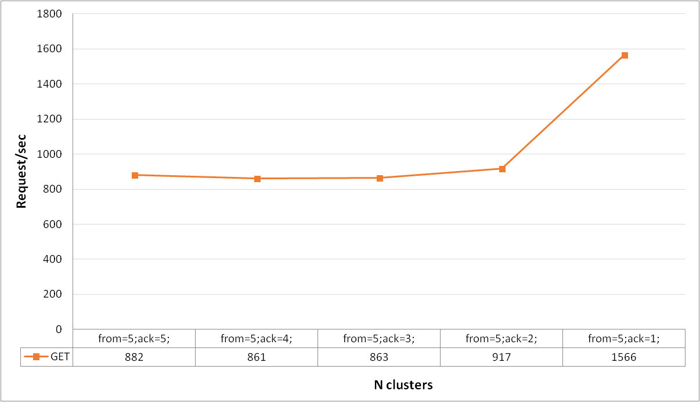

Сервер, wrk и async-profiler запускались через wsl
------------------------------------------------------------------------------------------------------------------------
**Параметр flushThresholdBytes в dao равен 1 МБ.
Размер очереди в Executor для обработки запросов равен 100.
Алгоритмов распределения данных между узлами - consistent hashing (virtual nodes number = 10).
Число узлов в кластере = 5**

Общие параметры для нагрузочного тестирования:
    - Длительность 60 секунд;
    - Число потоков 64;
    - Число соединений 64;

Для начала определим максимальный выдерживаемый rate при репликации. Запустим сервис на 5 узлах с from=5 и ack=5.
При PUT запросах максимально возможный rate составил 1150 request/sec, при GET запросах 882 request/sec. Как мы видим
максимально возможный rate снизился по сравнению с предыдущей версией сервиса, так как теперь на каждый запрос
происходит больше обращений по сети к другим узлам в зависимости от from и get указанных в запросе. 
Сравним максимально возможный rate при from от 1 до 5 и ack=1 и from=5 и ack от 1 до 5.
Результаты представлены в виде графиков:
! и [](images/stage4/max_rate_from5-1_ack_1.png)
По графикам видно, что при увеличении from и фиксированном ack равном 1, чем меньше from тем выше максимально возможный 
rate запросов в секунду. На графике в случае GET запросов это четко прослеживается, а на графике PUT запросов
при from=5 результаты получились даже немного лучше, чем при rom равном 3 и 4, это может быть связано с тем, что 
ack равен только 1 и запросы к другим репликам отменятся если есть уже 1 успешный ответ, но отменяются они если не были
еще запущены, так при from=5, запросы к другим репликам стоят в очередь дольше, так как запросов больше и могут успеть
отмениться, то есть при 5 может быть, например так: 2 реплики ответили успешно, а 3 отменили, а при 3 репликах, могут 
успеть запуститься все 3 запроса к репликам, так как нагрузка меньше и сами PUT запросы легковесные, и при 1 успешном 
ответе, остальные 2 уже не отменить, так как запросы уже ушли. При фиксированном from и изменении ack также rate лучше
при меньшем ack. При этом на обоих графиках различия между from или ack от 3 до 5 минимальны, так как запросы все равно
отправляются всем репликам, а при ack много меньше from запросы успевают отмениться, так как кворум уже набран.
Случай когда одно из значений from или ack равно 2, то небольшое отличие порядка 10% в положительную сторону есть, 
при from или ack равном 1, отличие примерно в 2 раза, связано это с тем, что при ack=1 нужный ключ может находиться
локально и не надо будет проксировать запрос, а также можно успеть отменить остальные запросы к другим репликам, 
так как нужен всего 1 ответ. Хуже всего когда значения и from и ack одновременно высокие, так при from=5 и ack=1,
максимальный rate равен 2697 и 1566 для PUT и GET запросов соответственно, а при from=5 и ack=5: 1150 и 882 request/sec.

Сравним временные показатели для PUT запросов при rate 1000 и GET запросов при rate 500 и 300_000 сохраненными записями 
в трех случаях:
1) При отсутствии реплик;
При PUT запросах Avg time =  2.30ms, Max time = 9.93ms, 99.000% = 5.00ms, 99.900% = 8.34ms
При GET запросах Avg time =  2.04ms, Max time =  11.77ms, 99.000% = 4.00ms, 99.900% = 6.23ms
2) from=3, ack=2;
При PUT запросах Avg time = 2.61ms, Max time = 17.90ms, 99.000% = 11.3ms, 99.900% = 14.77ms
При GET запросах Avg time =  2.44ms, Max time =  11.23ms, 99.000% = 8.04ms, 99.900% = 11.01ms
3) from=5, ack=3;
При PUT запросах Avg time = 76.57ms, Max time = 344.58ms, 99.000% = 325.38ms, 99.900% = 339.20ms
При GET запросах Avg time =  4.61ms, Max time =  72.00ms, 99.000% = 25.15ms, 99.900% = 63.46ms

(Показатели для GET запросов могут быть лучше чес для PUT, так как rate при них в 2 раза ниже).
Как видно из результатов, при небольшом числе реплик отличия во временных показателях не иак сильно отличаются, чем если
бы репликации вообще не было, но с ростом from и ack скорость ответов значительно падает, так как помимо дополнительных 
запросов к другим узлам, требуется еще дождаться ответов от хотя бы ack реплик, может быть ситуация что, например, 
при ack=3, две реплики уже ответили, а 3 еще нет и для ответа клиенту приходиться ее ждать.

Таким образом, репликация снижает производительность системы, но придает системе отказоустойчивости, так как при 
неполадках с 1 или несколькими узлами мы все равно сможет получить свои данные, конечно, если фактор репликации 
позволяет и не упало больше from - ack + 1 узлов. Выбор оптимальных значений ack и from зависит от требований к 
отказоустойчивости к сервису, важности данных, надежности аппаратной конфигурации кластера. В общем случае лучше всего
показал себя случай с from=3 и ack=2, который позволит в случае неполадок с одним из узлов (выход из строя двух узлов 
короткий промежуток времени, да и еще именно тех, где лежит определенный ключ маловероятен) восстановить данные и
при котором показатели по времени и максимальному rate лучше, чем при более высоких значениях from или ack, 
но все же хуже, чем при отсутствии репликации примерно в 2 раза. 

**Результаты профилирования.**
Будем профилировать случай когда from=3, ack=2.

CPU:
    PUT запросы:
     19.55% - работа jdk.internal.net.http.Http1AsyncReceiver, который ставит в очередь входящие данные в HttpClient.
     10.76% - метод proceed из ProxyHandler, из них 4% - отправка проксируемого запроса, 4.6% - ожидание ответа на него
        остальное - формирование запроса для HttpClient и итогового ответа Response.
     3.69% - запись в сокет (one.nio.net.NativeSocket.write)
     13.73% - проверка на то, следует ли запрашивать дополнительные данные из Http1TubeSubscriber
        (jdk.internal.net.http.Http1AsyncReceiver.checkRequestMore)
     12.05% - отправка ответов на проксируемые запросы от других узлов jdk.internal.net.http.Exchange.responseAsync:2
     1.37% - main.service.common.SessionRunnable.run внутри основного handleRequest()
     7.76% - java.util.concurrent.ThreadPoolExecutor.getTask, синхронизация взятия в очередях в executor-ов
     7.86% - java.util.concurrent.ForkJoinWorkerThread.run для java.util.concurrent.CompletableFuture
     5.47% - sun.nio.ch.SelectorImpl.select в selectorManager HttpClient
     2.5% -  работа а SelectorManager.run в HttpClient
     1.35% - one.nio.net.NativeSelector.epollWait
     2.45% - чтение из сокета и one.nio.http.HttpSession.processHttpBuffer
     0.45% - метод proceed из daoHandler
     Остальное - запуск потоков в Executor-ах и JIT
    GET запросы:
      18.69% - работа jdk.internal.net.http.Http1AsyncReceiver, который ставит в очередь входящие данные в HttpClient.
      10.71% - метод proceed из ProxyHandler, из них 4.42% - отправка проксируемого запроса,
        5.95% - ожидание ответа на него, остальное - формирование запроса для HttpClient и итогового ответа Response.
      3.23% - запись в сокет (one.nio.net.NativeSocket.write)
      7% - проверка на то, следует ли запрашивать дополнительные данные из Http1TubeSubscriber
        (jdk.internal.net.http.Http1AsyncReceiver.checkRequestMore)
      10.98% - отправка ответов на проксируемые запросы от других узлов jdk.internal.net.http.Exchange.responseAsync:2
      2% - main.service.common.SessionRunnable.run внутри основного handleRequest()
      12.5% - java.util.concurrent.ThreadPoolExecutor.getTask, синхронизация взятия в очередях в executor-ов
      6.5% - java.util.concurrent.ForkJoinWorkerThread.run для java.util.concurrent.CompletableFuture
      7% - sun.nio.ch.SelectorImpl.select в selectorManager HttpClient
      4% -  работаа SelectorManager.run в HttpClient
      0.33% - one.nio.net.NativeSelector.epollWait
      4% - чтение из сокета и one.nio.http.HttpSession.processHttpBuffer
      1.66% - метод proceed из daoHandler
      Остальное - запуск потоков в Executor-ах и JIT, парсинг строк.
Alloc:
    PUT запросы:
      13.34% - аллокации внутри jdk.internal.net.http.HttpClientImpl.sendAsync
      22.5% - аллокации в jdk.internal.net.http.MultiExchange
      15% - аллокации в jdk.internal.net.http.HttpRequestBuilder для создания запроса через HttpClient
      5% - перевод httpResponse в one.nio Response: main.service.common.ServiceUtils.toResponse
      7.87% - main.service.DemoService.createReplicaResponsesTasks      7% -  get в dao
      3.35% - аллокации jdk.internal.net.http.Http1AsyncReceiver (2.29% - Http1Response$HeadersReader)
      Остальное - аллокации в Executor-ах и SelectorManager
    GET запросы:
      11.6% - аллокации внутри jdk.internal.net.http.HttpClientImpl.sendAsync
      21.43% - аллокации в jdk.internal.net.http.MultiExchange
      13.4% - аллокации в jdk.internal.net.http.HttpRequestBuilder для создания запроса через HttpClient
      5% - перевод httpResponse в one.nio Response: main.service.common.ServiceUtils.toResponse
      8% - аллокации в методе main.service.DemoService.createReplicaResponsesTasks
      7% -  get в dao
      4.19% - аллокации jdk.internal.net.http.Http1AsyncReceiver (2.73% - Http1Response$HeadersReader)
      Остальное - аллокации в Executor-ах и SelectorManager, парсинг строк.
Lock:
    PUT запросы:
      37.6% - лок во время получения запроса в проксируемом узле
        (jdk.internal.net.http.Http1AsyncReceiver.checkRequestMore и 
        jdk.internal.net.http.Http1AsyncReceiver.handlePendingDelegate)
      23.23% - лок в ComletableFuture для jdk.internal.net.http.Exchange.responseAsync
      28.22% - локи для jdk.internal.net.http.HttpClientImpl$SelectorManager (больше в профиле ничего нет, но
        судя по имплементации SelectorManager - это synchronize блоки внутри него).
      8.04% - select в HttpClientImpl$SelectorManager (sun.nio.ch.SelectorImpl.select)
      1.61% - jdk.internal.net.http.ConnectionPool.purgeExpiredConnectionsAndReturnNextDeadline
      0.33% - java.util.concurrent.LinkedBlockingQueue.take:13 из очереди в requestExecutor
    GET запросы:
      34.86% - лок во время получения запроса в проксируемом узле
        (jdk.internal.net.http.Http1AsyncReceiver.checkRequestMore и
        jdk.internal.net.http.Http1AsyncReceiver.handlePendingDelegate)
      23.18% - лок в ComletableFuture для jdk.internal.net.http.Exchange.responseAsync
      29.53% - локи для jdk.internal.net.http.HttpClientImpl$SelectorManager (больше в профиле ничего нет, но
        судя по имплементации SelectorManager - это synchronize блоки внутри него).
      9.18% - select в HttpClientImpl$SelectorManager (sun.nio.ch.SelectorImpl.select)
      1.71% - jdk.internal.net.http.ConnectionPool.purgeExpiredConnectionsAndReturnNextDeadline
      0.42% - java.util.concurrent.LinkedBlockingQueue.take:13 из очереди в requestExecutor

Как видно из результатов профилирования, большая часть времени работы CPU уходит на проксирование запросов по http
на другой узел и обратно, также при этом происходят более 90% локов и больше половины аллокаций.
Таким образом, как и в предыдущем stage, в первую очередь следует оптимизировать передачу данных между узлами кластера
заменив http протокол на другой, более эффективный, например, RPC, только в случае с репликацией такая оптимизация будет
еще полезней, так как число запросов в другие узлы вырастает. Также около 10%% CPU уходит на метод getTask(take)
для взятия задачи из очереди в requestExecutor, это связано с тем, что присутствует конкуренция между потоками,
так как каждый HttpClient содержит в себе executor, то есть 5 потоков минимум, при 1 потоке в таком executor-е + потоки
в requestExecutor и replicasResponsesExecutor, что много больше ядер на моем устройстве, которых только 4. 
Но так как каждый кластер в реальности будет на отдельной машине, то данная проблема исчезнет.
Была сделана оптимизация по вынесению обработки проксируемых запросов в отдельный executor, чтобы разгрузить основных
воркеров. Размер этого executor больше основного по причине того что большую часть времени потоки в нем ожидают
ответа для проксируемых запросов от других узлов. Также была сделана оптимизация, чтобы автоматически отменялось 
выполнение запросов к другим репликам если кворум уже набран или количество отказов гарантированно не позволит его
собрать, но только если эти задачи еще не начались.


Результаты wrk:

no replicas (stage 3), PUT rate=1000
```
./wrk -d 60 -t 64 -c 64 -R 500 -L -s ./wrk-scripts/stage1_GET.lua http://localhost:20001
Running 1m test @ http://localhost:20001
  64 threads and 64 connections
  Thread calibration: mean lat.: 3.014ms, rate sampling interval: 10ms
  Thread calibration: mean lat.: 2.730ms, rate sampling interval: 10ms
  Thread calibration: mean lat.: 2.381ms, rate sampling interval: 10ms
  Thread calibration: mean lat.: 2.318ms, rate sampling interval: 10ms
  Thread calibration: mean lat.: 2.170ms, rate sampling interval: 10ms
  Thread calibration: mean lat.: 2.079ms, rate sampling interval: 10ms
  Thread calibration: mean lat.: 2.040ms, rate sampling interval: 10ms
  Thread calibration: mean lat.: 2.205ms, rate sampling interval: 10ms
  Thread calibration: mean lat.: 1.884ms, rate sampling interval: 10ms
  Thread calibration: mean lat.: 2.259ms, rate sampling interval: 10ms
  Thread calibration: mean lat.: 2.056ms, rate sampling interval: 10ms
  Thread calibration: mean lat.: 2.150ms, rate sampling interval: 10ms
  Thread calibration: mean lat.: 2.485ms, rate sampling interval: 10ms
  Thread calibration: mean lat.: 2.492ms, rate sampling interval: 10ms
  Thread calibration: mean lat.: 2.147ms, rate sampling interval: 10ms
  Thread calibration: mean lat.: 2.047ms, rate sampling interval: 10ms
  Thread calibration: mean lat.: 1.897ms, rate sampling interval: 10ms
  Thread calibration: mean lat.: 1.912ms, rate sampling interval: 10ms
  Thread calibration: mean lat.: 1.903ms, rate sampling interval: 10ms
  Thread calibration: mean lat.: 2.370ms, rate sampling interval: 10ms
  Thread calibration: mean lat.: 2.318ms, rate sampling interval: 10ms
  Thread calibration: mean lat.: 2.475ms, rate sampling interval: 10ms
  Thread calibration: mean lat.: 2.716ms, rate sampling interval: 10ms
  Thread calibration: mean lat.: 2.299ms, rate sampling interval: 10ms
  Thread calibration: mean lat.: 2.083ms, rate sampling interval: 10ms
  Thread calibration: mean lat.: 2.071ms, rate sampling interval: 10ms
  Thread calibration: mean lat.: 2.215ms, rate sampling interval: 10ms
  Thread calibration: mean lat.: 2.230ms, rate sampling interval: 10ms
  Thread calibration: mean lat.: 2.139ms, rate sampling interval: 10ms
  Thread calibration: mean lat.: 2.123ms, rate sampling interval: 10ms
  Thread calibration: mean lat.: 2.096ms, rate sampling interval: 10ms
  Thread calibration: mean lat.: 2.085ms, rate sampling interval: 10ms
  Thread calibration: mean lat.: 2.147ms, rate sampling interval: 10ms
  Thread calibration: mean lat.: 2.192ms, rate sampling interval: 10ms
  Thread calibration: mean lat.: 2.697ms, rate sampling interval: 10ms
  Thread calibration: mean lat.: 2.280ms, rate sampling interval: 10ms
  Thread calibration: mean lat.: 2.036ms, rate sampling interval: 10ms
  Thread calibration: mean lat.: 2.126ms, rate sampling interval: 10ms
  Thread calibration: mean lat.: 2.179ms, rate sampling interval: 10ms
  Thread calibration: mean lat.: 2.170ms, rate sampling interval: 10ms
  Thread calibration: mean lat.: 2.124ms, rate sampling interval: 10ms
  Thread calibration: mean lat.: 2.086ms, rate sampling interval: 10ms
  Thread calibration: mean lat.: 2.055ms, rate sampling interval: 10ms
  Thread calibration: mean lat.: 2.074ms, rate sampling interval: 10ms
  Thread calibration: mean lat.: 2.733ms, rate sampling interval: 10ms
  Thread calibration: mean lat.: 2.801ms, rate sampling interval: 10ms
  Thread calibration: mean lat.: 2.673ms, rate sampling interval: 10ms
  Thread calibration: mean lat.: 2.644ms, rate sampling interval: 10ms
  Thread calibration: mean lat.: 2.661ms, rate sampling interval: 10ms
  Thread calibration: mean lat.: 2.734ms, rate sampling interval: 10ms
  Thread calibration: mean lat.: 2.687ms, rate sampling interval: 10ms
  Thread calibration: mean lat.: 2.628ms, rate sampling interval: 10ms
  Thread calibration: mean lat.: 2.688ms, rate sampling interval: 10ms
  Thread calibration: mean lat.: 2.742ms, rate sampling interval: 10ms
  Thread calibration: mean lat.: 2.616ms, rate sampling interval: 10ms
  Thread calibration: mean lat.: 2.593ms, rate sampling interval: 10ms
  Thread calibration: mean lat.: 2.582ms, rate sampling interval: 10ms
  Thread calibration: mean lat.: 2.398ms, rate sampling interval: 10ms
  Thread calibration: mean lat.: 2.496ms, rate sampling interval: 10ms
  Thread calibration: mean lat.: 2.374ms, rate sampling interval: 10ms
  Thread calibration: mean lat.: 2.221ms, rate sampling interval: 10ms
  Thread calibration: mean lat.: 2.272ms, rate sampling interval: 10ms
  Thread calibration: mean lat.: 1.941ms, rate sampling interval: 10ms
  Thread calibration: mean lat.: 1.992ms, rate sampling interval: 10ms
^C^C  Thread Stats   Avg      Stdev     Max   +/- Stdev
    Latency     2.30ms    0.87ms   9.93ms   75.07%
    Req/Sec     8.30     28.08   111.00     91.94%
  Latency Distribution (HdrHistogram - Recorded Latency)
 50.000%    2.21ms
 75.000%    2.76ms
 90.000%    3.31ms
 99.000%    5.00ms
 99.900%    8.34ms
 99.990%    9.45ms
 99.999%    9.94ms
100.000%    9.94ms

  Detailed Percentile spectrum:
       Value   Percentile   TotalCount 1/(1-Percentile)

       0.265     0.000000            1         1.00
       1.348     0.100000          897         1.11
       1.659     0.200000         1794         1.25
       1.867     0.300000         2690         1.43
       2.040     0.400000         3584         1.67
       2.215     0.500000         4482         2.00
       2.311     0.550000         4932         2.22
       2.411     0.600000         5386         2.50
       2.509     0.650000         5828         2.86
       2.623     0.700000         6274         3.33
       2.759     0.750000         6722         4.00
       2.825     0.775000         6945         4.44
       2.895     0.800000         7173         5.00
       2.979     0.825000         7393         5.71
       3.065     0.850000         7619         6.67
       3.175     0.875000         7840         8.00
       3.237     0.887500         7952         8.89
       3.305     0.900000         8065        10.00
       3.379     0.912500         8179        11.43
       3.459     0.925000         8290        13.33
       3.557     0.937500         8402        16.00
       3.609     0.943750         8456        17.78
       3.679     0.950000         8513        20.00
       3.779     0.956250         8571        22.86
       3.871     0.962500         8625        26.67
       3.969     0.968750         8681        32.00
       4.035     0.971875         8708        35.56
       4.135     0.975000         8736        40.00
       4.231     0.978125         8764        45.71
       4.391     0.981250         8792        53.33
       4.531     0.984375         8820        64.00
       4.607     0.985938         8834        71.11
       4.719     0.987500         8848        80.00
       4.891     0.989062         8863        91.43
       5.095     0.990625         8876       106.67
       5.259     0.992188         8890       128.00
       5.531     0.992969         8897       142.22
       5.707     0.993750         8904       160.00
       6.047     0.994531         8911       182.86
       6.307     0.995313         8918       213.33
       6.479     0.996094         8925       256.00
       6.707     0.996484         8929       284.44
       6.759     0.996875         8932       320.00
       6.987     0.997266         8936       365.71
       7.031     0.997656         8939       426.67
       7.127     0.998047         8943       512.00
       7.343     0.998242         8947       568.89
       7.343     0.998437         8947       640.00
       7.367     0.998633         8948       731.43
       8.011     0.998828         8950       853.33
       8.727     0.999023         8952      1024.00
       8.807     0.999121         8953      1137.78
       8.807     0.999219         8953      1280.00
       8.935     0.999316         8954      1462.86
       9.143     0.999414         8955      1706.67
       9.279     0.999512         8956      2048.00
       9.383     0.999561         8957      2275.56
       9.383     0.999609         8957      2560.00
       9.383     0.999658         8957      2925.71
       9.431     0.999707         8958      3413.33
       9.431     0.999756         8958      4096.00
       9.447     0.999780         8959      4551.11
       9.447     0.999805         8959      5120.00
       9.447     0.999829         8959      5851.43
       9.447     0.999854         8959      6826.67
       9.447     0.999878         8959      8192.00
       9.935     0.999890         8960      9102.22
       9.935     1.000000         8960          inf
#[Mean    =        2.304, StdDeviation   =        0.871]
#[Max     =        9.928, Total count    =         8960]
#[Buckets =           27, SubBuckets     =         2048]
----------------------------------------------------------
  14016 requests in 28.02s, 0.88MB read
Requests/sec:    500.21
Transfer/sec:     31.99KB
```

no replicas (stage 3), GET rate=500, 300_000 entries
```
./wrk -d 60 -t 64 -c 64 -R 500 -L -s ./wrk-scripts/stage1_GET.lua http://localhost:20001
Running 1m test @ http://localhost:20001
  64 threads and 64 connections
  Thread calibration: mean lat.: 2.475ms, rate sampling interval: 10ms
  Thread calibration: mean lat.: 2.145ms, rate sampling interval: 10ms
  Thread calibration: mean lat.: 1.857ms, rate sampling interval: 10ms
  Thread calibration: mean lat.: 1.770ms, rate sampling interval: 10ms
  Thread calibration: mean lat.: 1.713ms, rate sampling interval: 10ms
  Thread calibration: mean lat.: 1.876ms, rate sampling interval: 10ms
  Thread calibration: mean lat.: 1.708ms, rate sampling interval: 10ms
  Thread calibration: mean lat.: 1.851ms, rate sampling interval: 10ms
  Thread calibration: mean lat.: 2.055ms, rate sampling interval: 10ms
  Thread calibration: mean lat.: 1.734ms, rate sampling interval: 10ms
  Thread calibration: mean lat.: 1.932ms, rate sampling interval: 10ms
  Thread calibration: mean lat.: 1.864ms, rate sampling interval: 10ms
  Thread calibration: mean lat.: 1.906ms, rate sampling interval: 10ms
  Thread calibration: mean lat.: 2.177ms, rate sampling interval: 10ms
  Thread calibration: mean lat.: 1.870ms, rate sampling interval: 10ms
  Thread calibration: mean lat.: 2.018ms, rate sampling interval: 10ms
  Thread calibration: mean lat.: 2.326ms, rate sampling interval: 10ms
  Thread calibration: mean lat.: 1.972ms, rate sampling interval: 10ms
  Thread calibration: mean lat.: 1.927ms, rate sampling interval: 10ms
  Thread calibration: mean lat.: 1.902ms, rate sampling interval: 10ms
  Thread calibration: mean lat.: 1.975ms, rate sampling interval: 10ms
  Thread calibration: mean lat.: 1.959ms, rate sampling interval: 10ms
  Thread calibration: mean lat.: 1.947ms, rate sampling interval: 10ms
  Thread calibration: mean lat.: 1.955ms, rate sampling interval: 10ms
  Thread calibration: mean lat.: 1.971ms, rate sampling interval: 10ms
  Thread calibration: mean lat.: 2.276ms, rate sampling interval: 10ms
  Thread calibration: mean lat.: 1.982ms, rate sampling interval: 10ms
  Thread calibration: mean lat.: 1.916ms, rate sampling interval: 10ms
  Thread calibration: mean lat.: 2.174ms, rate sampling interval: 10ms
  Thread calibration: mean lat.: 2.431ms, rate sampling interval: 10ms
  Thread calibration: mean lat.: 1.997ms, rate sampling interval: 10ms
  Thread calibration: mean lat.: 2.367ms, rate sampling interval: 10ms
  Thread calibration: mean lat.: 2.059ms, rate sampling interval: 10ms
  Thread calibration: mean lat.: 2.111ms, rate sampling interval: 10ms
  Thread calibration: mean lat.: 2.091ms, rate sampling interval: 10ms
  Thread calibration: mean lat.: 2.154ms, rate sampling interval: 10ms
  Thread calibration: mean lat.: 2.293ms, rate sampling interval: 10ms
  Thread calibration: mean lat.: 2.104ms, rate sampling interval: 10ms
  Thread calibration: mean lat.: 2.132ms, rate sampling interval: 10ms
  Thread calibration: mean lat.: 2.056ms, rate sampling interval: 10ms
  Thread calibration: mean lat.: 1.947ms, rate sampling interval: 10ms
  Thread calibration: mean lat.: 2.039ms, rate sampling interval: 10ms
  Thread calibration: mean lat.: 1.893ms, rate sampling interval: 10ms
  Thread calibration: mean lat.: 1.945ms, rate sampling interval: 10ms
  Thread calibration: mean lat.: 2.415ms, rate sampling interval: 10ms
  Thread calibration: mean lat.: 1.918ms, rate sampling interval: 10ms
  Thread calibration: mean lat.: 1.930ms, rate sampling interval: 10ms
  Thread calibration: mean lat.: 1.906ms, rate sampling interval: 10ms
  Thread calibration: mean lat.: 1.983ms, rate sampling interval: 10ms
  Thread calibration: mean lat.: 2.019ms, rate sampling interval: 10ms
  Thread calibration: mean lat.: 2.262ms, rate sampling interval: 10ms
  Thread calibration: mean lat.: 1.886ms, rate sampling interval: 10ms
  Thread calibration: mean lat.: 1.846ms, rate sampling interval: 10ms
  Thread calibration: mean lat.: 2.297ms, rate sampling interval: 10ms
  Thread calibration: mean lat.: 2.074ms, rate sampling interval: 10ms
  Thread calibration: mean lat.: 1.936ms, rate sampling interval: 10ms
  Thread calibration: mean lat.: 2.051ms, rate sampling interval: 10ms
  Thread calibration: mean lat.: 2.045ms, rate sampling interval: 10ms
  Thread calibration: mean lat.: 1.970ms, rate sampling interval: 10ms
  Thread calibration: mean lat.: 1.953ms, rate sampling interval: 10ms
  Thread calibration: mean lat.: 2.507ms, rate sampling interval: 10ms
  Thread calibration: mean lat.: 2.303ms, rate sampling interval: 10ms
  Thread calibration: mean lat.: 1.984ms, rate sampling interval: 10ms
  Thread calibration: mean lat.: 1.898ms, rate sampling interval: 10ms
  Thread Stats   Avg      Stdev     Max   +/- Stdev
    Latency     2.04ms  737.81us  11.77ms   72.19%
    Req/Sec     8.32     28.10   111.00     91.92%
  Latency Distribution (HdrHistogram - Recorded Latency)
 50.000%    1.97ms
 75.000%    2.43ms
 90.000%    2.98ms
 99.000%    4.00ms
 99.900%    6.23ms
 99.990%   10.11ms
 99.999%   11.77ms
100.000%   11.77ms

  Detailed Percentile spectrum:
       Value   Percentile   TotalCount 1/(1-Percentile)

       0.216     0.000000            1         1.00
       1.202     0.100000         2500         1.11
       1.451     0.200000         5001         1.25
       1.647     0.300000         7492         1.43
       1.815     0.400000         9990         1.67
       1.973     0.500000        12499         2.00
       2.049     0.550000        13740         2.22
       2.133     0.600000        15010         2.50
       2.217     0.650000        16225         2.86
       2.317     0.700000        17477         3.33
       2.435     0.750000        18720         4.00
       2.499     0.775000        19358         4.44
       2.573     0.800000        19984         5.00
       2.657     0.825000        20596         5.71
       2.755     0.850000        21223         6.67
       2.859     0.875000        21849         8.00
       2.919     0.887500        22156         8.89
       2.981     0.900000        22468        10.00
       3.057     0.912500        22777        11.43
       3.135     0.925000        23090        13.33
       3.231     0.937500        23406        16.00
       3.287     0.943750        23559        17.78
       3.337     0.950000        23715        20.00
       3.397     0.956250        23869        22.86
       3.467     0.962500        24024        26.67
       3.553     0.968750        24180        32.00
       3.593     0.971875        24261        35.56
       3.639     0.975000        24338        40.00
       3.683     0.978125        24418        45.71
       3.745     0.981250        24492        53.33
       3.807     0.984375        24572        64.00
       3.861     0.985938        24609        71.11
       3.907     0.987500        24648        80.00
       3.977     0.989062        24688        91.43
       4.033     0.990625        24726       106.67
       4.123     0.992188        24765       128.00
       4.175     0.992969        24785       142.22
       4.239     0.993750        24805       160.00
       4.327     0.994531        24825       182.86
       4.403     0.995313        24843       213.33
       4.619     0.996094        24864       256.00
       4.715     0.996484        24873       284.44
       4.775     0.996875        24882       320.00
       4.911     0.997266        24892       365.71
       5.067     0.997656        24902       426.67
       5.279     0.998047        24912       512.00
       5.495     0.998242        24917       568.89
       5.611     0.998437        24921       640.00
       5.691     0.998633        24926       731.43
       5.907     0.998828        24931       853.33
       6.279     0.999023        24936      1024.00
       6.423     0.999121        24939      1137.78
       6.539     0.999219        24941      1280.00
       6.739     0.999316        24943      1462.86
       7.063     0.999414        24946      1706.67
       7.195     0.999512        24948      2048.00
       7.283     0.999561        24950      2275.56
       7.311     0.999609        24951      2560.00
       7.483     0.999658        24952      2925.71
       7.543     0.999707        24953      3413.33
       7.675     0.999756        24954      4096.00
       8.407     0.999780        24955      4551.11
       8.631     0.999805        24956      5120.00
       8.631     0.999829        24956      5851.43
       9.039     0.999854        24957      6826.67
       9.039     0.999878        24957      8192.00
      10.111     0.999890        24958      9102.22
      10.111     0.999902        24958     10240.00
      10.111     0.999915        24958     11702.86
      10.839     0.999927        24959     13653.33
      10.839     0.999939        24959     16384.00
      10.839     0.999945        24959     18204.44
      10.839     0.999951        24959     20480.00
      10.839     0.999957        24959     23405.71
      11.775     0.999963        24960     27306.67
      11.775     1.000000        24960          inf
#[Mean    =        2.038, StdDeviation   =        0.738]
#[Max     =       11.768, Total count    =        24960]
#[Buckets =           27, SubBuckets     =         2048]
----------------------------------------------------------
  30016 requests in 1.00m, 1.88MB read
Requests/sec:    500.13
Transfer/sec:     32.12KB
```

from = 5, ack = 3, PUT, rate=1000
```
./wrk -d 60 -t 64 -c 64 -R 1000 -L -s ./wrk-scripts/stage4_PUT_from5_ack3.lua http://localhost:2000
1
Running 1m test @ http://localhost:20001
  64 threads and 64 connections
  Thread calibration: mean lat.: 35.308ms, rate sampling interval: 247ms
  Thread calibration: mean lat.: 35.597ms, rate sampling interval: 249ms
  Thread calibration: mean lat.: 35.264ms, rate sampling interval: 247ms
  Thread calibration: mean lat.: 35.604ms, rate sampling interval: 247ms
  Thread calibration: mean lat.: 35.461ms, rate sampling interval: 247ms
  Thread calibration: mean lat.: 35.520ms, rate sampling interval: 249ms
  Thread calibration: mean lat.: 35.107ms, rate sampling interval: 246ms
  Thread calibration: mean lat.: 35.388ms, rate sampling interval: 245ms
  Thread calibration: mean lat.: 35.309ms, rate sampling interval: 245ms
  Thread calibration: mean lat.: 34.770ms, rate sampling interval: 243ms
  Thread calibration: mean lat.: 34.659ms, rate sampling interval: 242ms
  Thread calibration: mean lat.: 34.533ms, rate sampling interval: 242ms
  Thread calibration: mean lat.: 34.954ms, rate sampling interval: 243ms
  Thread calibration: mean lat.: 45.433ms, rate sampling interval: 291ms
  Thread calibration: mean lat.: 34.800ms, rate sampling interval: 240ms
  Thread calibration: mean lat.: 34.936ms, rate sampling interval: 242ms
  Thread calibration: mean lat.: 34.800ms, rate sampling interval: 236ms
  Thread calibration: mean lat.: 35.381ms, rate sampling interval: 244ms
  Thread calibration: mean lat.: 35.325ms, rate sampling interval: 243ms
  Thread calibration: mean lat.: 35.571ms, rate sampling interval: 244ms
  Thread calibration: mean lat.: 35.763ms, rate sampling interval: 245ms
  Thread calibration: mean lat.: 35.850ms, rate sampling interval: 247ms
  Thread calibration: mean lat.: 36.198ms, rate sampling interval: 247ms
  Thread calibration: mean lat.: 36.504ms, rate sampling interval: 249ms
  Thread calibration: mean lat.: 35.491ms, rate sampling interval: 245ms
  Thread calibration: mean lat.: 35.778ms, rate sampling interval: 246ms
  Thread calibration: mean lat.: 38.240ms, rate sampling interval: 251ms
  Thread calibration: mean lat.: 38.524ms, rate sampling interval: 258ms
  Thread calibration: mean lat.: 40.313ms, rate sampling interval: 263ms
  Thread calibration: mean lat.: 39.619ms, rate sampling interval: 259ms
  Thread calibration: mean lat.: 39.151ms, rate sampling interval: 256ms
  Thread calibration: mean lat.: 37.868ms, rate sampling interval: 253ms
  Thread calibration: mean lat.: 42.831ms, rate sampling interval: 269ms
  Thread calibration: mean lat.: 40.431ms, rate sampling interval: 260ms
  Thread calibration: mean lat.: 36.779ms, rate sampling interval: 250ms
  Thread calibration: mean lat.: 41.090ms, rate sampling interval: 264ms
  Thread calibration: mean lat.: 39.982ms, rate sampling interval: 259ms
  Thread calibration: mean lat.: 41.905ms, rate sampling interval: 266ms
  Thread calibration: mean lat.: 37.012ms, rate sampling interval: 250ms
  Thread calibration: mean lat.: 41.731ms, rate sampling interval: 264ms
  Thread calibration: mean lat.: 42.751ms, rate sampling interval: 267ms
  Thread calibration: mean lat.: 43.521ms, rate sampling interval: 269ms
  Thread calibration: mean lat.: 43.819ms, rate sampling interval: 271ms
  Thread calibration: mean lat.: 43.958ms, rate sampling interval: 270ms
  Thread calibration: mean lat.: 43.092ms, rate sampling interval: 270ms
  Thread calibration: mean lat.: 42.749ms, rate sampling interval: 267ms
  Thread calibration: mean lat.: 43.402ms, rate sampling interval: 273ms
  Thread calibration: mean lat.: 42.417ms, rate sampling interval: 271ms
  Thread calibration: mean lat.: 42.098ms, rate sampling interval: 272ms
  Thread calibration: mean lat.: 42.458ms, rate sampling interval: 272ms
  Thread calibration: mean lat.: 41.983ms, rate sampling interval: 270ms
  Thread calibration: mean lat.: 41.485ms, rate sampling interval: 268ms
  Thread calibration: mean lat.: 44.058ms, rate sampling interval: 280ms
  Thread calibration: mean lat.: 44.403ms, rate sampling interval: 276ms
  Thread calibration: mean lat.: 42.885ms, rate sampling interval: 270ms
  Thread calibration: mean lat.: 45.353ms, rate sampling interval: 279ms
  Thread calibration: mean lat.: 43.501ms, rate sampling interval: 273ms
  Thread calibration: mean lat.: 45.789ms, rate sampling interval: 283ms
  Thread calibration: mean lat.: 46.548ms, rate sampling interval: 283ms
  Thread calibration: mean lat.: 43.379ms, rate sampling interval: 271ms
  Thread calibration: mean lat.: 43.400ms, rate sampling interval: 276ms
  Thread calibration: mean lat.: 46.961ms, rate sampling interval: 286ms
  Thread calibration: mean lat.: 43.525ms, rate sampling interval: 271ms
  Thread calibration: mean lat.: 45.863ms, rate sampling interval: 280ms
  Thread Stats   Avg      Stdev     Max   +/- Stdev
    Latency    76.57ms   91.31ms 344.58ms   83.15%
    Req/Sec    15.26      1.83    21.00     87.55%
  Latency Distribution (HdrHistogram - Recorded Latency)
 50.000%   37.69ms
 75.000%   91.20ms
 90.000%  255.36ms
 99.000%  325.38ms
 99.900%  339.20ms
 99.990%  343.81ms
 99.999%  344.32ms
100.000%  344.83ms

  Detailed Percentile spectrum:
       Value   Percentile   TotalCount 1/(1-Percentile)

       1.394     0.000000            1         1.00
       5.711     0.100000         5019         1.11
      12.007     0.200000        10041         1.25
      16.383     0.300000        15053         1.43
      23.439     0.400000        20067         1.67
      37.695     0.500000        25093         2.00
      46.655     0.550000        27595         2.22
      55.583     0.600000        30106         2.50
      65.727     0.650000        32606         2.86
      77.823     0.700000        35121         3.33
      91.199     0.750000        37637         4.00
      98.239     0.775000        38887         4.44
     107.903     0.800000        40133         5.00
     149.631     0.825000        41389         5.71
     207.103     0.850000        42641         6.67
     236.671     0.875000        43899         8.00
     247.039     0.887500        44523         8.89
     255.359     0.900000        45148        10.00
     264.959     0.912500        45782        11.43
     274.943     0.925000        46417        13.33
     282.367     0.937500        47057        16.00
     284.927     0.943750        47354        17.78
     288.255     0.950000        47662        20.00
     292.351     0.956250        47975        22.86
     297.215     0.962500        48293        26.67
     302.847     0.968750        48597        32.00
     306.431     0.971875        48762        35.56
     309.247     0.975000        48912        40.00
     312.319     0.978125        49072        45.71
     315.903     0.981250        49225        53.33
     319.231     0.984375        49391        64.00
     320.767     0.985938        49459        71.11
     322.815     0.987500        49543        80.00
     324.607     0.989062        49628        91.43
     325.887     0.990625        49703       106.67
     327.423     0.992188        49778       128.00
     328.447     0.992969        49812       142.22
     329.983     0.993750        49856       160.00
     331.519     0.994531        49894       182.86
     333.311     0.995313        49939       213.33
     334.591     0.996094        49973       256.00
     335.103     0.996484        49992       284.44
     335.615     0.996875        50011       320.00
     336.127     0.997266        50039       365.71
     336.383     0.997656        50047       426.67
     337.151     0.998047        50074       512.00
     337.407     0.998242        50086       568.89
     337.407     0.998437        50086       640.00
     338.175     0.998633        50098       731.43
     338.687     0.998828        50109       853.33
     339.455     0.999023        50117      1024.00
     339.967     0.999121        50120      1137.78
     340.479     0.999219        50126      1280.00
     340.991     0.999316        50130      1462.86
     341.503     0.999414        50134      1706.67
     342.015     0.999512        50140      2048.00
     342.271     0.999561        50144      2275.56
     342.271     0.999609        50144      2560.00
     342.527     0.999658        50146      2925.71
     342.783     0.999707        50151      3413.33
     342.783     0.999756        50151      4096.00
     343.039     0.999780        50154      4551.11
     343.039     0.999805        50154      5120.00
     343.295     0.999829        50156      5851.43
     343.295     0.999854        50156      6826.67
     343.551     0.999878        50157      8192.00
     343.807     0.999890        50158      9102.22
     344.063     0.999902        50160     10240.00
     344.063     0.999915        50160     11702.86
     344.063     0.999927        50160     13653.33
     344.063     0.999939        50160     16384.00
     344.319     0.999945        50162     18204.44
     344.319     0.999951        50162     20480.00
     344.319     0.999957        50162     23405.71
     344.319     0.999963        50162     27306.67
     344.319     0.999969        50162     32768.00
     344.319     0.999973        50162     36408.89
     344.319     0.999976        50162     40960.00
     344.319     0.999979        50162     46811.43
     344.831     0.999982        50163     54613.33
     344.831     1.000000        50163          inf
#[Mean    =       76.567, StdDeviation   =       91.314]
#[Max     =      344.576, Total count    =        50163]
#[Buckets =           27, SubBuckets     =         2048]
----------------------------------------------------------
  59895 requests in 1.00m, 3.83MB read
Requests/sec:    998.09
Transfer/sec:     65.30KB
```

from = 3, ack = 2, PUT, rate=1000
```
./wrk -d 60 -t 64 -c 64 -R 1000 -L -s ./wrk-scripts/stage4_PUT_from3_ack2.lua http://localhost:2000
1
Running 1m test @ http://localhost:20001
  64 threads and 64 connections
  Thread calibration: mean lat.: 1.923ms, rate sampling interval: 10ms
  Thread calibration: mean lat.: 1.910ms, rate sampling interval: 10ms
  Thread calibration: mean lat.: 1.843ms, rate sampling interval: 10ms
  Thread calibration: mean lat.: 1.832ms, rate sampling interval: 10ms
  Thread calibration: mean lat.: 1.989ms, rate sampling interval: 10ms
  Thread calibration: mean lat.: 1.900ms, rate sampling interval: 10ms
  Thread calibration: mean lat.: 1.935ms, rate sampling interval: 10ms
  Thread calibration: mean lat.: 1.881ms, rate sampling interval: 10ms
  Thread calibration: mean lat.: 1.837ms, rate sampling interval: 10ms
  Thread calibration: mean lat.: 1.874ms, rate sampling interval: 10ms
  Thread calibration: mean lat.: 1.850ms, rate sampling interval: 10ms
  Thread calibration: mean lat.: 1.845ms, rate sampling interval: 10ms
  Thread calibration: mean lat.: 1.755ms, rate sampling interval: 10ms
  Thread calibration: mean lat.: 1.766ms, rate sampling interval: 10ms
  Thread calibration: mean lat.: 1.771ms, rate sampling interval: 10ms
  Thread calibration: mean lat.: 1.854ms, rate sampling interval: 10ms
  Thread calibration: mean lat.: 1.819ms, rate sampling interval: 10ms
  Thread calibration: mean lat.: 1.776ms, rate sampling interval: 10ms
  Thread calibration: mean lat.: 1.712ms, rate sampling interval: 10ms
  Thread calibration: mean lat.: 1.813ms, rate sampling interval: 10ms
  Thread calibration: mean lat.: 1.829ms, rate sampling interval: 10ms
  Thread calibration: mean lat.: 1.815ms, rate sampling interval: 10ms
  Thread calibration: mean lat.: 1.826ms, rate sampling interval: 10ms
  Thread calibration: mean lat.: 1.845ms, rate sampling interval: 10ms
  Thread calibration: mean lat.: 1.851ms, rate sampling interval: 10ms
  Thread calibration: mean lat.: 1.839ms, rate sampling interval: 10ms
  Thread calibration: mean lat.: 1.848ms, rate sampling interval: 10ms
  Thread calibration: mean lat.: 1.893ms, rate sampling interval: 10ms
  Thread calibration: mean lat.: 1.829ms, rate sampling interval: 10ms
  Thread calibration: mean lat.: 1.828ms, rate sampling interval: 10ms
  Thread calibration: mean lat.: 1.788ms, rate sampling interval: 10ms
  Thread calibration: mean lat.: 1.863ms, rate sampling interval: 10ms
  Thread calibration: mean lat.: 1.844ms, rate sampling interval: 10ms
  Thread calibration: mean lat.: 1.747ms, rate sampling interval: 10ms
  Thread calibration: mean lat.: 1.757ms, rate sampling interval: 10ms
  Thread calibration: mean lat.: 1.765ms, rate sampling interval: 10ms
  Thread calibration: mean lat.: 1.831ms, rate sampling interval: 10ms
  Thread calibration: mean lat.: 1.773ms, rate sampling interval: 10ms
  Thread calibration: mean lat.: 1.779ms, rate sampling interval: 10ms
  Thread calibration: mean lat.: 1.916ms, rate sampling interval: 10ms
  Thread calibration: mean lat.: 1.810ms, rate sampling interval: 10ms
  Thread calibration: mean lat.: 1.890ms, rate sampling interval: 10ms
  Thread calibration: mean lat.: 1.884ms, rate sampling interval: 10ms
  Thread calibration: mean lat.: 1.836ms, rate sampling interval: 10ms
  Thread calibration: mean lat.: 1.786ms, rate sampling interval: 10ms
  Thread calibration: mean lat.: 1.796ms, rate sampling interval: 10ms
  Thread calibration: mean lat.: 1.884ms, rate sampling interval: 10ms
  Thread calibration: mean lat.: 1.885ms, rate sampling interval: 10ms
  Thread calibration: mean lat.: 1.836ms, rate sampling interval: 10ms
  Thread calibration: mean lat.: 1.882ms, rate sampling interval: 10ms
  Thread calibration: mean lat.: 1.834ms, rate sampling interval: 10ms
  Thread calibration: mean lat.: 1.857ms, rate sampling interval: 10ms
  Thread calibration: mean lat.: 1.911ms, rate sampling interval: 10ms
  Thread calibration: mean lat.: 1.773ms, rate sampling interval: 10ms
  Thread calibration: mean lat.: 1.888ms, rate sampling interval: 10ms
  Thread calibration: mean lat.: 1.787ms, rate sampling interval: 10ms
  Thread calibration: mean lat.: 1.907ms, rate sampling interval: 10ms
  Thread calibration: mean lat.: 1.866ms, rate sampling interval: 10ms
  Thread calibration: mean lat.: 1.908ms, rate sampling interval: 10ms
  Thread calibration: mean lat.: 1.861ms, rate sampling interval: 10ms
  Thread calibration: mean lat.: 1.959ms, rate sampling interval: 10ms
  Thread calibration: mean lat.: 1.810ms, rate sampling interval: 10ms
  Thread calibration: mean lat.: 1.887ms, rate sampling interval: 10ms
  Thread calibration: mean lat.: 1.954ms, rate sampling interval: 10ms
  Thread Stats   Avg      Stdev     Max   +/- Stdev
    Latency     2.61ms    1.02ms  17.90ms   80.22%
    Req/Sec    16.45     38.05   111.00     84.21%
  Latency Distribution (HdrHistogram - Recorded Latency)
 50.000%    2.43ms
 75.000%    3.01ms
 90.000%    3.69ms
 99.000%    6.16ms
 99.900%   11.30ms
 99.990%   14.77ms
 99.999%   17.92ms
100.000%   17.92ms

  Detailed Percentile spectrum:
       Value   Percentile   TotalCount 1/(1-Percentile)

       0.732     0.000000            1         1.00
       1.617     0.100000         5017         1.11
       1.864     0.200000        10000         1.25
       2.067     0.300000        14993         1.43
       2.249     0.400000        20005         1.67
       2.433     0.500000        25000         2.00
       2.533     0.550000        27510         2.22
       2.639     0.600000        29994         2.50
       2.751     0.650000        32479         2.86
       2.875     0.700000        34995         3.33
       3.009     0.750000        37476         4.00
       3.091     0.775000        38738         4.44
       3.179     0.800000        39987         5.00
       3.275     0.825000        41222         5.71
       3.381     0.850000        42461         6.67
       3.515     0.875000        43714         8.00
       3.595     0.887500        44342         8.89
       3.689     0.900000        44960        10.00
       3.793     0.912500        45586        11.43
       3.919     0.925000        46208        13.33
       4.075     0.937500        46836        16.00
       4.167     0.943750        47145        17.78
       4.271     0.950000        47462        20.00
       4.399     0.956250        47768        22.86
       4.563     0.962500        48088        26.67
       4.743     0.968750        48392        32.00
       4.867     0.971875        48555        35.56
       4.991     0.975000        48707        40.00
       5.167     0.978125        48862        45.71
       5.351     0.981250        49020        53.33
       5.551     0.984375        49173        64.00
       5.671     0.985938        49254        71.11
       5.807     0.987500        49329        80.00
       6.019     0.989062        49407        91.43
       6.235     0.990625        49485       106.67
       6.555     0.992188        49563       128.00
       6.731     0.992969        49603       142.22
       6.931     0.993750        49641       160.00
       7.179     0.994531        49680       182.86
       7.511     0.995313        49719       213.33
       7.799     0.996094        49758       256.00
       8.123     0.996484        49778       284.44
       8.359     0.996875        49799       320.00
       8.711     0.997266        49817       365.71
       9.183     0.997656        49836       426.67
       9.767     0.998047        49856       512.00
      10.079     0.998242        49866       568.89
      10.423     0.998437        49875       640.00
      10.695     0.998633        49885       731.43
      10.903     0.998828        49895       853.33
      11.375     0.999023        49905      1024.00
      11.671     0.999121        49910      1137.78
      11.791     0.999219        49914      1280.00
      12.039     0.999316        49919      1462.86
      12.503     0.999414        49924      1706.67
      12.655     0.999512        49929      2048.00
      13.087     0.999561        49932      2275.56
      13.239     0.999609        49934      2560.00
      13.279     0.999658        49936      2925.71
      13.583     0.999707        49939      3413.33
      14.023     0.999756        49941      4096.00
      14.119     0.999780        49943      4551.11
      14.151     0.999805        49944      5120.00
      14.327     0.999829        49945      5851.43
      14.399     0.999854        49946      6826.67
      14.519     0.999878        49947      8192.00
      14.775     0.999890        49948      9102.22
      15.135     0.999902        49949     10240.00
      15.135     0.999915        49949     11702.86
      15.687     0.999927        49950     13653.33
      15.687     0.999939        49950     16384.00
      15.871     0.999945        49951     18204.44
      15.871     0.999951        49951     20480.00
      15.871     0.999957        49951     23405.71
      16.199     0.999963        49952     27306.67
      16.199     0.999969        49952     32768.00
      16.199     0.999973        49952     36408.89
      16.199     0.999976        49952     40960.00
      16.199     0.999979        49952     46811.43
      17.919     0.999982        49953     54613.33
      17.919     1.000000        49953          inf
#[Mean    =        2.607, StdDeviation   =        1.021]
#[Max     =       17.904, Total count    =        49953]
#[Buckets =           27, SubBuckets     =         2048]
----------------------------------------------------------
  60032 requests in 1.00m, 3.84MB read
Requests/sec:   1000.88
Transfer/sec:     65.49KB
```

from = 5, ack = 3, GET, rate=500, 300_000 entries
```
./wrk -d 60 -t 64 -c 64 -R 500 -L -s ./wrk-scripts/stage4_GET_from5_ack3.lua http://localhost:20001
Running 1m test @ http://localhost:20001
  64 threads and 64 connections
  Thread calibration: mean lat.: 63.045ms, rate sampling interval: 548ms
  Thread calibration: mean lat.: 62.742ms, rate sampling interval: 527ms
  Thread calibration: mean lat.: 65.705ms, rate sampling interval: 544ms
  Thread calibration: mean lat.: 65.463ms, rate sampling interval: 537ms
  Thread calibration: mean lat.: 63.915ms, rate sampling interval: 521ms
  Thread calibration: mean lat.: 62.937ms, rate sampling interval: 521ms
  Thread calibration: mean lat.: 62.256ms, rate sampling interval: 515ms
  Thread calibration: mean lat.: 74.530ms, rate sampling interval: 556ms
  Thread calibration: mean lat.: 74.468ms, rate sampling interval: 547ms
  Thread calibration: mean lat.: 74.406ms, rate sampling interval: 559ms
  Thread calibration: mean lat.: 76.778ms, rate sampling interval: 567ms
  Thread calibration: mean lat.: 73.758ms, rate sampling interval: 579ms
  Thread calibration: mean lat.: 72.208ms, rate sampling interval: 553ms
  Thread calibration: mean lat.: 72.925ms, rate sampling interval: 561ms
  Thread calibration: mean lat.: 74.979ms, rate sampling interval: 583ms
  Thread calibration: mean lat.: 75.857ms, rate sampling interval: 589ms
  Thread calibration: mean lat.: 77.334ms, rate sampling interval: 592ms
  Thread calibration: mean lat.: 78.187ms, rate sampling interval: 595ms
  Thread calibration: mean lat.: 77.726ms, rate sampling interval: 595ms
  Thread calibration: mean lat.: 71.973ms, rate sampling interval: 584ms
  Thread calibration: mean lat.: 70.336ms, rate sampling interval: 574ms
  Thread calibration: mean lat.: 70.405ms, rate sampling interval: 574ms
  Thread calibration: mean lat.: 68.896ms, rate sampling interval: 571ms
  Thread calibration: mean lat.: 70.015ms, rate sampling interval: 577ms
  Thread calibration: mean lat.: 71.780ms, rate sampling interval: 578ms
  Thread calibration: mean lat.: 69.633ms, rate sampling interval: 568ms
  Thread calibration: mean lat.: 72.511ms, rate sampling interval: 587ms
  Thread calibration: mean lat.: 72.974ms, rate sampling interval: 586ms
  Thread calibration: mean lat.: 68.681ms, rate sampling interval: 569ms
  Thread calibration: mean lat.: 62.537ms, rate sampling interval: 537ms
  Thread calibration: mean lat.: 62.389ms, rate sampling interval: 531ms
  Thread calibration: mean lat.: 60.946ms, rate sampling interval: 535ms
  Thread calibration: mean lat.: 61.948ms, rate sampling interval: 533ms
  Thread calibration: mean lat.: 65.014ms, rate sampling interval: 535ms
  Thread calibration: mean lat.: 62.502ms, rate sampling interval: 532ms
  Thread calibration: mean lat.: 65.532ms, rate sampling interval: 535ms
  Thread calibration: mean lat.: 63.132ms, rate sampling interval: 529ms
  Thread calibration: mean lat.: 67.114ms, rate sampling interval: 537ms
  Thread calibration: mean lat.: 65.219ms, rate sampling interval: 539ms
  Thread calibration: mean lat.: 64.885ms, rate sampling interval: 539ms
  Thread calibration: mean lat.: 64.481ms, rate sampling interval: 528ms
  Thread calibration: mean lat.: 63.305ms, rate sampling interval: 521ms
  Thread calibration: mean lat.: 62.556ms, rate sampling interval: 519ms
  Thread calibration: mean lat.: 64.667ms, rate sampling interval: 514ms
  Thread calibration: mean lat.: 63.497ms, rate sampling interval: 508ms
  Thread calibration: mean lat.: 65.781ms, rate sampling interval: 516ms
  Thread calibration: mean lat.: 67.860ms, rate sampling interval: 520ms
  Thread calibration: mean lat.: 67.985ms, rate sampling interval: 520ms
  Thread calibration: mean lat.: 67.096ms, rate sampling interval: 516ms
  Thread calibration: mean lat.: 77.034ms, rate sampling interval: 539ms
  Thread calibration: mean lat.: 71.077ms, rate sampling interval: 531ms
  Thread calibration: mean lat.: 68.514ms, rate sampling interval: 519ms
  Thread calibration: mean lat.: 75.673ms, rate sampling interval: 539ms
  Thread calibration: mean lat.: 74.859ms, rate sampling interval: 550ms
  Thread calibration: mean lat.: 73.654ms, rate sampling interval: 531ms
  Thread calibration: mean lat.: 72.624ms, rate sampling interval: 535ms
  Thread calibration: mean lat.: 73.714ms, rate sampling interval: 535ms
  Thread calibration: mean lat.: 73.856ms, rate sampling interval: 562ms
  Thread calibration: mean lat.: 71.369ms, rate sampling interval: 536ms
  Thread calibration: mean lat.: 74.197ms, rate sampling interval: 546ms
  Thread calibration: mean lat.: 72.722ms, rate sampling interval: 536ms
  Thread calibration: mean lat.: 78.369ms, rate sampling interval: 575ms
  Thread calibration: mean lat.: 77.780ms, rate sampling interval: 566ms
  Thread calibration: mean lat.: 78.599ms, rate sampling interval: 566ms
  Thread Stats   Avg      Stdev     Max   +/- Stdev
    Latency     4.61ms    4.77ms  72.00ms   95.35%
    Req/Sec     7.29      0.77     9.00     99.95%
  Latency Distribution (HdrHistogram - Recorded Latency)
 50.000%    3.48ms
 75.000%    5.03ms
 90.000%    7.25ms
 99.000%   25.15ms
 99.900%   63.46ms
 99.990%   69.89ms
 99.999%   72.06ms
100.000%   72.06ms

  Detailed Percentile spectrum:
       Value   Percentile   TotalCount 1/(1-Percentile)

       0.960     0.000000            1         1.00
       2.157     0.100000         2496         1.11
       2.533     0.200000         4997         1.25
       2.835     0.300000         7488         1.43
       3.141     0.400000         9985         1.67
       3.483     0.500000        12473         2.00
       3.699     0.550000        13731         2.22
       3.945     0.600000        14967         2.50
       4.251     0.650000        16224         2.86
       4.623     0.700000        17469         3.33
       5.031     0.750000        18709         4.00
       5.287     0.775000        19340         4.44
       5.571     0.800000        19958         5.00
       5.903     0.825000        20581         5.71
       6.283     0.850000        21209         6.67
       6.719     0.875000        21829         8.00
       6.963     0.887500        22142         8.89
       7.251     0.900000        22460        10.00
       7.563     0.912500        22764        11.43
       7.923     0.925000        23076        13.33
       8.415     0.937500        23386        16.00
       8.719     0.943750        23544        17.78
       9.095     0.950000        23701        20.00
       9.671     0.956250        23855        22.86
      10.511     0.962500        24011        26.67
      11.583     0.968750        24166        32.00
      12.295     0.971875        24247        35.56
      13.391     0.975000        24323        40.00
      14.671     0.978125        24400        45.71
      16.671     0.981250        24478        53.33
      19.071     0.984375        24556        64.00
      20.575     0.985938        24595        71.11
      22.303     0.987500        24634        80.00
      23.759     0.989062        24673        91.43
      25.967     0.990625        24712       106.67
      28.975     0.992188        24752       128.00
      30.495     0.992969        24770       142.22
      32.751     0.993750        24790       160.00
      35.935     0.994531        24810       182.86
      41.119     0.995313        24829       213.33
      44.063     0.996094        24848       256.00
      45.759     0.996484        24858       284.44
      47.455     0.996875        24868       320.00
      50.143     0.997266        24877       365.71
      55.455     0.997656        24887       426.67
      58.975     0.998047        24897       512.00
      60.351     0.998242        24902       568.89
      60.991     0.998437        24907       640.00
      61.279     0.998633        24911       731.43
      62.335     0.998828        24916       853.33
      63.743     0.999023        24921      1024.00
      64.479     0.999121        24925      1137.78
      64.543     0.999219        24926      1280.00
      65.055     0.999316        24928      1462.86
      65.311     0.999414        24931      1706.67
      65.919     0.999512        24933      2048.00
      66.303     0.999561        24935      2275.56
      66.431     0.999609        24936      2560.00
      66.559     0.999658        24937      2925.71
      66.623     0.999707        24938      3413.33
      66.815     0.999756        24939      4096.00
      68.479     0.999780        24940      4551.11
      68.543     0.999805        24941      5120.00
      68.543     0.999829        24941      5851.43
      68.735     0.999854        24942      6826.67
      68.735     0.999878        24942      8192.00
      69.887     0.999890        24943      9102.22
      69.887     0.999902        24943     10240.00
      69.887     0.999915        24943     11702.86
      70.399     0.999927        24944     13653.33
      70.399     0.999939        24944     16384.00
      70.399     0.999945        24944     18204.44
      70.399     0.999951        24944     20480.00
      70.399     0.999957        24944     23405.71
      72.063     0.999963        24945     27306.67
      72.063     1.000000        24945          inf
#[Mean    =        4.610, StdDeviation   =        4.770]
#[Max     =       72.000, Total count    =        24945]
#[Buckets =           27, SubBuckets     =         2048]
----------------------------------------------------------
  30016 requests in 1.00m, 2.71MB read
Requests/sec:    500.80
Transfer/sec:     46.35KB
```

from = 3, ack = 2, GET, rate=500, 300_000 entries
```
./wrk -d 60 -t 64 -c 64 -R 500 -L -s ./wrk-scripts/stage4_GET_from3_ack2.lua http://localhost:20001
Running 1m test @ http://localhost:20001
  64 threads and 64 connections
  Thread calibration: mean lat.: 3.156ms, rate sampling interval: 10ms
  Thread calibration: mean lat.: 2.895ms, rate sampling interval: 10ms
  Thread calibration: mean lat.: 2.321ms, rate sampling interval: 10ms
  Thread calibration: mean lat.: 2.103ms, rate sampling interval: 10ms
  Thread calibration: mean lat.: 1.975ms, rate sampling interval: 10ms
  Thread calibration: mean lat.: 1.948ms, rate sampling interval: 10ms
  Thread calibration: mean lat.: 2.822ms, rate sampling interval: 10ms
  Thread calibration: mean lat.: 2.366ms, rate sampling interval: 10ms
  Thread calibration: mean lat.: 2.158ms, rate sampling interval: 10ms
  Thread calibration: mean lat.: 2.129ms, rate sampling interval: 10ms
  Thread calibration: mean lat.: 2.114ms, rate sampling interval: 10ms
  Thread calibration: mean lat.: 2.482ms, rate sampling interval: 10ms
  Thread calibration: mean lat.: 2.062ms, rate sampling interval: 10ms
  Thread calibration: mean lat.: 2.214ms, rate sampling interval: 10ms
  Thread calibration: mean lat.: 2.120ms, rate sampling interval: 10ms
  Thread calibration: mean lat.: 2.165ms, rate sampling interval: 10ms
  Thread calibration: mean lat.: 2.144ms, rate sampling interval: 10ms
  Thread calibration: mean lat.: 2.047ms, rate sampling interval: 10ms
  Thread calibration: mean lat.: 2.507ms, rate sampling interval: 10ms
  Thread calibration: mean lat.: 2.368ms, rate sampling interval: 10ms
  Thread calibration: mean lat.: 2.357ms, rate sampling interval: 10ms
  Thread calibration: mean lat.: 2.215ms, rate sampling interval: 10ms
  Thread calibration: mean lat.: 2.142ms, rate sampling interval: 10ms
  Thread calibration: mean lat.: 2.105ms, rate sampling interval: 10ms
  Thread calibration: mean lat.: 2.034ms, rate sampling interval: 10ms
  Thread calibration: mean lat.: 2.760ms, rate sampling interval: 10ms
  Thread calibration: mean lat.: 2.584ms, rate sampling interval: 10ms
  Thread calibration: mean lat.: 2.542ms, rate sampling interval: 10ms
  Thread calibration: mean lat.: 2.445ms, rate sampling interval: 10ms
  Thread calibration: mean lat.: 2.368ms, rate sampling interval: 10ms
  Thread calibration: mean lat.: 2.395ms, rate sampling interval: 10ms
  Thread calibration: mean lat.: 2.407ms, rate sampling interval: 10ms
  Thread calibration: mean lat.: 2.299ms, rate sampling interval: 10ms
  Thread calibration: mean lat.: 2.209ms, rate sampling interval: 10ms
  Thread calibration: mean lat.: 2.681ms, rate sampling interval: 10ms
  Thread calibration: mean lat.: 2.585ms, rate sampling interval: 10ms
  Thread calibration: mean lat.: 2.495ms, rate sampling interval: 10ms
  Thread calibration: mean lat.: 2.360ms, rate sampling interval: 10ms
  Thread calibration: mean lat.: 2.140ms, rate sampling interval: 10ms
  Thread calibration: mean lat.: 2.328ms, rate sampling interval: 10ms
  Thread calibration: mean lat.: 2.601ms, rate sampling interval: 10ms
  Thread calibration: mean lat.: 2.619ms, rate sampling interval: 10ms
  Thread calibration: mean lat.: 2.573ms, rate sampling interval: 10ms
  Thread calibration: mean lat.: 2.343ms, rate sampling interval: 10ms
  Thread calibration: mean lat.: 2.446ms, rate sampling interval: 10ms
  Thread calibration: mean lat.: 2.168ms, rate sampling interval: 10ms
  Thread calibration: mean lat.: 2.385ms, rate sampling interval: 10ms
  Thread calibration: mean lat.: 2.296ms, rate sampling interval: 10ms
  Thread calibration: mean lat.: 2.216ms, rate sampling interval: 10ms
  Thread calibration: mean lat.: 2.233ms, rate sampling interval: 10ms
  Thread calibration: mean lat.: 2.218ms, rate sampling interval: 10ms
  Thread calibration: mean lat.: 2.216ms, rate sampling interval: 10ms
  Thread calibration: mean lat.: 2.072ms, rate sampling interval: 10ms
  Thread calibration: mean lat.: 2.382ms, rate sampling interval: 10ms
  Thread calibration: mean lat.: 2.252ms, rate sampling interval: 10ms
  Thread calibration: mean lat.: 2.617ms, rate sampling interval: 10ms
  Thread calibration: mean lat.: 2.536ms, rate sampling interval: 10ms
  Thread calibration: mean lat.: 2.579ms, rate sampling interval: 10ms
  Thread calibration: mean lat.: 2.898ms, rate sampling interval: 10ms
  Thread calibration: mean lat.: 2.580ms, rate sampling interval: 10ms
  Thread calibration: mean lat.: 2.762ms, rate sampling interval: 10ms
  Thread calibration: mean lat.: 2.805ms, rate sampling interval: 10ms
  Thread calibration: mean lat.: 2.807ms, rate sampling interval: 10ms
  Thread calibration: mean lat.: 2.844ms, rate sampling interval: 10ms
  Thread Stats   Avg      Stdev     Max   +/- Stdev
    Latency     2.44ms  820.24us  11.23ms   75.32%
    Req/Sec     8.31     28.22   111.00     91.99%
  Latency Distribution (HdrHistogram - Recorded Latency)
 50.000%    2.31ms
 75.000%    2.82ms
 90.000%    3.43ms
 99.000%    5.16ms
 99.900%    8.04ms
 99.990%   11.01ms
 99.999%   11.24ms
100.000%   11.24ms

  Detailed Percentile spectrum:
       Value   Percentile   TotalCount 1/(1-Percentile)

       0.857     0.000000            1         1.00
       1.580     0.100000         2502         1.11
       1.801     0.200000         4992         1.25
       1.980     0.300000         7496         1.43
       2.141     0.400000         9989         1.67
       2.307     0.500000        12503         2.00
       2.391     0.550000        13737         2.22
       2.481     0.600000        14986         2.50
       2.579     0.650000        16235         2.86
       2.691     0.700000        17480         3.33
       2.819     0.750000        18732         4.00
       2.893     0.775000        19344         4.44
       2.977     0.800000        19980         5.00
       3.073     0.825000        20592         5.71
       3.179     0.850000        21225         6.67
       3.295     0.875000        21846         8.00
       3.361     0.887500        22161         8.89
       3.427     0.900000        22469        10.00
       3.519     0.912500        22779        11.43
       3.623     0.925000        23089        13.33
       3.725     0.937500        23403        16.00
       3.789     0.943750        23558        17.78
       3.857     0.950000        23713        20.00
       3.935     0.956250        23868        22.86
       4.033     0.962500        24026        26.67
       4.143     0.968750        24185        32.00
       4.227     0.971875        24259        35.56
       4.303     0.975000        24340        40.00
       4.407     0.978125        24414        45.71
       4.511     0.981250        24495        53.33
       4.695     0.984375        24570        64.00
       4.799     0.985938        24609        71.11
       4.939     0.987500        24648        80.00
       5.059     0.989062        24687        91.43
       5.247     0.990625        24726       106.67
       5.479     0.992188        24766       128.00
       5.571     0.992969        24785       142.22
       5.727     0.993750        24804       160.00
       5.843     0.994531        24825       182.86
       6.011     0.995313        24843       213.33
       6.239     0.996094        24863       256.00
       6.391     0.996484        24873       284.44
       6.503     0.996875        24882       320.00
       6.659     0.997266        24892       365.71
       6.835     0.997656        24902       426.67
       7.155     0.998047        24912       512.00
       7.235     0.998242        24917       568.89
       7.331     0.998437        24921       640.00
       7.667     0.998633        24926       731.43
       7.955     0.998828        24931       853.33
       8.067     0.999023        24936      1024.00
       8.199     0.999121        24939      1137.78
       8.319     0.999219        24941      1280.00
       8.455     0.999316        24943      1462.86
       8.623     0.999414        24946      1706.67
       8.911     0.999512        24948      2048.00
       9.135     0.999561        24950      2275.56
       9.375     0.999609        24951      2560.00
       9.415     0.999658        24952      2925.71
       9.983     0.999707        24953      3413.33
      10.071     0.999756        24954      4096.00
      10.199     0.999780        24955      4551.11
      10.407     0.999805        24956      5120.00
      10.407     0.999829        24956      5851.43
      10.599     0.999854        24957      6826.67
      10.599     0.999878        24957      8192.00
      11.007     0.999890        24958      9102.22
      11.007     0.999902        24958     10240.00
      11.007     0.999915        24958     11702.86
      11.191     0.999927        24959     13653.33
      11.191     0.999939        24959     16384.00
      11.191     0.999945        24959     18204.44
      11.191     0.999951        24959     20480.00
      11.191     0.999957        24959     23405.71
      11.239     0.999963        24960     27306.67
      11.239     1.000000        24960          inf
#[Mean    =        2.440, StdDeviation   =        0.820]
#[Max     =       11.232, Total count    =        24960]
#[Buckets =           27, SubBuckets     =         2048]
----------------------------------------------------------
  30016 requests in 1.00m, 2.71MB read
Requests/sec:    500.15
Transfer/sec:     46.29KB
```


from = 5, ack = 1, PUT
```
./wrk -d 60 -t 64 -c 64 -R 10000 -L -s ./wrk-scripts/stage4_PUT_from5_ack1.lua http://localhost:200
01
Running 1m test @ http://localhost:20001
  64 threads and 64 connections
  Thread calibration: mean lat.: 3267.578ms, rate sampling interval: 12304ms
  Thread calibration: mean lat.: 3279.177ms, rate sampling interval: 12304ms
  Thread calibration: mean lat.: 3281.251ms, rate sampling interval: 12320ms
  Thread calibration: mean lat.: 3280.384ms, rate sampling interval: 12328ms
  Thread calibration: mean lat.: 3277.771ms, rate sampling interval: 12328ms
  Thread calibration: mean lat.: 3261.296ms, rate sampling interval: 12296ms
  Thread calibration: mean lat.: 3283.597ms, rate sampling interval: 12312ms
  Thread calibration: mean lat.: 3256.016ms, rate sampling interval: 12296ms
  Thread calibration: mean lat.: 3309.935ms, rate sampling interval: 12328ms
  Thread calibration: mean lat.: 3286.494ms, rate sampling interval: 12304ms
  Thread calibration: mean lat.: 3306.224ms, rate sampling interval: 12328ms
  Thread calibration: mean lat.: 3308.782ms, rate sampling interval: 12353ms
  Thread calibration: mean lat.: 3311.260ms, rate sampling interval: 12361ms
  Thread calibration: mean lat.: 3313.730ms, rate sampling interval: 12328ms
  Thread calibration: mean lat.: 3317.213ms, rate sampling interval: 12345ms
  Thread calibration: mean lat.: 3320.052ms, rate sampling interval: 12369ms
  Thread calibration: mean lat.: 3314.668ms, rate sampling interval: 12337ms
  Thread calibration: mean lat.: 3311.626ms, rate sampling interval: 12328ms
  Thread calibration: mean lat.: 3312.579ms, rate sampling interval: 12337ms
  Thread calibration: mean lat.: 3318.119ms, rate sampling interval: 12361ms
  Thread calibration: mean lat.: 3317.513ms, rate sampling interval: 12353ms
  Thread calibration: mean lat.: 3313.416ms, rate sampling interval: 12345ms
  Thread calibration: mean lat.: 3313.089ms, rate sampling interval: 12353ms
  Thread calibration: mean lat.: 3307.421ms, rate sampling interval: 12337ms
  Thread calibration: mean lat.: 3307.909ms, rate sampling interval: 12328ms
  Thread calibration: mean lat.: 3311.638ms, rate sampling interval: 12345ms
  Thread calibration: mean lat.: 3310.688ms, rate sampling interval: 12345ms
  Thread calibration: mean lat.: 3301.342ms, rate sampling interval: 12320ms
  Thread calibration: mean lat.: 3309.264ms, rate sampling interval: 12345ms
  Thread calibration: mean lat.: 3313.276ms, rate sampling interval: 12337ms
  Thread calibration: mean lat.: 3311.323ms, rate sampling interval: 12328ms
  Thread calibration: mean lat.: 3313.336ms, rate sampling interval: 12328ms
  Thread calibration: mean lat.: 3315.581ms, rate sampling interval: 12337ms
  Thread calibration: mean lat.: 3316.370ms, rate sampling interval: 12337ms
  Thread calibration: mean lat.: 3313.223ms, rate sampling interval: 12320ms
  Thread calibration: mean lat.: 3318.265ms, rate sampling interval: 12345ms
  Thread calibration: mean lat.: 3314.162ms, rate sampling interval: 12345ms
  Thread calibration: mean lat.: 3310.560ms, rate sampling interval: 12320ms
  Thread calibration: mean lat.: 3315.034ms, rate sampling interval: 12345ms
  Thread calibration: mean lat.: 3308.035ms, rate sampling interval: 12312ms
  Thread calibration: mean lat.: 3305.886ms, rate sampling interval: 12320ms
  Thread calibration: mean lat.: 3308.198ms, rate sampling interval: 12312ms
  Thread calibration: mean lat.: 3309.946ms, rate sampling interval: 12320ms
  Thread calibration: mean lat.: 3309.813ms, rate sampling interval: 12320ms
  Thread calibration: mean lat.: 3307.251ms, rate sampling interval: 12312ms
  Thread calibration: mean lat.: 3306.481ms, rate sampling interval: 12304ms
  Thread calibration: mean lat.: 3311.671ms, rate sampling interval: 12328ms
  Thread calibration: mean lat.: 3309.271ms, rate sampling interval: 12320ms
  Thread calibration: mean lat.: 3311.413ms, rate sampling interval: 12328ms
  Thread calibration: mean lat.: 3309.643ms, rate sampling interval: 12320ms
  Thread calibration: mean lat.: 3306.432ms, rate sampling interval: 12312ms
  Thread calibration: mean lat.: 3307.349ms, rate sampling interval: 12304ms
  Thread calibration: mean lat.: 3309.277ms, rate sampling interval: 12320ms
  Thread calibration: mean lat.: 3311.494ms, rate sampling interval: 12320ms
  Thread calibration: mean lat.: 3307.379ms, rate sampling interval: 12312ms
  Thread calibration: mean lat.: 3310.565ms, rate sampling interval: 12320ms
  Thread calibration: mean lat.: 3309.073ms, rate sampling interval: 12320ms
  Thread calibration: mean lat.: 3316.346ms, rate sampling interval: 12345ms
  Thread calibration: mean lat.: 3308.362ms, rate sampling interval: 12320ms
  Thread calibration: mean lat.: 3308.555ms, rate sampling interval: 12320ms
  Thread calibration: mean lat.: 3313.850ms, rate sampling interval: 12337ms
  Thread calibration: mean lat.: 3308.030ms, rate sampling interval: 12312ms
  Thread calibration: mean lat.: 3302.411ms, rate sampling interval: 12304ms
  Thread calibration: mean lat.: 3304.334ms, rate sampling interval: 12304ms
^[[A^[[A  Thread Stats   Avg      Stdev     Max   +/- Stdev
    Latency    24.79s    10.40s   43.78s    58.66%
    Req/Sec    40.81      1.67    43.00     75.00%
  Latency Distribution (HdrHistogram - Recorded Latency)
 50.000%   24.63s
 75.000%   33.62s
 90.000%   39.49s
 99.000%   43.25s
 99.900%   43.71s
 99.990%   43.78s
 99.999%   43.81s
100.000%   43.81s

  Detailed Percentile spectrum:
       Value   Percentile   TotalCount 1/(1-Percentile)

    6983.679     0.000000            1         1.00
   10559.487     0.100000        13179         1.11
   14000.127     0.200000        26357         1.25
   17743.871     0.300000        39559         1.43
   21184.511     0.400000        52726         1.67
   24625.151     0.500000        65863         2.00
   26312.703     0.550000        72490         2.22
   28033.023     0.600000        79030         2.50
   29736.959     0.650000        85649         2.86
   31735.807     0.700000        92223         3.33
   33619.967     0.750000        98865         4.00
   34471.935     0.775000       102099         4.44
   35291.135     0.800000       105421         5.00
   36143.103     0.825000       108685         5.71
   37191.679     0.850000       112019         6.67
   38404.095     0.875000       115237         8.00
   38961.151     0.887500       116933         8.89
   39485.439     0.900000       118539        10.00
   40206.335     0.912500       120199        11.43
   40730.623     0.925000       121895        13.33
   41320.447     0.937500       123522        16.00
   41549.823     0.943750       124379        17.78
   41779.199     0.950000       125191        20.00
   42008.575     0.956250       126052        22.86
   42237.951     0.962500       126863        26.67
   42434.559     0.968750       127599        32.00
   42565.631     0.971875       128096        35.56
   42663.935     0.975000       128470        40.00
   42762.239     0.978125       128821        45.71
   42893.311     0.981250       129283        53.33
   42991.615     0.984375       129645        64.00
   43057.151     0.985938       129883        71.11
   43155.455     0.987500       130114        80.00
   43220.991     0.989062       130307        91.43
   43286.527     0.990625       130537       106.67
   43352.063     0.992188       130703       128.00
   43384.831     0.992969       130815       142.22
   43417.599     0.993750       130941       160.00
   43450.367     0.994531       131043       182.86
   43483.135     0.995313       131096       213.33
   43548.671     0.996094       131207       256.00
   43581.439     0.996484       131308       284.44
   43581.439     0.996875       131308       320.00
   43614.207     0.997266       131378       365.71
   43646.975     0.997656       131437       426.67
   43646.975     0.998047       131437       512.00
   43679.743     0.998242       131501       568.89
   43679.743     0.998437       131501       640.00
   43712.511     0.998633       131567       731.43
   43712.511     0.998828       131567       853.33
   43712.511     0.999023       131567      1024.00
   43745.279     0.999121       131631      1137.78
   43745.279     0.999219       131631      1280.00
   43745.279     0.999316       131631      1462.86
   43745.279     0.999414       131631      1706.67
   43745.279     0.999512       131631      2048.00
   43778.047     0.999561       131682      2275.56
   43778.047     0.999609       131682      2560.00
   43778.047     0.999658       131682      2925.71
   43778.047     0.999707       131682      3413.33
   43778.047     0.999756       131682      4096.00
   43778.047     0.999780       131682      4551.11
   43778.047     0.999805       131682      5120.00
   43778.047     0.999829       131682      5851.43
   43778.047     0.999854       131682      6826.67
   43778.047     0.999878       131682      8192.00
   43778.047     0.999890       131682      9102.22
   43778.047     0.999902       131682     10240.00
   43778.047     0.999915       131682     11702.86
   43778.047     0.999927       131682     13653.33
   43810.815     0.999939       131691     16384.00
   43810.815     1.000000       131691          inf
#[Mean    =    24788.732, StdDeviation   =    10397.052]
#[Max     =    43778.048, Total count    =       131691]
#[Buckets =           27, SubBuckets     =         2048]
----------------------------------------------------------
  161726 requests in 1.00m, 10.33MB read
Requests/sec:   2697.84
Transfer/sec:    176.52KB
```

from = 4, ack = 1, PUT
```
./wrk -d 60 -t 64 -c 64 -R 10000 -L -s ./wrk-scripts/stage4_PUT_from4_ack1.lua http://localhost:200
01
Running 1m test @ http://localhost:20001
  64 threads and 64 connections
  Thread calibration: mean lat.: 3255.411ms, rate sampling interval: 11698ms
  Thread calibration: mean lat.: 3256.708ms, rate sampling interval: 11722ms
  Thread calibration: mean lat.: 3252.280ms, rate sampling interval: 11698ms
  Thread calibration: mean lat.: 3254.539ms, rate sampling interval: 11698ms
  Thread calibration: mean lat.: 3250.872ms, rate sampling interval: 11698ms
  Thread calibration: mean lat.: 3254.602ms, rate sampling interval: 11698ms
  Thread calibration: mean lat.: 3256.534ms, rate sampling interval: 11706ms
  Thread calibration: mean lat.: 3262.154ms, rate sampling interval: 11722ms
  Thread calibration: mean lat.: 3256.962ms, rate sampling interval: 11714ms
  Thread calibration: mean lat.: 3259.863ms, rate sampling interval: 11689ms
  Thread calibration: mean lat.: 3261.991ms, rate sampling interval: 11714ms
  Thread calibration: mean lat.: 3262.607ms, rate sampling interval: 11714ms
  Thread calibration: mean lat.: 3258.862ms, rate sampling interval: 11730ms
  Thread calibration: mean lat.: 3265.472ms, rate sampling interval: 11771ms
  Thread calibration: mean lat.: 3266.324ms, rate sampling interval: 11747ms
  Thread calibration: mean lat.: 3254.382ms, rate sampling interval: 11714ms
  Thread calibration: mean lat.: 3258.022ms, rate sampling interval: 11698ms
  Thread calibration: mean lat.: 3268.734ms, rate sampling interval: 11714ms
  Thread calibration: mean lat.: 3248.888ms, rate sampling interval: 11673ms
  Thread calibration: mean lat.: 3265.758ms, rate sampling interval: 11714ms
  Thread calibration: mean lat.: 3261.953ms, rate sampling interval: 11698ms
  Thread calibration: mean lat.: 3268.979ms, rate sampling interval: 11739ms
  Thread calibration: mean lat.: 3281.686ms, rate sampling interval: 11755ms
  Thread calibration: mean lat.: 3325.813ms, rate sampling interval: 11804ms
  Thread calibration: mean lat.: 3270.753ms, rate sampling interval: 11763ms
  Thread calibration: mean lat.: 3280.949ms, rate sampling interval: 11755ms
  Thread calibration: mean lat.: 3274.985ms, rate sampling interval: 11722ms
  Thread calibration: mean lat.: 3273.318ms, rate sampling interval: 11747ms
  Thread calibration: mean lat.: 3280.228ms, rate sampling interval: 11747ms
  Thread calibration: mean lat.: 3269.145ms, rate sampling interval: 11714ms
  Thread calibration: mean lat.: 3279.118ms, rate sampling interval: 11763ms
  Thread calibration: mean lat.: 3283.489ms, rate sampling interval: 11747ms
  Thread calibration: mean lat.: 3280.654ms, rate sampling interval: 11730ms
  Thread calibration: mean lat.: 3283.379ms, rate sampling interval: 11739ms
  Thread calibration: mean lat.: 3276.342ms, rate sampling interval: 11739ms
  Thread calibration: mean lat.: 3306.884ms, rate sampling interval: 11780ms
  Thread calibration: mean lat.: 3295.100ms, rate sampling interval: 11763ms
  Thread calibration: mean lat.: 3297.092ms, rate sampling interval: 11755ms
  Thread calibration: mean lat.: 3294.930ms, rate sampling interval: 11763ms
  Thread calibration: mean lat.: 3303.114ms, rate sampling interval: 11739ms
  Thread calibration: mean lat.: 3301.156ms, rate sampling interval: 11730ms
  Thread calibration: mean lat.: 3312.591ms, rate sampling interval: 11780ms
  Thread calibration: mean lat.: 3308.117ms, rate sampling interval: 11755ms
  Thread calibration: mean lat.: 3302.071ms, rate sampling interval: 11722ms
  Thread calibration: mean lat.: 3303.221ms, rate sampling interval: 11747ms
  Thread calibration: mean lat.: 3333.302ms, rate sampling interval: 11788ms
  Thread calibration: mean lat.: 3304.929ms, rate sampling interval: 11739ms
  Thread calibration: mean lat.: 3309.467ms, rate sampling interval: 11755ms
  Thread calibration: mean lat.: 3308.062ms, rate sampling interval: 11755ms
  Thread calibration: mean lat.: 3307.180ms, rate sampling interval: 11755ms
  Thread calibration: mean lat.: 3304.473ms, rate sampling interval: 11747ms
  Thread calibration: mean lat.: 3307.427ms, rate sampling interval: 11747ms
  Thread calibration: mean lat.: 3300.990ms, rate sampling interval: 11739ms
  Thread calibration: mean lat.: 3336.754ms, rate sampling interval: 11804ms
  Thread calibration: mean lat.: 3310.847ms, rate sampling interval: 11771ms
  Thread calibration: mean lat.: 3312.081ms, rate sampling interval: 11763ms
  Thread calibration: mean lat.: 3307.498ms, rate sampling interval: 11730ms
  Thread calibration: mean lat.: 3317.234ms, rate sampling interval: 11747ms
  Thread calibration: mean lat.: 3313.864ms, rate sampling interval: 11771ms
  Thread calibration: mean lat.: 3312.050ms, rate sampling interval: 11763ms
  Thread calibration: mean lat.: 3307.782ms, rate sampling interval: 11730ms
  Thread calibration: mean lat.: 3354.372ms, rate sampling interval: 11886ms
  Thread calibration: mean lat.: 3307.661ms, rate sampling interval: 11747ms
  Thread calibration: mean lat.: 3306.555ms, rate sampling interval: 11739ms
  Thread Stats   Avg      Stdev     Max   +/- Stdev
    Latency    25.76s    11.23s   45.81s    58.56%
    Req/Sec    33.98      1.17    36.00    100.00%
  Latency Distribution (HdrHistogram - Recorded Latency)
 50.000%   25.53s
 75.000%   35.62s
 90.000%   41.58s
 99.000%   45.38s
 99.900%   45.74s
 99.990%   45.81s
 99.999%   45.84s
100.000%   45.84s

  Detailed Percentile spectrum:
       Value   Percentile   TotalCount 1/(1-Percentile)

    6840.319     0.000000            1         1.00
   10280.959     0.100000        11028         1.11
   14352.383     0.200000        22085         1.25
   17727.487     0.300000        33119         1.43
   21479.423     0.400000        44132         1.67
   25526.271     0.500000        55149         2.00
   27394.047     0.550000        60668         2.22
   29245.439     0.600000        66176         2.50
   31424.511     0.650000        71694         2.86
   33652.735     0.700000        77195         3.33
   35618.815     0.750000        82782         4.00
   36405.247     0.775000        85540         4.44
   37289.983     0.800000        88217         5.00
   38338.559     0.825000        91025         5.71
   39354.367     0.850000        93735         6.67
   40435.711     0.875000        96559         8.00
   41025.535     0.887500        97932         8.89
   41582.591     0.900000        99244        10.00
   42172.415     0.912500       100608        11.43
   42663.935     0.925000       102024        13.33
   43220.991     0.937500       103430        16.00
   43614.207     0.943750       104070        17.78
   44007.423     0.950000       104810        20.00
   44204.031     0.956250       105572        22.86
   44335.103     0.962500       106267        26.67
   44498.943     0.968750       106871        32.00
   44597.247     0.971875       107224        35.56
   44695.551     0.975000       107565        40.00
   44826.623     0.978125       107880        45.71
   44990.463     0.981250       108195        53.33
   45154.303     0.984375       108567        64.00
   45219.839     0.985938       108726        71.11
   45285.375     0.987500       108926        80.00
   45350.911     0.989062       109093        91.43
   45416.447     0.990625       109320       106.67
   45449.215     0.992188       109424       128.00
   45481.983     0.992969       109504       142.22
   45514.751     0.993750       109587       160.00
   45547.519     0.994531       109667       182.86
   45580.287     0.995313       109744       213.33
   45613.055     0.996094       109825       256.00
   45645.823     0.996484       109918       284.44
   45645.823     0.996875       109918       320.00
   45678.591     0.997266       110001       365.71
   45678.591     0.997656       110001       426.67
   45711.359     0.998047       110073       512.00
   45711.359     0.998242       110073       568.89
   45744.127     0.998437       110147       640.00
   45744.127     0.998633       110147       731.43
   45744.127     0.998828       110147       853.33
   45776.895     0.999023       110208      1024.00
   45776.895     0.999121       110208      1137.78
   45776.895     0.999219       110208      1280.00
   45776.895     0.999316       110208      1462.86
   45776.895     0.999414       110208      1706.67
   45776.895     0.999512       110208      2048.00
   45776.895     0.999561       110208      2275.56
   45809.663     0.999609       110252      2560.00
   45809.663     0.999658       110252      2925.71
   45809.663     0.999707       110252      3413.33
   45809.663     0.999756       110252      4096.00
   45809.663     0.999780       110252      4551.11
   45809.663     0.999805       110252      5120.00
   45809.663     0.999829       110252      5851.43
   45809.663     0.999854       110252      6826.67
   45809.663     0.999878       110252      8192.00
   45809.663     0.999890       110252      9102.22
   45809.663     0.999902       110252     10240.00
   45809.663     0.999915       110252     11702.86
   45809.663     0.999927       110252     13653.33
   45809.663     0.999939       110252     16384.00
   45809.663     0.999945       110252     18204.44
   45809.663     0.999951       110252     20480.00
   45809.663     0.999957       110252     23405.71
   45809.663     0.999963       110252     27306.67
   45809.663     0.999969       110252     32768.00
   45809.663     0.999973       110252     36408.89
   45842.431     0.999976       110255     40960.00
   45842.431     1.000000       110255          inf
#[Mean    =    25762.098, StdDeviation   =    11228.320]
#[Max     =    45809.664, Total count    =       110255]
#[Buckets =           27, SubBuckets     =         2048]
----------------------------------------------------------
  141828 requests in 1.00m, 9.06MB read
Requests/sec:   2364.96
Transfer/sec:    154.74KB
```

from = 3, ack = 1, PUT
```
./wrk -d 60 -t 64 -c 64 -R 10000 -L -s ./wrk-scripts/stage4_PUT_from3_ack1.lua http://localhost:200
01
Running 1m test @ http://localhost:20001
  64 threads and 64 connections
  Thread calibration: mean lat.: 3306.292ms, rate sampling interval: 13385ms
  Thread calibration: mean lat.: 3303.968ms, rate sampling interval: 13369ms
  Thread calibration: mean lat.: 3303.249ms, rate sampling interval: 13361ms
  Thread calibration: mean lat.: 3298.811ms, rate sampling interval: 13361ms
  Thread calibration: mean lat.: 3310.375ms, rate sampling interval: 13385ms
  Thread calibration: mean lat.: 3301.250ms, rate sampling interval: 13361ms
  Thread calibration: mean lat.: 3314.780ms, rate sampling interval: 13393ms
  Thread calibration: mean lat.: 3306.194ms, rate sampling interval: 13369ms
  Thread calibration: mean lat.: 3314.266ms, rate sampling interval: 13369ms
  Thread calibration: mean lat.: 3316.896ms, rate sampling interval: 13385ms
  Thread calibration: mean lat.: 3317.004ms, rate sampling interval: 13377ms
  Thread calibration: mean lat.: 3321.439ms, rate sampling interval: 13377ms
  Thread calibration: mean lat.: 3322.224ms, rate sampling interval: 13393ms
  Thread calibration: mean lat.: 3321.429ms, rate sampling interval: 13369ms
  Thread calibration: mean lat.: 3328.377ms, rate sampling interval: 13385ms
  Thread calibration: mean lat.: 3314.065ms, rate sampling interval: 13369ms
  Thread calibration: mean lat.: 3333.762ms, rate sampling interval: 13393ms
  Thread calibration: mean lat.: 3334.501ms, rate sampling interval: 13402ms
  Thread calibration: mean lat.: 3340.372ms, rate sampling interval: 13402ms
  Thread calibration: mean lat.: 3334.195ms, rate sampling interval: 13385ms
  Thread calibration: mean lat.: 3324.310ms, rate sampling interval: 13369ms
  Thread calibration: mean lat.: 3333.915ms, rate sampling interval: 13361ms
  Thread calibration: mean lat.: 3347.083ms, rate sampling interval: 13393ms
  Thread calibration: mean lat.: 3343.746ms, rate sampling interval: 13385ms
  Thread calibration: mean lat.: 3352.205ms, rate sampling interval: 13385ms
  Thread calibration: mean lat.: 3359.111ms, rate sampling interval: 13402ms
  Thread calibration: mean lat.: 3370.678ms, rate sampling interval: 13426ms
  Thread calibration: mean lat.: 3384.146ms, rate sampling interval: 13426ms
  Thread calibration: mean lat.: 3387.772ms, rate sampling interval: 13418ms
  Thread calibration: mean lat.: 3384.656ms, rate sampling interval: 13418ms
  Thread calibration: mean lat.: 3396.065ms, rate sampling interval: 13459ms
  Thread calibration: mean lat.: 3395.729ms, rate sampling interval: 13434ms
  Thread calibration: mean lat.: 3407.997ms, rate sampling interval: 13451ms
  Thread calibration: mean lat.: 3410.649ms, rate sampling interval: 13451ms
  Thread calibration: mean lat.: 3415.695ms, rate sampling interval: 13451ms
  Thread calibration: mean lat.: 3406.654ms, rate sampling interval: 13426ms
  Thread calibration: mean lat.: 3403.770ms, rate sampling interval: 13426ms
  Thread calibration: mean lat.: 3410.956ms, rate sampling interval: 13426ms
  Thread calibration: mean lat.: 3426.122ms, rate sampling interval: 13443ms
  Thread calibration: mean lat.: 3419.848ms, rate sampling interval: 13426ms
  Thread calibration: mean lat.: 3422.536ms, rate sampling interval: 13451ms
  Thread calibration: mean lat.: 3419.756ms, rate sampling interval: 13443ms
  Thread calibration: mean lat.: 3419.170ms, rate sampling interval: 13418ms
  Thread calibration: mean lat.: 3415.644ms, rate sampling interval: 13410ms
  Thread calibration: mean lat.: 3426.271ms, rate sampling interval: 13418ms
  Thread calibration: mean lat.: 3419.252ms, rate sampling interval: 13410ms
  Thread calibration: mean lat.: 3419.819ms, rate sampling interval: 13418ms
  Thread calibration: mean lat.: 3427.041ms, rate sampling interval: 13426ms
  Thread calibration: mean lat.: 3430.693ms, rate sampling interval: 13451ms
  Thread calibration: mean lat.: 3427.757ms, rate sampling interval: 13418ms
  Thread calibration: mean lat.: 3419.302ms, rate sampling interval: 13410ms
  Thread calibration: mean lat.: 3426.194ms, rate sampling interval: 13418ms
  Thread calibration: mean lat.: 3422.563ms, rate sampling interval: 13402ms
  Thread calibration: mean lat.: 3423.908ms, rate sampling interval: 13402ms
  Thread calibration: mean lat.: 3422.609ms, rate sampling interval: 13410ms
  Thread calibration: mean lat.: 3433.133ms, rate sampling interval: 13418ms
  Thread calibration: mean lat.: 3423.674ms, rate sampling interval: 13393ms
  Thread calibration: mean lat.: 3427.496ms, rate sampling interval: 13393ms
  Thread calibration: mean lat.: 3424.700ms, rate sampling interval: 13410ms
  Thread calibration: mean lat.: 3431.423ms, rate sampling interval: 13410ms
  Thread calibration: mean lat.: 3425.969ms, rate sampling interval: 13393ms
  Thread calibration: mean lat.: 3434.858ms, rate sampling interval: 13418ms
  Thread calibration: mean lat.: 3425.736ms, rate sampling interval: 13402ms
  Thread calibration: mean lat.: 3435.612ms, rate sampling interval: 13410ms
  Thread Stats   Avg      Stdev     Max   +/- Stdev
    Latency    27.18s    11.35s   47.09s    57.80%
    Req/Sec    32.24      0.43    33.00    100.00%
  Latency Distribution (HdrHistogram - Recorded Latency)
 50.000%   26.95s
 75.000%   37.03s
 90.000%   43.09s
 99.000%   46.69s
 99.900%   47.05s
 99.990%   47.09s
 99.999%   47.12s
100.000%   47.12s

  Detailed Percentile spectrum:
       Value   Percentile   TotalCount 1/(1-Percentile)

    7565.311     0.000000            1         1.00
   11558.911     0.100000        10475         1.11
   15507.455     0.200000        20928         1.25
   19398.655     0.300000        31391         1.43
   23019.519     0.400000        41822         1.67
   26951.679     0.500000        52298         2.00
   29114.367     0.550000        57517         2.22
   30982.143     0.600000        62760         2.50
   32931.839     0.650000        67981         2.86
   34832.383     0.700000        73223         3.33
   37027.839     0.750000        78421         4.00
   38076.415     0.775000        81080         4.44
   39092.223     0.800000        83649         5.00
   40206.335     0.825000        86315         5.71
   41222.143     0.850000        88924         6.67
   42172.415     0.875000        91517         8.00
   42631.167     0.887500        92811         8.89
   43089.919     0.900000        94150        10.00
   43548.671     0.912500        95463        11.43
   44040.191     0.925000        96769        13.33
   44531.711     0.937500        98063        16.00
   44761.087     0.943750        98749        17.78
   45023.231     0.950000        99367        20.00
   45285.375     0.956250       100030        22.86
   45547.519     0.962500       100649        26.67
   45809.663     0.968750       101299        32.00
   45907.967     0.971875       101627        35.56
   46039.039     0.975000       101996        40.00
   46170.111     0.978125       102339        45.71
   46301.183     0.981250       102627        53.33
   46432.255     0.984375       102921        64.00
   46530.559     0.985938       103156        71.11
   46596.095     0.987500       103303        80.00
   46661.631     0.989062       103467        91.43
   46727.167     0.990625       103653       106.67
   46792.703     0.992188       103812       128.00
   46825.471     0.992969       103893       142.22
   46858.239     0.993750       103976       160.00
   46891.007     0.994531       104056       182.86
   46923.775     0.995313       104136       213.33
   46956.543     0.996094       104221       256.00
   46956.543     0.996484       104221       284.44
   46989.311     0.996875       104309       320.00
   46989.311     0.997266       104309       365.71
   46989.311     0.997656       104309       426.67
   47022.079     0.998047       104392       512.00
   47022.079     0.998242       104392       568.89
   47022.079     0.998437       104392       640.00
   47054.847     0.998633       104471       731.43
   47054.847     0.998828       104471       853.33
   47054.847     0.999023       104471      1024.00
   47054.847     0.999121       104471      1137.78
   47054.847     0.999219       104471      1280.00
   47087.615     0.999316       104539      1462.86
   47087.615     0.999414       104539      1706.67
   47087.615     0.999512       104539      2048.00
   47087.615     0.999561       104539      2275.56
   47087.615     0.999609       104539      2560.00
   47087.615     0.999658       104539      2925.71
   47087.615     0.999707       104539      3413.33
   47087.615     0.999756       104539      4096.00
   47087.615     0.999780       104539      4551.11
   47087.615     0.999805       104539      5120.00
   47087.615     0.999829       104539      5851.43
   47087.615     0.999854       104539      6826.67
   47087.615     0.999878       104539      8192.00
   47087.615     0.999890       104539      9102.22
   47087.615     0.999902       104539     10240.00
   47120.383     0.999915       104548     11702.86
   47120.383     1.000000       104548          inf
#[Mean    =    27184.095, StdDeviation   =    11354.948]
#[Max     =    47087.616, Total count    =       104548]
#[Buckets =           27, SubBuckets     =         2048]
----------------------------------------------------------
  128624 requests in 1.00m, 8.22MB read
Requests/sec:   2147.68
Transfer/sec:    140.52KB
```

from = 2, ack = 1, PUT
```
./wrk -d 60 -t 64 -c 64 -R 10000 -L -s ./wrk-scripts/stage4_PUT_from2_ack1.lua http://localhost:200
01
Running 1m test @ http://localhost:20001
  64 threads and 64 connections
  Thread calibration: mean lat.: 2762.090ms, rate sampling interval: 12115ms
  Thread calibration: mean lat.: 2748.333ms, rate sampling interval: 12099ms
  Thread calibration: mean lat.: 2747.956ms, rate sampling interval: 12066ms
  Thread calibration: mean lat.: 2766.400ms, rate sampling interval: 12115ms
  Thread calibration: mean lat.: 2760.727ms, rate sampling interval: 12107ms
  Thread calibration: mean lat.: 2762.097ms, rate sampling interval: 12124ms
  Thread calibration: mean lat.: 2771.792ms, rate sampling interval: 12132ms
  Thread calibration: mean lat.: 2739.863ms, rate sampling interval: 12034ms
  Thread calibration: mean lat.: 2773.622ms, rate sampling interval: 12099ms
  Thread calibration: mean lat.: 2749.777ms, rate sampling interval: 12058ms
  Thread calibration: mean lat.: 2741.488ms, rate sampling interval: 12034ms
  Thread calibration: mean lat.: 2761.273ms, rate sampling interval: 12091ms
  Thread calibration: mean lat.: 2766.609ms, rate sampling interval: 12107ms
  Thread calibration: mean lat.: 2765.303ms, rate sampling interval: 12115ms
  Thread calibration: mean lat.: 2760.419ms, rate sampling interval: 12107ms
  Thread calibration: mean lat.: 2765.873ms, rate sampling interval: 12099ms
  Thread calibration: mean lat.: 2765.241ms, rate sampling interval: 12115ms
  Thread calibration: mean lat.: 2761.854ms, rate sampling interval: 12099ms
  Thread calibration: mean lat.: 2768.776ms, rate sampling interval: 12115ms
  Thread calibration: mean lat.: 2762.639ms, rate sampling interval: 12091ms
  Thread calibration: mean lat.: 2765.989ms, rate sampling interval: 12107ms
  Thread calibration: mean lat.: 2759.009ms, rate sampling interval: 12091ms
  Thread calibration: mean lat.: 2749.745ms, rate sampling interval: 12083ms
  Thread calibration: mean lat.: 2771.134ms, rate sampling interval: 12115ms
  Thread calibration: mean lat.: 2768.572ms, rate sampling interval: 12107ms
  Thread calibration: mean lat.: 2770.582ms, rate sampling interval: 12099ms
  Thread calibration: mean lat.: 2746.658ms, rate sampling interval: 12066ms
  Thread calibration: mean lat.: 2764.849ms, rate sampling interval: 12124ms
  Thread calibration: mean lat.: 2761.640ms, rate sampling interval: 12091ms
  Thread calibration: mean lat.: 2752.091ms, rate sampling interval: 12075ms
  Thread calibration: mean lat.: 2776.668ms, rate sampling interval: 12132ms
  Thread calibration: mean lat.: 2796.868ms, rate sampling interval: 12132ms
  Thread calibration: mean lat.: 2774.055ms, rate sampling interval: 12115ms
  Thread calibration: mean lat.: 2758.789ms, rate sampling interval: 12083ms
  Thread calibration: mean lat.: 2769.161ms, rate sampling interval: 12115ms
  Thread calibration: mean lat.: 2756.980ms, rate sampling interval: 12099ms
  Thread calibration: mean lat.: 2773.400ms, rate sampling interval: 12115ms
  Thread calibration: mean lat.: 2766.437ms, rate sampling interval: 12091ms
  Thread calibration: mean lat.: 2776.940ms, rate sampling interval: 12124ms
  Thread calibration: mean lat.: 2789.473ms, rate sampling interval: 12124ms
  Thread calibration: mean lat.: 2782.955ms, rate sampling interval: 12115ms
  Thread calibration: mean lat.: 2775.620ms, rate sampling interval: 12099ms
  Thread calibration: mean lat.: 2776.133ms, rate sampling interval: 12099ms
  Thread calibration: mean lat.: 2787.956ms, rate sampling interval: 12115ms
  Thread calibration: mean lat.: 2805.961ms, rate sampling interval: 12156ms
  Thread calibration: mean lat.: 2801.358ms, rate sampling interval: 12140ms
  Thread calibration: mean lat.: 2782.432ms, rate sampling interval: 12107ms
  Thread calibration: mean lat.: 2788.394ms, rate sampling interval: 12132ms
  Thread calibration: mean lat.: 2776.903ms, rate sampling interval: 12107ms
  Thread calibration: mean lat.: 2773.390ms, rate sampling interval: 12091ms
  Thread calibration: mean lat.: 2786.556ms, rate sampling interval: 12124ms
  Thread calibration: mean lat.: 2793.773ms, rate sampling interval: 12132ms
  Thread calibration: mean lat.: 2783.389ms, rate sampling interval: 12115ms
  Thread calibration: mean lat.: 2789.545ms, rate sampling interval: 12124ms
  Thread calibration: mean lat.: 2791.197ms, rate sampling interval: 12115ms
  Thread calibration: mean lat.: 2781.638ms, rate sampling interval: 12107ms
  Thread calibration: mean lat.: 2784.126ms, rate sampling interval: 12099ms
  Thread calibration: mean lat.: 2815.874ms, rate sampling interval: 12148ms
  Thread calibration: mean lat.: 2787.784ms, rate sampling interval: 12115ms
  Thread calibration: mean lat.: 2799.844ms, rate sampling interval: 12148ms
  Thread calibration: mean lat.: 2813.773ms, rate sampling interval: 12156ms
  Thread calibration: mean lat.: 2802.711ms, rate sampling interval: 12132ms
  Thread calibration: mean lat.: 2798.418ms, rate sampling interval: 12156ms
  Thread calibration: mean lat.: 2792.424ms, rate sampling interval: 12124ms
  Thread Stats   Avg      Stdev     Max   +/- Stdev
    Latency    25.23s    10.62s   43.38s    57.15%
    Req/Sec    41.60      0.93    43.00    100.00%
  Latency Distribution (HdrHistogram - Recorded Latency)
 50.000%   24.99s
 75.000%   34.73s
 90.000%   39.91s
 99.000%   43.02s
 99.900%   43.32s
 99.990%   43.38s
 99.999%   43.42s
100.000%   43.42s

  Detailed Percentile spectrum:
       Value   Percentile   TotalCount 1/(1-Percentile)

    6914.047     0.000000            3         1.00
   10608.639     0.100000        13551         1.11
   14270.463     0.200000        27100         1.25
   17629.183     0.300000        40643         1.43
   21430.271     0.400000        54223         1.67
   24985.599     0.500000        67743         2.00
   26984.447     0.550000        74541         2.22
   28950.527     0.600000        81327         2.50
   30834.687     0.650000        88084         2.86
   32735.231     0.700000        94882         3.33
   34734.079     0.750000       101728         4.00
   35651.583     0.775000       105100         4.44
   36470.783     0.800000       108467         5.00
   37486.591     0.825000       111851         5.71
   38338.559     0.850000       115196         6.67
   39124.991     0.875000       118636         8.00
   39485.439     0.887500       120289         8.89
   39911.423     0.900000       121993        10.00
   40304.639     0.912500       123634        11.43
   40697.855     0.925000       125337        13.33
   41123.839     0.937500       127094        16.00
   41385.983     0.943750       127936        17.78
   41648.127     0.950000       128713        20.00
   41877.503     0.956250       129614        22.86
   42139.647     0.962500       130497        26.67
   42401.791     0.968750       131339        32.00
   42500.095     0.971875       131694        35.56
   42631.167     0.975000       132230        40.00
   42696.703     0.978125       132603        45.71
   42762.239     0.981250       132944        53.33
   42860.543     0.984375       133379        64.00
   42926.079     0.985938       133677        71.11
   42958.847     0.987500       133827        80.00
   42991.615     0.989062       134000        91.43
   43057.151     0.990625       134331       106.67
   43089.919     0.992188       134491       128.00
   43122.687     0.992969       134647       142.22
   43122.687     0.993750       134647       160.00
   43155.455     0.994531       134783       182.86
   43188.223     0.995313       134918       213.33
   43220.991     0.996094       135044       256.00
   43220.991     0.996484       135044       284.44
   43253.759     0.996875       135162       320.00
   43253.759     0.997266       135162       365.71
   43253.759     0.997656       135162       426.67
   43286.527     0.998047       135279       512.00
   43286.527     0.998242       135279       568.89
   43286.527     0.998437       135279       640.00
   43319.295     0.998633       135389       731.43
   43319.295     0.998828       135389       853.33
   43319.295     0.999023       135389      1024.00
   43319.295     0.999121       135389      1137.78
   43319.295     0.999219       135389      1280.00
   43319.295     0.999316       135389      1462.86
   43352.063     0.999414       135437      1706.67
   43352.063     0.999512       135437      2048.00
   43352.063     0.999561       135437      2275.56
   43352.063     0.999609       135437      2560.00
   43352.063     0.999658       135437      2925.71
   43352.063     0.999707       135437      3413.33
   43384.831     0.999756       135465      4096.00
   43384.831     0.999780       135465      4551.11
   43384.831     0.999805       135465      5120.00
   43384.831     0.999829       135465      5851.43
   43384.831     0.999854       135465      6826.67
   43384.831     0.999878       135465      8192.00
   43384.831     0.999890       135465      9102.22
   43384.831     0.999902       135465     10240.00
   43384.831     0.999915       135465     11702.86
   43384.831     0.999927       135465     13653.33
   43384.831     0.999939       135465     16384.00
   43417.599     0.999945       135473     18204.44
   43417.599     1.000000       135473          inf
#[Mean    =    25231.511, StdDeviation   =    10623.071]
#[Max     =    43384.832, Total count    =       135473]
#[Buckets =           27, SubBuckets     =         2048]
----------------------------------------------------------
  166389 requests in 1.00m, 10.63MB read
Requests/sec:   2774.63
Transfer/sec:    181.54KB
```

from = 1, ack = 1, PUT
```
./wrk -d 60 -t 64 -c 64 -R 10000 -L -s ./wrk-scripts/stage4_PUT_from1_ack1.lua http://localhost:200
01
Running 1m test @ http://localhost:20001
  64 threads and 64 connections
  Thread calibration: mean lat.: 1830.926ms, rate sampling interval: 6623ms
  Thread calibration: mean lat.: 1841.327ms, rate sampling interval: 6672ms
  Thread calibration: mean lat.: 1825.974ms, rate sampling interval: 6610ms
  Thread calibration: mean lat.: 1828.732ms, rate sampling interval: 6627ms
  Thread calibration: mean lat.: 1839.227ms, rate sampling interval: 6664ms
  Thread calibration: mean lat.: 1846.029ms, rate sampling interval: 6684ms
  Thread calibration: mean lat.: 1842.962ms, rate sampling interval: 6680ms
  Thread calibration: mean lat.: 1828.904ms, rate sampling interval: 6627ms
  Thread calibration: mean lat.: 1831.825ms, rate sampling interval: 6668ms
  Thread calibration: mean lat.: 1838.997ms, rate sampling interval: 6660ms
  Thread calibration: mean lat.: 1836.845ms, rate sampling interval: 6664ms
  Thread calibration: mean lat.: 1829.804ms, rate sampling interval: 6619ms
  Thread calibration: mean lat.: 1837.695ms, rate sampling interval: 6655ms
  Thread calibration: mean lat.: 1849.162ms, rate sampling interval: 6688ms
  Thread calibration: mean lat.: 1835.376ms, rate sampling interval: 6660ms
  Thread calibration: mean lat.: 1841.328ms, rate sampling interval: 6676ms
  Thread calibration: mean lat.: 1822.711ms, rate sampling interval: 6586ms
  Thread calibration: mean lat.: 1832.706ms, rate sampling interval: 6647ms
  Thread calibration: mean lat.: 1830.846ms, rate sampling interval: 6615ms
  Thread calibration: mean lat.: 1843.149ms, rate sampling interval: 6676ms
  Thread calibration: mean lat.: 1823.295ms, rate sampling interval: 6619ms
  Thread calibration: mean lat.: 1823.313ms, rate sampling interval: 6619ms
  Thread calibration: mean lat.: 1832.649ms, rate sampling interval: 6668ms
  Thread calibration: mean lat.: 1842.355ms, rate sampling interval: 6680ms
  Thread calibration: mean lat.: 1823.554ms, rate sampling interval: 6635ms
  Thread calibration: mean lat.: 1831.512ms, rate sampling interval: 6619ms
  Thread calibration: mean lat.: 1816.310ms, rate sampling interval: 6574ms
  Thread calibration: mean lat.: 1817.346ms, rate sampling interval: 6578ms
  Thread calibration: mean lat.: 1841.988ms, rate sampling interval: 6668ms
  Thread calibration: mean lat.: 1854.046ms, rate sampling interval: 6705ms
  Thread calibration: mean lat.: 1858.907ms, rate sampling interval: 6709ms
  Thread calibration: mean lat.: 1838.178ms, rate sampling interval: 6660ms
  Thread calibration: mean lat.: 1824.059ms, rate sampling interval: 6598ms
  Thread calibration: mean lat.: 1833.317ms, rate sampling interval: 6643ms
  Thread calibration: mean lat.: 1853.623ms, rate sampling interval: 6672ms
  Thread calibration: mean lat.: 1846.441ms, rate sampling interval: 6647ms
  Thread calibration: mean lat.: 1815.674ms, rate sampling interval: 6594ms
  Thread calibration: mean lat.: 1832.791ms, rate sampling interval: 6651ms
  Thread calibration: mean lat.: 1828.311ms, rate sampling interval: 6598ms
  Thread calibration: mean lat.: 1838.793ms, rate sampling interval: 6655ms
  Thread calibration: mean lat.: 1866.132ms, rate sampling interval: 6729ms
  Thread calibration: mean lat.: 1856.832ms, rate sampling interval: 6684ms
  Thread calibration: mean lat.: 1843.680ms, rate sampling interval: 6680ms
  Thread calibration: mean lat.: 1813.162ms, rate sampling interval: 6541ms
  Thread calibration: mean lat.: 1808.115ms, rate sampling interval: 6541ms
  Thread calibration: mean lat.: 1837.165ms, rate sampling interval: 6664ms
  Thread calibration: mean lat.: 1850.475ms, rate sampling interval: 6672ms
  Thread calibration: mean lat.: 1858.871ms, rate sampling interval: 6696ms
  Thread calibration: mean lat.: 1843.126ms, rate sampling interval: 6655ms
  Thread calibration: mean lat.: 1850.426ms, rate sampling interval: 6701ms
  Thread calibration: mean lat.: 1836.266ms, rate sampling interval: 6647ms
  Thread calibration: mean lat.: 1839.014ms, rate sampling interval: 6590ms
  Thread calibration: mean lat.: 1829.239ms, rate sampling interval: 6610ms
  Thread calibration: mean lat.: 1840.344ms, rate sampling interval: 6647ms
  Thread calibration: mean lat.: 1847.916ms, rate sampling interval: 6684ms
  Thread calibration: mean lat.: 1858.384ms, rate sampling interval: 6705ms
  Thread calibration: mean lat.: 1860.958ms, rate sampling interval: 6705ms
  Thread calibration: mean lat.: 1855.313ms, rate sampling interval: 6696ms
  Thread calibration: mean lat.: 1841.902ms, rate sampling interval: 6590ms
  Thread calibration: mean lat.: 1858.940ms, rate sampling interval: 6709ms
  Thread calibration: mean lat.: 1855.834ms, rate sampling interval: 6684ms
  Thread calibration: mean lat.: 1850.154ms, rate sampling interval: 6680ms
  Thread calibration: mean lat.: 1861.341ms, rate sampling interval: 6701ms
  Thread calibration: mean lat.: 1861.841ms, rate sampling interval: 6696ms
  Thread Stats   Avg      Stdev     Max   +/- Stdev
    Latency    18.73s     8.53s   33.46s    57.06%
    Req/Sec    63.20      1.89    67.00     84.60%
  Latency Distribution (HdrHistogram - Recorded Latency)
 50.000%   18.74s
 75.000%   26.23s
 90.000%   30.43s
 99.000%   33.05s
 99.900%   33.36s
 99.990%   33.42s
 99.999%   33.46s
100.000%   33.47s

  Detailed Percentile spectrum:
       Value   Percentile   TotalCount 1/(1-Percentile)

    3706.879     0.000000            1         1.00
    6778.879     0.100000        20416         1.11
    9666.559     0.200000        40843         1.25
   13115.391     0.300000        61233         1.43
   16031.743     0.400000        81635         1.67
   18743.295     0.500000       102108         2.00
   20267.007     0.550000       112286         2.22
   21708.799     0.600000       122479         2.50
   23183.359     0.650000       132670         2.86
   24788.991     0.700000       142829         3.33
   26230.783     0.750000       153061         4.00
   26902.527     0.775000       158243         4.44
   27590.655     0.800000       163269         5.00
   28311.551     0.825000       168359         5.71
   29016.063     0.850000       173462         6.67
   29687.807     0.875000       178638         8.00
   30048.255     0.887500       181144         8.89
   30425.087     0.900000       183726        10.00
   30801.919     0.912500       186252        11.43
   31162.367     0.925000       188770        13.33
   31539.199     0.937500       191298        16.00
   31735.807     0.943750       192640        17.78
   31899.647     0.950000       193864        20.00
   32063.487     0.956250       195167        22.86
   32243.711     0.962500       196477        26.67
   32407.551     0.968750       197701        32.00
   32505.855     0.971875       198403        35.56
   32587.775     0.975000       198977        40.00
   32686.079     0.978125       199640        45.71
   32784.383     0.981250       200279        53.33
   32882.687     0.984375       200933        64.00
   32931.839     0.985938       201273        71.11
   32964.607     0.987500       201502        80.00
   33013.759     0.989062       201851        91.43
   33062.911     0.990625       202217       106.67
   33095.679     0.992188       202456       128.00
   33128.447     0.992969       202681       142.22
   33144.831     0.993750       202789       160.00
   33177.599     0.994531       202994       182.86
   33193.983     0.995313       203090       213.33
   33226.751     0.996094       203277       256.00
   33243.135     0.996484       203365       284.44
   33259.519     0.996875       203454       320.00
   33275.903     0.997266       203542       365.71
   33292.287     0.997656       203623       426.67
   33308.671     0.998047       203697       512.00
   33308.671     0.998242       203697       568.89
   33325.055     0.998437       203764       640.00
   33325.055     0.998633       203764       731.43
   33341.439     0.998828       203824       853.33
   33357.823     0.999023       203876      1024.00
   33357.823     0.999121       203876      1137.78
   33357.823     0.999219       203876      1280.00
   33374.207     0.999316       203929      1462.86
   33374.207     0.999414       203929      1706.67
   33390.591     0.999512       203970      2048.00
   33390.591     0.999561       203970      2275.56
   33390.591     0.999609       203970      2560.00
   33390.591     0.999658       203970      2925.71
   33406.975     0.999707       204000      3413.33
   33406.975     0.999756       204000      4096.00
   33406.975     0.999780       204000      4551.11
   33406.975     0.999805       204000      5120.00
   33406.975     0.999829       204000      5851.43
   33423.359     0.999854       204023      6826.67
   33423.359     0.999878       204023      8192.00
   33423.359     0.999890       204023      9102.22
   33423.359     0.999902       204023     10240.00
   33423.359     0.999915       204023     11702.86
   33423.359     0.999927       204023     13653.33
   33423.359     0.999939       204023     16384.00
   33423.359     0.999945       204023     18204.44
   33439.743     0.999951       204031     20480.00
   33439.743     0.999957       204031     23405.71
   33439.743     0.999963       204031     27306.67
   33439.743     0.999969       204031     32768.00
   33439.743     0.999973       204031     36408.89
   33439.743     0.999976       204031     40960.00
   33439.743     0.999979       204031     46811.43
   33439.743     0.999982       204031     54613.33
   33439.743     0.999985       204031     65536.00
   33456.127     0.999986       204033     72817.78
   33456.127     0.999988       204033     81920.00
   33456.127     0.999989       204033     93622.86
   33456.127     0.999991       204033    109226.67
   33456.127     0.999992       204033    131072.00
   33456.127     0.999993       204033    145635.56
   33456.127     0.999994       204033    163840.00
   33456.127     0.999995       204033    187245.71
   33472.511     0.999995       204034    218453.33
   33472.511     1.000000       204034          inf
#[Mean    =    18733.046, StdDeviation   =     8528.759]
#[Max     =    33456.128, Total count    =       204034]
#[Buckets =           27, SubBuckets     =         2048]
----------------------------------------------------------
  266674 requests in 1.00m, 17.04MB read
Requests/sec:   4447.97
Transfer/sec:    291.03KB
```

from = 5, ack = 5, PUT
```
./wrk -d 60 -t 64 -c 64 -R 10000 -L -s ./wrk-scripts/stage4_PUT_from5_ack5.lua http://localhost:200
01
Running 1m test @ http://localhost:20001
  64 threads and 64 connections
  Thread calibration: mean lat.: 4263.018ms, rate sampling interval: 15179ms
  Thread calibration: mean lat.: 4255.389ms, rate sampling interval: 15138ms
  Thread calibration: mean lat.: 4271.240ms, rate sampling interval: 15196ms
  Thread calibration: mean lat.: 4272.431ms, rate sampling interval: 15171ms
  Thread calibration: mean lat.: 4269.264ms, rate sampling interval: 15163ms
  Thread calibration: mean lat.: 4276.648ms, rate sampling interval: 15171ms
  Thread calibration: mean lat.: 4277.038ms, rate sampling interval: 15147ms
  Thread calibration: mean lat.: 4296.775ms, rate sampling interval: 15179ms
  Thread calibration: mean lat.: 4331.726ms, rate sampling interval: 15204ms
  Thread calibration: mean lat.: 4310.745ms, rate sampling interval: 15179ms
  Thread calibration: mean lat.: 4317.694ms, rate sampling interval: 15187ms
  Thread calibration: mean lat.: 4318.202ms, rate sampling interval: 15187ms
  Thread calibration: mean lat.: 4321.623ms, rate sampling interval: 15163ms
  Thread calibration: mean lat.: 4355.047ms, rate sampling interval: 15220ms
  Thread calibration: mean lat.: 4349.139ms, rate sampling interval: 15204ms
  Thread calibration: mean lat.: 4347.888ms, rate sampling interval: 15179ms
  Thread calibration: mean lat.: 4355.883ms, rate sampling interval: 15187ms
  Thread calibration: mean lat.: 4359.074ms, rate sampling interval: 15187ms
  Thread calibration: mean lat.: 4364.284ms, rate sampling interval: 15196ms
  Thread calibration: mean lat.: 4368.353ms, rate sampling interval: 15212ms
  Thread calibration: mean lat.: 4381.723ms, rate sampling interval: 15220ms
  Thread calibration: mean lat.: 4363.816ms, rate sampling interval: 15171ms
  Thread calibration: mean lat.: 4364.646ms, rate sampling interval: 15171ms
  Thread calibration: mean lat.: 4367.063ms, rate sampling interval: 15171ms
  Thread calibration: mean lat.: 4368.877ms, rate sampling interval: 15171ms
  Thread calibration: mean lat.: 4369.770ms, rate sampling interval: 15179ms
  Thread calibration: mean lat.: 4373.436ms, rate sampling interval: 15187ms
  Thread calibration: mean lat.: 4373.856ms, rate sampling interval: 15179ms
  Thread calibration: mean lat.: 4374.175ms, rate sampling interval: 15179ms
  Thread calibration: mean lat.: 4377.199ms, rate sampling interval: 15187ms
  Thread calibration: mean lat.: 4376.178ms, rate sampling interval: 15179ms
  Thread calibration: mean lat.: 4378.216ms, rate sampling interval: 15187ms
  Thread calibration: mean lat.: 4377.040ms, rate sampling interval: 15179ms
  Thread calibration: mean lat.: 4387.518ms, rate sampling interval: 15204ms
  Thread calibration: mean lat.: 4384.025ms, rate sampling interval: 15196ms
  Thread calibration: mean lat.: 4381.698ms, rate sampling interval: 15196ms
  Thread calibration: mean lat.: 4384.782ms, rate sampling interval: 15196ms
  Thread calibration: mean lat.: 4385.987ms, rate sampling interval: 15196ms
  Thread calibration: mean lat.: 4388.081ms, rate sampling interval: 15204ms
  Thread calibration: mean lat.: 4386.664ms, rate sampling interval: 15196ms
  Thread calibration: mean lat.: 4388.645ms, rate sampling interval: 15204ms
  Thread calibration: mean lat.: 4386.846ms, rate sampling interval: 15196ms
  Thread calibration: mean lat.: 4387.807ms, rate sampling interval: 15204ms
  Thread calibration: mean lat.: 4387.989ms, rate sampling interval: 15204ms
  Thread calibration: mean lat.: 4389.693ms, rate sampling interval: 15204ms
  Thread calibration: mean lat.: 4370.686ms, rate sampling interval: 15138ms
  Thread calibration: mean lat.: 4371.768ms, rate sampling interval: 15138ms
  Thread calibration: mean lat.: 4371.979ms, rate sampling interval: 15147ms
  Thread calibration: mean lat.: 4372.521ms, rate sampling interval: 15147ms
  Thread calibration: mean lat.: 4372.114ms, rate sampling interval: 15147ms
  Thread calibration: mean lat.: 4373.128ms, rate sampling interval: 15147ms
  Thread calibration: mean lat.: 4373.181ms, rate sampling interval: 15147ms
  Thread calibration: mean lat.: 4375.042ms, rate sampling interval: 15147ms
  Thread calibration: mean lat.: 4373.232ms, rate sampling interval: 15138ms
  Thread calibration: mean lat.: 4374.276ms, rate sampling interval: 15147ms
  Thread calibration: mean lat.: 4375.506ms, rate sampling interval: 15147ms
  Thread calibration: mean lat.: 4375.712ms, rate sampling interval: 15147ms
  Thread calibration: mean lat.: 4376.851ms, rate sampling interval: 15155ms
  Thread calibration: mean lat.: 4374.241ms, rate sampling interval: 15138ms
  Thread calibration: mean lat.: 4375.526ms, rate sampling interval: 15147ms
  Thread calibration: mean lat.: 4377.208ms, rate sampling interval: 15147ms
  Thread calibration: mean lat.: 4378.878ms, rate sampling interval: 15147ms
  Thread calibration: mean lat.: 4375.010ms, rate sampling interval: 15138ms
  Thread calibration: mean lat.: 4375.782ms, rate sampling interval: 15138ms
  Thread Stats   Avg      Stdev     Max   +/- Stdev
    Latency    30.57s    13.03s    0.88m    57.57%
    Req/Sec    16.15      0.36    17.00    100.00%
  Latency Distribution (HdrHistogram - Recorded Latency)
 50.000%   30.46s
 75.000%   41.88s
 90.000%   48.63s
 99.000%    0.88m
 99.900%    0.88m
 99.990%    0.88m
 99.999%    0.88m
100.000%    0.88m

  Detailed Percentile spectrum:
       Value   Percentile   TotalCount 1/(1-Percentile)

    8454.143     0.000000            1         1.00
   12369.919     0.100000         5377         1.11
   16990.207     0.200000        10744         1.25
   21676.031     0.300000        16112         1.43
   26066.943     0.400000        21484         1.67
   30457.855     0.500000        26851         2.00
   32735.231     0.550000        29524         2.22
   35192.831     0.600000        32232         2.50
   37519.359     0.650000        34912         2.86
   39714.815     0.700000        37594         3.33
   41877.503     0.750000        40263         4.00
   43024.383     0.775000        41597         4.44
   44171.263     0.800000        42953         5.00
   45252.607     0.825000        44309         5.71
   46366.719     0.850000        45648         6.67
   47513.599     0.875000        46998         8.00
   48037.887     0.887500        47658         8.89
   48627.711     0.900000        48326        10.00
   49184.767     0.912500        49007        11.43
   49741.823     0.925000        49680        13.33
   50298.879     0.937500        50340        16.00
   50561.023     0.943750        50656        17.78
   50855.935     0.950000        50996        20.00
   51150.847     0.956250        51355        22.86
   51412.991     0.962500        51677        26.67
   51675.135     0.968750        52004        32.00
   51838.975     0.971875        52202        35.56
   51970.047     0.975000        52357        40.00
   52101.119     0.978125        52523        45.71
   52232.191     0.981250        52677        53.33
   52363.263     0.984375        52840        64.00
   52461.567     0.985938        52961        71.11
   52527.103     0.987500        53035        80.00
   52592.639     0.989062        53111        91.43
   52658.175     0.990625        53194       106.67
   52723.711     0.992188        53278       128.00
   52756.479     0.992969        53310       142.22
   52789.247     0.993750        53356       160.00
   52822.015     0.994531        53392       182.86
   52854.783     0.995313        53430       213.33
   52887.551     0.996094        53472       256.00
   52920.319     0.996484        53506       284.44
   52920.319     0.996875        53506       320.00
   52953.087     0.997266        53548       365.71
   52953.087     0.997656        53548       426.67
   52985.855     0.998047        53589       512.00
   52985.855     0.998242        53589       568.89
   52985.855     0.998437        53589       640.00
   53018.623     0.998633        53621       731.43
   53018.623     0.998828        53621       853.33
   53018.623     0.999023        53621      1024.00
   53051.391     0.999121        53659      1137.78
   53051.391     0.999219        53659      1280.00
   53051.391     0.999316        53659      1462.86
   53051.391     0.999414        53659      1706.67
   53051.391     0.999512        53659      2048.00
   53051.391     0.999561        53659      2275.56
   53051.391     0.999609        53659      2560.00
   53051.391     0.999658        53659      2925.71
   53051.391     0.999707        53659      3413.33
   53051.391     0.999756        53659      4096.00
   53051.391     0.999780        53659      4551.11
   53084.159     0.999805        53670      5120.00
   53084.159     1.000000        53670          inf
#[Mean    =    30572.221, StdDeviation   =    13030.349]
#[Max     =    53051.392, Total count    =        53670]
#[Buckets =           27, SubBuckets     =         2048]
----------------------------------------------------------
  69001 requests in 1.00m, 4.41MB read
Requests/sec:   1150.59
Transfer/sec:     75.28KB
```


from = 5, ack = 1, GET
```
./wrk -d 60 -t 64 -c 64 -R 10000 -L -s ./wrk-scripts/stage4_GET_from5_ack1.lua http://localhost:200
01
Running 1m test @ http://localhost:20001
  64 threads and 64 connections
  Thread calibration: mean lat.: 5348.034ms, rate sampling interval: 16441ms
  Thread calibration: mean lat.: 5359.902ms, rate sampling interval: 16449ms
  Thread calibration: mean lat.: 5360.630ms, rate sampling interval: 16449ms
  Thread calibration: mean lat.: 5379.939ms, rate sampling interval: 16433ms
  Thread calibration: mean lat.: 5382.531ms, rate sampling interval: 16441ms
  Thread calibration: mean lat.: 5379.289ms, rate sampling interval: 16424ms
  Thread calibration: mean lat.: 5368.392ms, rate sampling interval: 16408ms
  Thread calibration: mean lat.: 5365.453ms, rate sampling interval: 16392ms
  Thread calibration: mean lat.: 5366.095ms, rate sampling interval: 16392ms
  Thread calibration: mean lat.: 5372.416ms, rate sampling interval: 16424ms
  Thread calibration: mean lat.: 5368.203ms, rate sampling interval: 16408ms
  Thread calibration: mean lat.: 5365.461ms, rate sampling interval: 16400ms
  Thread calibration: mean lat.: 5373.402ms, rate sampling interval: 16416ms
  Thread calibration: mean lat.: 5375.881ms, rate sampling interval: 16416ms
  Thread calibration: mean lat.: 5372.969ms, rate sampling interval: 16416ms
  Thread calibration: mean lat.: 5376.341ms, rate sampling interval: 16408ms
  Thread calibration: mean lat.: 5377.573ms, rate sampling interval: 16408ms
  Thread calibration: mean lat.: 5369.034ms, rate sampling interval: 16408ms
  Thread calibration: mean lat.: 5366.171ms, rate sampling interval: 16383ms
  Thread calibration: mean lat.: 5370.853ms, rate sampling interval: 16416ms
  Thread calibration: mean lat.: 5383.576ms, rate sampling interval: 16490ms
  Thread calibration: mean lat.: 5375.253ms, rate sampling interval: 16416ms
  Thread calibration: mean lat.: 5368.096ms, rate sampling interval: 16408ms
  Thread calibration: mean lat.: 5374.663ms, rate sampling interval: 16416ms
  Thread calibration: mean lat.: 5371.054ms, rate sampling interval: 16416ms
  Thread calibration: mean lat.: 5348.361ms, rate sampling interval: 16351ms
  Thread calibration: mean lat.: 5389.252ms, rate sampling interval: 16449ms
  Thread calibration: mean lat.: 5366.405ms, rate sampling interval: 16400ms
  Thread calibration: mean lat.: 5369.149ms, rate sampling interval: 16408ms
  Thread calibration: mean lat.: 5366.281ms, rate sampling interval: 16351ms
  Thread calibration: mean lat.: 5360.783ms, rate sampling interval: 16334ms
  Thread calibration: mean lat.: 5366.090ms, rate sampling interval: 16392ms
  Thread calibration: mean lat.: 5379.626ms, rate sampling interval: 16424ms
  Thread calibration: mean lat.: 5368.797ms, rate sampling interval: 16408ms
  Thread calibration: mean lat.: 5372.010ms, rate sampling interval: 16408ms
  Thread calibration: mean lat.: 5366.432ms, rate sampling interval: 16408ms
  Thread calibration: mean lat.: 5379.744ms, rate sampling interval: 16449ms
  Thread calibration: mean lat.: 5360.721ms, rate sampling interval: 16359ms
  Thread calibration: mean lat.: 5371.072ms, rate sampling interval: 16400ms
  Thread calibration: mean lat.: 5370.626ms, rate sampling interval: 16408ms
  Thread calibration: mean lat.: 5358.604ms, rate sampling interval: 16400ms
  Thread calibration: mean lat.: 5383.310ms, rate sampling interval: 16465ms
  Thread calibration: mean lat.: 5381.893ms, rate sampling interval: 16441ms
  Thread calibration: mean lat.: 5350.456ms, rate sampling interval: 16359ms
  Thread calibration: mean lat.: 5365.225ms, rate sampling interval: 16400ms
  Thread calibration: mean lat.: 5373.706ms, rate sampling interval: 16433ms
  Thread calibration: mean lat.: 5383.013ms, rate sampling interval: 16424ms
  Thread calibration: mean lat.: 5387.007ms, rate sampling interval: 16441ms
  Thread calibration: mean lat.: 5376.657ms, rate sampling interval: 16424ms
  Thread calibration: mean lat.: 5360.501ms, rate sampling interval: 16326ms
  Thread calibration: mean lat.: 5370.666ms, rate sampling interval: 16416ms
  Thread calibration: mean lat.: 5352.108ms, rate sampling interval: 16326ms
  Thread calibration: mean lat.: 5378.133ms, rate sampling interval: 16441ms
  Thread calibration: mean lat.: 5379.989ms, rate sampling interval: 16433ms
  Thread calibration: mean lat.: 5365.437ms, rate sampling interval: 16400ms
  Thread calibration: mean lat.: 5370.935ms, rate sampling interval: 16359ms
  Thread calibration: mean lat.: 5375.722ms, rate sampling interval: 16433ms
  Thread calibration: mean lat.: 5374.352ms, rate sampling interval: 16433ms
  Thread calibration: mean lat.: 5360.470ms, rate sampling interval: 16400ms
  Thread calibration: mean lat.: 5361.412ms, rate sampling interval: 16326ms
  Thread calibration: mean lat.: 5365.038ms, rate sampling interval: 16392ms
  Thread calibration: mean lat.: 5353.828ms, rate sampling interval: 16383ms
  Thread calibration: mean lat.: 5378.062ms, rate sampling interval: 16416ms
  Thread calibration: mean lat.: 5363.642ms, rate sampling interval: 16383ms
  Thread Stats   Avg      Stdev     Max   +/- Stdev
    Latency    32.46s    11.32s   50.59s    60.44%
    Req/Sec    26.00      4.97    30.00     66.67%
  Latency Distribution (HdrHistogram - Recorded Latency)
 50.000%   33.05s
 75.000%   42.40s
 90.000%   47.38s
 99.000%   50.27s
 99.900%   50.56s
 99.990%   50.59s
 99.999%   50.63s
100.000%   50.63s

  Detailed Percentile spectrum:
       Value   Percentile   TotalCount 1/(1-Percentile)

    9068.543     0.000000            1         1.00
   16056.319     0.100000         8425         1.11
   21594.111     0.200000        16864         1.25
   26017.791     0.300000        25289         1.43
   29556.735     0.400000        33670         1.67
   33046.527     0.500000        42104         2.00
   34701.311     0.550000        46358         2.22
   36569.087     0.600000        50586         2.50
   38469.631     0.650000        54732         2.86
   40534.015     0.700000        58926         3.33
   42401.791     0.750000        63184         4.00
   43220.991     0.775000        65280         4.44
   44040.191     0.800000        67332         5.00
   44957.695     0.825000        69489         5.71
   45842.431     0.850000        71605         6.67
   46596.095     0.875000        73651         8.00
   46989.311     0.887500        74754         8.89
   47382.527     0.900000        75774        10.00
   47775.743     0.912500        76809        11.43
   48168.959     0.925000        77862        13.33
   48562.175     0.937500        78902        16.00
   48758.783     0.943750        79439        17.78
   48988.159     0.950000        79992        20.00
   49184.767     0.956250        80534        22.86
   49348.607     0.962500        81023        26.67
   49545.215     0.968750        81574        32.00
   49643.519     0.971875        81834        35.56
   49741.823     0.975000        82074        40.00
   49840.127     0.978125        82319        45.71
   49971.199     0.981250        82666        53.33
   50069.503     0.984375        82877        64.00
   50135.039     0.985938        83025        71.11
   50167.807     0.987500        83111        80.00
   50233.343     0.989062        83291        91.43
   50266.111     0.990625        83373       106.67
   50331.647     0.992188        83556       128.00
   50364.415     0.992969        83637       142.22
   50364.415     0.993750        83637       160.00
   50397.183     0.994531        83727       182.86
   50429.951     0.995313        83816       213.33
   50462.719     0.996094        83900       256.00
   50462.719     0.996484        83900       284.44
   50462.719     0.996875        83900       320.00
   50495.487     0.997266        83983       365.71
   50495.487     0.997656        83983       426.67
   50528.255     0.998047        84059       512.00
   50528.255     0.998242        84059       568.89
   50528.255     0.998437        84059       640.00
   50528.255     0.998633        84059       731.43
   50561.023     0.998828        84132       853.33
   50561.023     0.999023        84132      1024.00
   50561.023     0.999121        84132      1137.78
   50561.023     0.999219        84132      1280.00
   50561.023     0.999316        84132      1462.86
   50561.023     0.999414        84132      1706.67
   50561.023     0.999512        84132      2048.00
   50561.023     0.999561        84132      2275.56
   50561.023     0.999609        84132      2560.00
   50561.023     0.999658        84132      2925.71
   50593.791     0.999707        84157      3413.33
   50593.791     0.999756        84157      4096.00
   50593.791     0.999780        84157      4551.11
   50593.791     0.999805        84157      5120.00
   50593.791     0.999829        84157      5851.43
   50593.791     0.999854        84157      6826.67
   50593.791     0.999878        84157      8192.00
   50593.791     0.999890        84157      9102.22
   50593.791     0.999902        84157     10240.00
   50593.791     0.999915        84157     11702.86
   50593.791     0.999927        84157     13653.33
   50593.791     0.999939        84157     16384.00
   50593.791     0.999945        84157     18204.44
   50593.791     0.999951        84157     20480.00
   50593.791     0.999957        84157     23405.71
   50593.791     0.999963        84157     27306.67
   50593.791     0.999969        84157     32768.00
   50593.791     0.999973        84157     36408.89
   50593.791     0.999976        84157     40960.00
   50626.559     0.999979        84159     46811.43
   50626.559     1.000000        84159          inf
#[Mean    =    32457.534, StdDeviation   =    11321.650]
#[Max     =    50593.792, Total count    =        84159]
#[Buckets =           27, SubBuckets     =         2048]
----------------------------------------------------------
  93946 requests in 1.00m, 8.53MB read
Requests/sec:   1566.59
Transfer/sec:    145.71KB
```

from = 4, ack = 1, GET
```
./wrk -d 60 -t 64 -c 64 -R 10000 -L -s ./wrk-scripts/stage4_GET_from4_ack1.lua http://localhost:200
01
Running 1m test @ http://localhost:20001
  64 threads and 64 connections
  Thread calibration: mean lat.: 3537.844ms, rate sampling interval: 13623ms
  Thread calibration: mean lat.: 3567.069ms, rate sampling interval: 13664ms
  Thread calibration: mean lat.: 3544.987ms, rate sampling interval: 13606ms
  Thread calibration: mean lat.: 3555.271ms, rate sampling interval: 13623ms
  Thread calibration: mean lat.: 3540.007ms, rate sampling interval: 13598ms
  Thread calibration: mean lat.: 3547.833ms, rate sampling interval: 13606ms
  Thread calibration: mean lat.: 3575.628ms, rate sampling interval: 13656ms
  Thread calibration: mean lat.: 3526.082ms, rate sampling interval: 13615ms
  Thread calibration: mean lat.: 3548.726ms, rate sampling interval: 13606ms
  Thread calibration: mean lat.: 3597.978ms, rate sampling interval: 13656ms
  Thread calibration: mean lat.: 3571.487ms, rate sampling interval: 13639ms
  Thread calibration: mean lat.: 3584.992ms, rate sampling interval: 13672ms
  Thread calibration: mean lat.: 3586.907ms, rate sampling interval: 13647ms
  Thread calibration: mean lat.: 3581.540ms, rate sampling interval: 13631ms
  Thread calibration: mean lat.: 3581.208ms, rate sampling interval: 13639ms
  Thread calibration: mean lat.: 3572.256ms, rate sampling interval: 13615ms
  Thread calibration: mean lat.: 3577.239ms, rate sampling interval: 13615ms
  Thread calibration: mean lat.: 3592.427ms, rate sampling interval: 13639ms
  Thread calibration: mean lat.: 3585.176ms, rate sampling interval: 13664ms
  Thread calibration: mean lat.: 3546.353ms, rate sampling interval: 13631ms
  Thread calibration: mean lat.: 3583.514ms, rate sampling interval: 13631ms
  Thread calibration: mean lat.: 3571.660ms, rate sampling interval: 13615ms
  Thread calibration: mean lat.: 3570.873ms, rate sampling interval: 13615ms
  Thread calibration: mean lat.: 3581.313ms, rate sampling interval: 13623ms
  Thread calibration: mean lat.: 3590.292ms, rate sampling interval: 13664ms
  Thread calibration: mean lat.: 3584.549ms, rate sampling interval: 13639ms
  Thread calibration: mean lat.: 3590.945ms, rate sampling interval: 13664ms
  Thread calibration: mean lat.: 3564.845ms, rate sampling interval: 13598ms
  Thread calibration: mean lat.: 3589.063ms, rate sampling interval: 13623ms
  Thread calibration: mean lat.: 3577.956ms, rate sampling interval: 13615ms
  Thread calibration: mean lat.: 3582.433ms, rate sampling interval: 13623ms
  Thread calibration: mean lat.: 3557.818ms, rate sampling interval: 13623ms
  Thread calibration: mean lat.: 3575.605ms, rate sampling interval: 13606ms
  Thread calibration: mean lat.: 3589.891ms, rate sampling interval: 13631ms
  Thread calibration: mean lat.: 3599.928ms, rate sampling interval: 13656ms
  Thread calibration: mean lat.: 3591.517ms, rate sampling interval: 13623ms
  Thread calibration: mean lat.: 3581.114ms, rate sampling interval: 13647ms
  Thread calibration: mean lat.: 3579.418ms, rate sampling interval: 13631ms
  Thread calibration: mean lat.: 3588.758ms, rate sampling interval: 13631ms
  Thread calibration: mean lat.: 3599.922ms, rate sampling interval: 13656ms
  Thread calibration: mean lat.: 3607.480ms, rate sampling interval: 13631ms
  Thread calibration: mean lat.: 3602.992ms, rate sampling interval: 13639ms
  Thread calibration: mean lat.: 3618.537ms, rate sampling interval: 13680ms
  Thread calibration: mean lat.: 3603.660ms, rate sampling interval: 13623ms
  Thread calibration: mean lat.: 3611.914ms, rate sampling interval: 13647ms
  Thread calibration: mean lat.: 3624.007ms, rate sampling interval: 13664ms
  Thread calibration: mean lat.: 3602.428ms, rate sampling interval: 13598ms
  Thread calibration: mean lat.: 3604.915ms, rate sampling interval: 13631ms
  Thread calibration: mean lat.: 3602.410ms, rate sampling interval: 13590ms
  Thread calibration: mean lat.: 3602.720ms, rate sampling interval: 13631ms
  Thread calibration: mean lat.: 3595.924ms, rate sampling interval: 13598ms
  Thread calibration: mean lat.: 3604.497ms, rate sampling interval: 13606ms
  Thread calibration: mean lat.: 3612.563ms, rate sampling interval: 13672ms
  Thread calibration: mean lat.: 3606.570ms, rate sampling interval: 13656ms
  Thread calibration: mean lat.: 3613.285ms, rate sampling interval: 13631ms
  Thread calibration: mean lat.: 3610.730ms, rate sampling interval: 13615ms
  Thread calibration: mean lat.: 3615.434ms, rate sampling interval: 13615ms
  Thread calibration: mean lat.: 3611.689ms, rate sampling interval: 13631ms
  Thread calibration: mean lat.: 3613.019ms, rate sampling interval: 13656ms
  Thread calibration: mean lat.: 3610.256ms, rate sampling interval: 13664ms
  Thread calibration: mean lat.: 3611.675ms, rate sampling interval: 13656ms
  Thread calibration: mean lat.: 3602.501ms, rate sampling interval: 13631ms
  Thread calibration: mean lat.: 3603.467ms, rate sampling interval: 13656ms
  Thread calibration: mean lat.: 3612.466ms, rate sampling interval: 13664ms
  Thread Stats   Avg      Stdev     Max   +/- Stdev
    Latency    27.61s    11.67s   48.46s    58.32%
    Req/Sec    28.67      0.47    29.00    100.00%
  Latency Distribution (HdrHistogram - Recorded Latency)
 50.000%   27.18s
 75.000%   37.45s
 90.000%   44.14s
 99.000%   48.10s
 99.900%   48.43s
 99.990%   48.50s
 99.999%   48.50s
100.000%   48.50s

  Detailed Percentile spectrum:
       Value   Percentile   TotalCount 1/(1-Percentile)

    7659.519     0.000000            3         1.00
   11640.831     0.100000         9155         1.11
   15376.383     0.200000        18318         1.25
   19496.959     0.300000        27453         1.43
   23527.423     0.400000        36597         1.67
   27181.055     0.500000        45745         2.00
   29212.671     0.550000        50327         2.22
   31440.895     0.600000        54878         2.50
   33439.743     0.650000        59475         2.86
   35586.047     0.700000        64045         3.33
   37453.823     0.750000        68627         4.00
   38600.703     0.775000        70919         4.44
   39452.671     0.800000        73199         5.00
   40501.247     0.825000        75484         5.71
   41680.895     0.850000        77781         6.67
   42958.847     0.875000        80107         8.00
   43581.439     0.887500        81194         8.89
   44138.495     0.900000        82351        10.00
   44859.391     0.912500        83530        11.43
   45350.911     0.925000        84643        13.33
   45907.967     0.937500        85788        16.00
   46170.111     0.943750        86368        17.78
   46465.023     0.950000        86891        20.00
   46759.935     0.956250        87542        22.86
   46989.311     0.962500        88054        26.67
   47251.455     0.968750        88625        32.00
   47415.295     0.971875        88914        35.56
   47546.367     0.975000        89228        40.00
   47677.439     0.978125        89556        45.71
   47775.743     0.981250        89812        53.33
   47874.047     0.984375        90056        64.00
   47939.583     0.985938        90213        71.11
   48005.119     0.987500        90377        80.00
   48070.655     0.989062        90534        91.43
   48136.191     0.990625        90666       106.67
   48201.727     0.992188        90809       128.00
   48234.495     0.992969        90900       142.22
   48234.495     0.993750        90900       160.00
   48267.263     0.994531        90995       182.86
   48300.031     0.995313        91081       213.33
   48332.799     0.996094        91148       256.00
   48332.799     0.996484        91148       284.44
   48365.567     0.996875        91224       320.00
   48365.567     0.997266        91224       365.71
   48398.335     0.997656        91298       426.67
   48398.335     0.998047        91298       512.00
   48431.103     0.998242        91383       568.89
   48431.103     0.998437        91383       640.00
   48431.103     0.998633        91383       731.43
   48431.103     0.998828        91383       853.33
   48431.103     0.999023        91383      1024.00
   48431.103     0.999121        91383      1137.78
   48463.871     0.999219        91448      1280.00
   48463.871     0.999316        91448      1462.86
   48463.871     0.999414        91448      1706.67
   48463.871     0.999512        91448      2048.00
   48463.871     0.999561        91448      2275.56
   48463.871     0.999609        91448      2560.00
   48463.871     0.999658        91448      2925.71
   48463.871     0.999707        91448      3413.33
   48463.871     0.999756        91448      4096.00
   48463.871     0.999780        91448      4551.11
   48463.871     0.999805        91448      5120.00
   48463.871     0.999829        91448      5851.43
   48496.639     0.999854        91462      6826.67
   48496.639     1.000000        91462          inf
#[Mean    =    27609.876, StdDeviation   =    11669.920]
#[Max     =    48463.872, Total count    =        91462]
#[Buckets =           27, SubBuckets     =         2048]
----------------------------------------------------------
  115085 requests in 1.00m, 10.47MB read
  Non-2xx or 3xx responses: 5
Requests/sec:   1919.54
Transfer/sec:    178.80KB
```

from = 3, ack = 1, GET
```
 ./wrk -d 60 -t 64 -c 64 -R 10000 -L -s ./wrk-scripts/stage4_GET_from3_ack1.lua http://localhost:200
01
Running 1m test @ http://localhost:20001
  64 threads and 64 connections
  Thread calibration: mean lat.: 3441.262ms, rate sampling interval: 12378ms
  Thread calibration: mean lat.: 3432.728ms, rate sampling interval: 12337ms
  Thread calibration: mean lat.: 3426.610ms, rate sampling interval: 12320ms
  Thread calibration: mean lat.: 3441.754ms, rate sampling interval: 12369ms
  Thread calibration: mean lat.: 3435.810ms, rate sampling interval: 12345ms
  Thread calibration: mean lat.: 3441.176ms, rate sampling interval: 12353ms
  Thread calibration: mean lat.: 3435.206ms, rate sampling interval: 12328ms
  Thread calibration: mean lat.: 3441.615ms, rate sampling interval: 12345ms
  Thread calibration: mean lat.: 3441.658ms, rate sampling interval: 12345ms
  Thread calibration: mean lat.: 3434.079ms, rate sampling interval: 12312ms
  Thread calibration: mean lat.: 3447.349ms, rate sampling interval: 12353ms
  Thread calibration: mean lat.: 3444.323ms, rate sampling interval: 12345ms
  Thread calibration: mean lat.: 3462.843ms, rate sampling interval: 12361ms
  Thread calibration: mean lat.: 3443.483ms, rate sampling interval: 12337ms
  Thread calibration: mean lat.: 3438.175ms, rate sampling interval: 12304ms
  Thread calibration: mean lat.: 3452.310ms, rate sampling interval: 12337ms
  Thread calibration: mean lat.: 3450.204ms, rate sampling interval: 12337ms
  Thread calibration: mean lat.: 3456.013ms, rate sampling interval: 12337ms
  Thread calibration: mean lat.: 3447.030ms, rate sampling interval: 12320ms
  Thread calibration: mean lat.: 3458.262ms, rate sampling interval: 12361ms
  Thread calibration: mean lat.: 3452.214ms, rate sampling interval: 12378ms
  Thread calibration: mean lat.: 3461.699ms, rate sampling interval: 12353ms
  Thread calibration: mean lat.: 3442.408ms, rate sampling interval: 12328ms
  Thread calibration: mean lat.: 3474.921ms, rate sampling interval: 12394ms
  Thread calibration: mean lat.: 3453.697ms, rate sampling interval: 12369ms
  Thread calibration: mean lat.: 3458.026ms, rate sampling interval: 12337ms
  Thread calibration: mean lat.: 3458.266ms, rate sampling interval: 12328ms
  Thread calibration: mean lat.: 3446.923ms, rate sampling interval: 12353ms
  Thread calibration: mean lat.: 3454.492ms, rate sampling interval: 12328ms
  Thread calibration: mean lat.: 3458.586ms, rate sampling interval: 12345ms
  Thread calibration: mean lat.: 3459.669ms, rate sampling interval: 12345ms
  Thread calibration: mean lat.: 3460.391ms, rate sampling interval: 12337ms
  Thread calibration: mean lat.: 3460.757ms, rate sampling interval: 12345ms
  Thread calibration: mean lat.: 3459.994ms, rate sampling interval: 12337ms
  Thread calibration: mean lat.: 3456.996ms, rate sampling interval: 12312ms
  Thread calibration: mean lat.: 3460.648ms, rate sampling interval: 12337ms
  Thread calibration: mean lat.: 3459.993ms, rate sampling interval: 12328ms
  Thread calibration: mean lat.: 3455.902ms, rate sampling interval: 12320ms
  Thread calibration: mean lat.: 3459.997ms, rate sampling interval: 12337ms
  Thread calibration: mean lat.: 3460.414ms, rate sampling interval: 12337ms
  Thread calibration: mean lat.: 3464.919ms, rate sampling interval: 12369ms
  Thread calibration: mean lat.: 3452.431ms, rate sampling interval: 12312ms
  Thread calibration: mean lat.: 3459.777ms, rate sampling interval: 12345ms
  Thread calibration: mean lat.: 3453.546ms, rate sampling interval: 12296ms
  Thread calibration: mean lat.: 3462.959ms, rate sampling interval: 12353ms
  Thread calibration: mean lat.: 3457.185ms, rate sampling interval: 12304ms
  Thread calibration: mean lat.: 3462.230ms, rate sampling interval: 12361ms
  Thread calibration: mean lat.: 3459.607ms, rate sampling interval: 12345ms
  Thread calibration: mean lat.: 3455.496ms, rate sampling interval: 12320ms
  Thread calibration: mean lat.: 3459.546ms, rate sampling interval: 12345ms
  Thread calibration: mean lat.: 3467.150ms, rate sampling interval: 12361ms
  Thread calibration: mean lat.: 3450.803ms, rate sampling interval: 12287ms
  Thread calibration: mean lat.: 3460.434ms, rate sampling interval: 12328ms
  Thread calibration: mean lat.: 3462.458ms, rate sampling interval: 12320ms
  Thread calibration: mean lat.: 3456.981ms, rate sampling interval: 12328ms
  Thread calibration: mean lat.: 3467.344ms, rate sampling interval: 12369ms
  Thread calibration: mean lat.: 3454.580ms, rate sampling interval: 12320ms
  Thread calibration: mean lat.: 3467.263ms, rate sampling interval: 12345ms
  Thread calibration: mean lat.: 3463.738ms, rate sampling interval: 12369ms
  Thread calibration: mean lat.: 3460.892ms, rate sampling interval: 12345ms
  Thread calibration: mean lat.: 3457.532ms, rate sampling interval: 12337ms
  Thread calibration: mean lat.: 3459.409ms, rate sampling interval: 12337ms
  Thread calibration: mean lat.: 3459.651ms, rate sampling interval: 12312ms
  Thread calibration: mean lat.: 3458.571ms, rate sampling interval: 12337ms
  Thread Stats   Avg      Stdev     Max   +/- Stdev
    Latency    27.62s    11.72s   48.30s    58.35%
    Req/Sec    28.00      0.71    29.00    100.00%
  Latency Distribution (HdrHistogram - Recorded Latency)
 50.000%   27.31s
 75.000%   37.65s
 90.000%   44.11s
 99.000%   47.91s
 99.900%   48.27s
 99.990%   48.33s
 99.999%   48.33s
100.000%   48.33s

  Detailed Percentile spectrum:
       Value   Percentile   TotalCount 1/(1-Percentile)

    7421.951     0.000000            1         1.00
   11509.759     0.100000         9098         1.11
   15572.991     0.200000        18188         1.25
   19578.879     0.300000        27275         1.43
   23560.191     0.400000        36400         1.67
   27312.127     0.500000        45470         2.00
   29442.047     0.550000        50004         2.22
   31670.271     0.600000        54558         2.50
   33587.199     0.650000        59111         2.86
   35586.047     0.700000        63722         3.33
   37650.431     0.750000        68199         4.00
   38633.471     0.775000        70503         4.44
   39682.047     0.800000        72760         5.00
   40796.159     0.825000        75057         5.71
   41975.807     0.850000        77289         6.67
   42991.615     0.875000        79578         8.00
   43581.439     0.887500        80742         8.89
   44105.727     0.900000        81840        10.00
   44597.247     0.912500        82964        11.43
   45154.303     0.925000        84108        13.33
   45744.127     0.937500        85259        16.00
   46235.647     0.950000        86422        20.00
   46465.023     0.956250        86971        22.86
   46694.399     0.962500        87508        26.67
   46989.311     0.968750        88090        32.00
   47120.383     0.971875        88378        35.56
   47284.223     0.975000        88693        40.00
   47382.527     0.978125        88924        45.71
   47513.599     0.981250        89222        53.33
   47644.671     0.984375        89488        64.00
   47742.975     0.985938        89683        71.11
   47808.511     0.987500        89823        80.00
   47874.047     0.989062        89977        91.43
   47906.815     0.990625        90057       106.67
   47972.351     0.992188        90228       128.00
   48005.119     0.992969        90298       142.22
   48037.887     0.993750        90371       160.00
   48070.655     0.994531        90444       182.86
   48103.423     0.995313        90521       213.33
   48136.191     0.996094        90587       256.00
   48136.191     0.996484        90587       284.44
   48168.959     0.996875        90649       320.00
   48201.727     0.997266        90710       365.71
   48201.727     0.997656        90710       426.67
   48234.495     0.998047        90762       512.00
   48234.495     0.998242        90762       568.89
   48234.495     0.998437        90762       640.00
   48267.263     0.998633        90824       731.43
   48267.263     0.998828        90824       853.33
   48267.263     0.999023        90824      1024.00
   48300.031     0.999121        90881      1137.78
   48300.031     0.999219        90881      1280.00
   48300.031     0.999316        90881      1462.86
   48300.031     0.999414        90881      1706.67
   48300.031     0.999512        90881      2048.00
   48300.031     0.999561        90881      2275.56
   48300.031     0.999609        90881      2560.00
   48300.031     0.999658        90881      2925.71
   48300.031     0.999707        90881      3413.33
   48332.799     0.999756        90904      4096.00
   48332.799     1.000000        90904          inf
#[Mean    =    27624.939, StdDeviation   =    11716.716]
#[Max     =    48300.032, Total count    =        90904]
#[Buckets =           27, SubBuckets     =         2048]
----------------------------------------------------------
  116736 requests in 1.00m, 10.62MB read
  Non-2xx or 3xx responses: 7
Requests/sec:   1945.56
Transfer/sec:    181.24KB
```

from = 2, ack = 1, GET
```
./wrk -d 60 -t 64 -c 64 -R 10000 -L -s ./wrk-scripts/stage4_GET_from2_ack1.lua http://localhost:200
01
Running 1m test @ http://localhost:20001
  64 threads and 64 connections
  Thread calibration: mean lat.: 3167.951ms, rate sampling interval: 11649ms
  Thread calibration: mean lat.: 3184.686ms, rate sampling interval: 11681ms
  Thread calibration: mean lat.: 3185.474ms, rate sampling interval: 11681ms
  Thread calibration: mean lat.: 3185.388ms, rate sampling interval: 11657ms
  Thread calibration: mean lat.: 3175.214ms, rate sampling interval: 11657ms
  Thread calibration: mean lat.: 3188.074ms, rate sampling interval: 11673ms
  Thread calibration: mean lat.: 3191.802ms, rate sampling interval: 11681ms
  Thread calibration: mean lat.: 3188.323ms, rate sampling interval: 11665ms
  Thread calibration: mean lat.: 3195.279ms, rate sampling interval: 11665ms
  Thread calibration: mean lat.: 3181.805ms, rate sampling interval: 11657ms
  Thread calibration: mean lat.: 3183.742ms, rate sampling interval: 11657ms
  Thread calibration: mean lat.: 3183.579ms, rate sampling interval: 11657ms
  Thread calibration: mean lat.: 3202.365ms, rate sampling interval: 11681ms
  Thread calibration: mean lat.: 3192.549ms, rate sampling interval: 11681ms
  Thread calibration: mean lat.: 3197.474ms, rate sampling interval: 11673ms
  Thread calibration: mean lat.: 3188.329ms, rate sampling interval: 11665ms
  Thread calibration: mean lat.: 3181.608ms, rate sampling interval: 11649ms
  Thread calibration: mean lat.: 3196.250ms, rate sampling interval: 11665ms
  Thread calibration: mean lat.: 3190.208ms, rate sampling interval: 11665ms
  Thread calibration: mean lat.: 3209.544ms, rate sampling interval: 11689ms
  Thread calibration: mean lat.: 3206.019ms, rate sampling interval: 11665ms
  Thread calibration: mean lat.: 3201.785ms, rate sampling interval: 11681ms
  Thread calibration: mean lat.: 3193.583ms, rate sampling interval: 11665ms
  Thread calibration: mean lat.: 3201.834ms, rate sampling interval: 11673ms
  Thread calibration: mean lat.: 2963.305ms, rate sampling interval: 10584ms
  Thread calibration: mean lat.: 3211.635ms, rate sampling interval: 11673ms
  Thread calibration: mean lat.: 3219.704ms, rate sampling interval: 11689ms
  Thread calibration: mean lat.: 3239.377ms, rate sampling interval: 11706ms
  Thread calibration: mean lat.: 3201.846ms, rate sampling interval: 11665ms
  Thread calibration: mean lat.: 3242.964ms, rate sampling interval: 11714ms
  Thread calibration: mean lat.: 3244.875ms, rate sampling interval: 11714ms
  Thread calibration: mean lat.: 3240.998ms, rate sampling interval: 11698ms
  Thread calibration: mean lat.: 3221.407ms, rate sampling interval: 11673ms
  Thread calibration: mean lat.: 3243.240ms, rate sampling interval: 11689ms
  Thread calibration: mean lat.: 3264.200ms, rate sampling interval: 11714ms
  Thread calibration: mean lat.: 3255.392ms, rate sampling interval: 11722ms
  Thread calibration: mean lat.: 3259.695ms, rate sampling interval: 11722ms
  Thread calibration: mean lat.: 3252.122ms, rate sampling interval: 11698ms
  Thread calibration: mean lat.: 3240.153ms, rate sampling interval: 11689ms
  Thread calibration: mean lat.: 3256.063ms, rate sampling interval: 11689ms
  Thread calibration: mean lat.: 3251.277ms, rate sampling interval: 11689ms
  Thread calibration: mean lat.: 3251.037ms, rate sampling interval: 11681ms
  Thread calibration: mean lat.: 3248.708ms, rate sampling interval: 11681ms
  Thread calibration: mean lat.: 3246.177ms, rate sampling interval: 11673ms
  Thread calibration: mean lat.: 3246.556ms, rate sampling interval: 11665ms
  Thread calibration: mean lat.: 3242.648ms, rate sampling interval: 11665ms
  Thread calibration: mean lat.: 3246.062ms, rate sampling interval: 11665ms
  Thread calibration: mean lat.: 3239.238ms, rate sampling interval: 11665ms
  Thread calibration: mean lat.: 3241.558ms, rate sampling interval: 11665ms
  Thread calibration: mean lat.: 3253.110ms, rate sampling interval: 11706ms
  Thread calibration: mean lat.: 3244.149ms, rate sampling interval: 11665ms
  Thread calibration: mean lat.: 3235.639ms, rate sampling interval: 11649ms
  Thread calibration: mean lat.: 3247.174ms, rate sampling interval: 11689ms
  Thread calibration: mean lat.: 3252.787ms, rate sampling interval: 11673ms
  Thread calibration: mean lat.: 3241.420ms, rate sampling interval: 11657ms
  Thread calibration: mean lat.: 3250.045ms, rate sampling interval: 11681ms
  Thread calibration: mean lat.: 3254.268ms, rate sampling interval: 11714ms
  Thread calibration: mean lat.: 3249.969ms, rate sampling interval: 11689ms
  Thread calibration: mean lat.: 3255.610ms, rate sampling interval: 11706ms
  Thread calibration: mean lat.: 3252.996ms, rate sampling interval: 11714ms
  Thread calibration: mean lat.: 3247.734ms, rate sampling interval: 11698ms
  Thread calibration: mean lat.: 3261.010ms, rate sampling interval: 11706ms
  Thread calibration: mean lat.: 3255.625ms, rate sampling interval: 11698ms
  Thread calibration: mean lat.: 3252.865ms, rate sampling interval: 11698ms
  Thread Stats   Avg      Stdev     Max   +/- Stdev
    Latency    24.38s    11.35s   44.20s    56.84%
    Req/Sec    37.75      3.12    44.00     75.00%
  Latency Distribution (HdrHistogram - Recorded Latency)
 50.000%   23.97s
 75.000%   34.11s
 90.000%   40.67s
 99.000%   43.84s
 99.900%   44.17s
 99.990%   44.24s
 99.999%   44.24s
100.000%   44.24s

  Detailed Percentile spectrum:
       Value   Percentile   TotalCount 1/(1-Percentile)

    5890.047     0.000000            1         1.00
    8708.095     0.100000        12267         1.11
   12492.799     0.200000        24477         1.25
   16064.511     0.300000        36686         1.43
   20135.935     0.400000        48953         1.67
   23969.791     0.500000        61165         2.00
   25919.487     0.550000        67297         2.22
   28049.407     0.600000        73380         2.50
   30130.175     0.650000        79499         2.86
   32079.871     0.700000        85596         3.33
   34111.487     0.750000        91753         4.00
   35225.599     0.775000        94784         4.44
   36601.855     0.800000        97878         5.00
   37617.663     0.825000       100884         5.71
   38535.167     0.850000       104002         6.67
   39649.279     0.875000       107025         8.00
   40173.567     0.887500       108550         8.89
   40665.087     0.900000       110158        10.00
   41091.071     0.912500       111605        11.43
   41517.055     0.925000       113208        13.33
   41943.039     0.937500       114694        16.00
   42139.647     0.943750       115406        17.78
   42369.023     0.950000       116223        20.00
   42631.167     0.956250       117030        22.86
   42827.775     0.962500       117713        26.67
   43057.151     0.968750       118529        32.00
   43155.455     0.971875       118850        35.56
   43286.527     0.975000       119256        40.00
   43417.599     0.978125       119689        45.71
   43515.903     0.981250       120061        53.33
   43614.207     0.984375       120409        64.00
   43679.743     0.985938       120616        71.11
   43745.279     0.987500       120841        80.00
   43778.047     0.989062       120955        91.43
   43843.583     0.990625       121150       106.67
   43909.119     0.992188       121341       128.00
   43941.887     0.992969       121440       142.22
   43974.655     0.993750       121535       160.00
   44007.423     0.994531       121634       182.86
   44040.191     0.995313       121729       213.33
   44072.959     0.996094       121850       256.00
   44105.727     0.996484       121971       284.44
   44105.727     0.996875       121971       320.00
   44105.727     0.997266       121971       365.71
   44138.495     0.997656       122082       426.67
   44138.495     0.998047       122082       512.00
   44138.495     0.998242       122082       568.89
   44171.263     0.998437       122190       640.00
   44171.263     0.998633       122190       731.43
   44171.263     0.998828       122190       853.33
   44171.263     0.999023       122190      1024.00
   44171.263     0.999121       122190      1137.78
   44171.263     0.999219       122190      1280.00
   44204.031     0.999316       122265      1462.86
   44204.031     0.999414       122265      1706.67
   44204.031     0.999512       122265      2048.00
   44204.031     0.999561       122265      2275.56
   44204.031     0.999609       122265      2560.00
   44204.031     0.999658       122265      2925.71
   44204.031     0.999707       122265      3413.33
   44204.031     0.999756       122265      4096.00
   44204.031     0.999780       122265      4551.11
   44204.031     0.999805       122265      5120.00
   44204.031     0.999829       122265      5851.43
   44204.031     0.999854       122265      6826.67
   44236.799     0.999878       122280      8192.00
   44236.799     1.000000       122280          inf
#[Mean    =    24384.514, StdDeviation   =    11353.655]
#[Max     =    44204.032, Total count    =       122280]
#[Buckets =           27, SubBuckets     =         2048]
----------------------------------------------------------
  157431 requests in 1.00m, 14.34MB read
  Non-2xx or 3xx responses: 65
Requests/sec:   2628.27
Transfer/sec:    245.21KB
```

from = 1, ack = 1, GET
```
./wrk -d 60 -t 64 -c 64 -R 10000 -L -s ./wrk-scripts/stage4_GET_from1_ack1.lua http://localhost:200
01
Running 1m test @ http://localhost:20001
  64 threads and 64 connections
  Thread calibration: mean lat.: 2091.511ms, rate sampling interval: 7766ms
  Thread calibration: mean lat.: 2087.368ms, rate sampling interval: 7720ms
  Thread calibration: mean lat.: 2088.354ms, rate sampling interval: 7733ms
  Thread calibration: mean lat.: 2086.073ms, rate sampling interval: 7708ms
  Thread calibration: mean lat.: 2085.304ms, rate sampling interval: 7700ms
  Thread calibration: mean lat.: 2084.242ms, rate sampling interval: 7708ms
  Thread calibration: mean lat.: 2100.225ms, rate sampling interval: 7753ms
  Thread calibration: mean lat.: 2090.142ms, rate sampling interval: 7741ms
  Thread calibration: mean lat.: 2097.250ms, rate sampling interval: 7737ms
  Thread calibration: mean lat.: 2090.728ms, rate sampling interval: 7716ms
  Thread calibration: mean lat.: 2087.171ms, rate sampling interval: 7720ms
  Thread calibration: mean lat.: 2086.782ms, rate sampling interval: 7745ms
  Thread calibration: mean lat.: 2074.683ms, rate sampling interval: 7679ms
  Thread calibration: mean lat.: 2096.458ms, rate sampling interval: 7749ms
  Thread calibration: mean lat.: 2081.752ms, rate sampling interval: 7696ms
  Thread calibration: mean lat.: 2101.485ms, rate sampling interval: 7733ms
  Thread calibration: mean lat.: 2103.553ms, rate sampling interval: 7790ms
  Thread calibration: mean lat.: 2093.974ms, rate sampling interval: 7737ms
  Thread calibration: mean lat.: 2098.720ms, rate sampling interval: 7716ms
  Thread calibration: mean lat.: 2098.165ms, rate sampling interval: 7716ms
  Thread calibration: mean lat.: 2109.047ms, rate sampling interval: 7745ms
  Thread calibration: mean lat.: 2094.532ms, rate sampling interval: 7688ms
  Thread calibration: mean lat.: 2092.046ms, rate sampling interval: 7766ms
  Thread calibration: mean lat.: 2093.276ms, rate sampling interval: 7761ms
  Thread calibration: mean lat.: 2105.310ms, rate sampling interval: 7725ms
  Thread calibration: mean lat.: 2094.145ms, rate sampling interval: 7692ms
  Thread calibration: mean lat.: 2096.770ms, rate sampling interval: 7708ms
  Thread calibration: mean lat.: 2095.475ms, rate sampling interval: 7725ms
  Thread calibration: mean lat.: 2086.718ms, rate sampling interval: 7655ms
  Thread calibration: mean lat.: 2085.103ms, rate sampling interval: 7671ms
  Thread calibration: mean lat.: 2104.427ms, rate sampling interval: 7708ms
  Thread calibration: mean lat.: 2108.088ms, rate sampling interval: 7745ms
  Thread calibration: mean lat.: 2091.925ms, rate sampling interval: 7782ms
  Thread calibration: mean lat.: 2087.636ms, rate sampling interval: 7659ms
  Thread calibration: mean lat.: 2107.716ms, rate sampling interval: 7737ms
  Thread calibration: mean lat.: 2125.053ms, rate sampling interval: 7766ms
  Thread calibration: mean lat.: 2107.926ms, rate sampling interval: 7753ms
  Thread calibration: mean lat.: 2111.266ms, rate sampling interval: 7819ms
  Thread calibration: mean lat.: 2112.121ms, rate sampling interval: 7737ms
  Thread calibration: mean lat.: 2114.214ms, rate sampling interval: 7741ms
  Thread calibration: mean lat.: 2134.633ms, rate sampling interval: 7864ms
  Thread calibration: mean lat.: 2139.554ms, rate sampling interval: 7823ms
  Thread calibration: mean lat.: 2114.917ms, rate sampling interval: 7745ms
  Thread calibration: mean lat.: 2106.816ms, rate sampling interval: 7770ms
  Thread calibration: mean lat.: 2115.046ms, rate sampling interval: 7729ms
  Thread calibration: mean lat.: 2114.800ms, rate sampling interval: 7745ms
  Thread calibration: mean lat.: 2115.663ms, rate sampling interval: 7815ms
  Thread calibration: mean lat.: 2126.284ms, rate sampling interval: 7749ms
  Thread calibration: mean lat.: 2130.982ms, rate sampling interval: 7770ms
  Thread calibration: mean lat.: 2116.731ms, rate sampling interval: 7782ms
  Thread calibration: mean lat.: 2121.383ms, rate sampling interval: 7790ms
  Thread calibration: mean lat.: 2125.119ms, rate sampling interval: 7745ms
  Thread calibration: mean lat.: 2123.702ms, rate sampling interval: 7782ms
  Thread calibration: mean lat.: 2107.593ms, rate sampling interval: 7794ms
  Thread calibration: mean lat.: 2103.281ms, rate sampling interval: 7712ms
  Thread calibration: mean lat.: 2130.701ms, rate sampling interval: 7831ms
  Thread calibration: mean lat.: 2142.796ms, rate sampling interval: 7823ms
  Thread calibration: mean lat.: 2129.244ms, rate sampling interval: 7782ms
  Thread calibration: mean lat.: 2144.614ms, rate sampling interval: 7827ms
  Thread calibration: mean lat.: 2137.271ms, rate sampling interval: 7782ms
  Thread calibration: mean lat.: 2147.834ms, rate sampling interval: 7868ms
  Thread calibration: mean lat.: 2125.164ms, rate sampling interval: 7815ms
  Thread calibration: mean lat.: 2116.517ms, rate sampling interval: 7798ms
  Thread calibration: mean lat.: 2102.690ms, rate sampling interval: 7712ms
  Thread Stats   Avg      Stdev     Max   +/- Stdev
    Latency    20.32s     8.93s   35.78s    57.66%
    Req/Sec    58.89      0.60    60.00    100.00%
  Latency Distribution (HdrHistogram - Recorded Latency)
 50.000%   20.32s
 75.000%   28.07s
 90.000%   32.69s
 99.000%   35.39s
 99.900%   35.72s
 99.990%   35.78s
 99.999%   35.82s
100.000%   35.82s

  Detailed Percentile spectrum:
       Value   Percentile   TotalCount 1/(1-Percentile)

    4759.551     0.000000            1         1.00
    7905.279     0.100000        19025         1.11
   11075.583     0.200000        38024         1.25
   14114.815     0.300000        57057         1.43
   17268.735     0.400000        76034         1.67
   20316.159     0.500000        95085         2.00
   21757.951     0.550000       104553         2.22
   23330.815     0.600000       114109         2.50
   24969.215     0.650000       123565         2.86
   26509.311     0.700000       133123         3.33
   28065.791     0.750000       142557         4.00
   28868.607     0.775000       147354         4.44
   29720.575     0.800000       152121         5.00
   30556.159     0.825000       156818         5.71
   31277.055     0.850000       161582         6.67
   32014.335     0.875000       166401         8.00
   32342.015     0.887500       168707         8.89
   32686.079     0.900000       171123        10.00
   33062.911     0.912500       173455        11.43
   33456.127     0.925000       175878        13.33
   33849.343     0.937500       178317        16.00
   33980.415     0.943750       179415        17.78
   34177.023     0.950000       180730        20.00
   34340.863     0.956250       181838        22.86
   34537.471     0.962500       182957        26.67
   34766.847     0.968750       184145        32.00
   34897.919     0.971875       184891        35.56
   34963.455     0.975000       185363        40.00
   35028.991     0.978125       185910        45.71
   35127.295     0.981250       186658        53.33
   35225.599     0.984375       187288        64.00
   35258.367     0.985938       187492        71.11
   35291.135     0.987500       187704        80.00
   35356.671     0.989062       188114        91.43
   35389.439     0.990625       188328       106.67
   35454.975     0.992188       188710       128.00
   35487.743     0.992969       188889       142.22
   35487.743     0.993750       188889       160.00
   35520.511     0.994531       189048       182.86
   35553.279     0.995313       189223       213.33
   35586.047     0.996094       189392       256.00
   35618.815     0.996484       189555       284.44
   35618.815     0.996875       189555       320.00
   35618.815     0.997266       189555       365.71
   35651.583     0.997656       189706       426.67
   35651.583     0.998047       189706       512.00
   35684.351     0.998242       189847       568.89
   35684.351     0.998437       189847       640.00
   35684.351     0.998633       189847       731.43
   35684.351     0.998828       189847       853.33
   35717.119     0.999023       189976      1024.00
   35717.119     0.999121       189976      1137.78
   35717.119     0.999219       189976      1280.00
   35717.119     0.999316       189976      1462.86
   35717.119     0.999414       189976      1706.67
   35717.119     0.999512       189976      2048.00
   35749.887     0.999561       190046      2275.56
   35749.887     0.999609       190046      2560.00
   35749.887     0.999658       190046      2925.71
   35749.887     0.999707       190046      3413.33
   35749.887     0.999756       190046      4096.00
   35749.887     0.999780       190046      4551.11
   35749.887     0.999805       190046      5120.00
   35749.887     0.999829       190046      5851.43
   35749.887     0.999854       190046      6826.67
   35749.887     0.999878       190046      8192.00
   35782.655     0.999890       190064      9102.22
   35782.655     0.999902       190064     10240.00
   35782.655     0.999915       190064     11702.86
   35782.655     0.999927       190064     13653.33
   35782.655     0.999939       190064     16384.00
   35782.655     0.999945       190064     18204.44
   35782.655     0.999951       190064     20480.00
   35782.655     0.999957       190064     23405.71
   35782.655     0.999963       190064     27306.67
   35782.655     0.999969       190064     32768.00
   35782.655     0.999973       190064     36408.89
   35782.655     0.999976       190064     40960.00
   35782.655     0.999979       190064     46811.43
   35782.655     0.999982       190064     54613.33
   35815.423     0.999985       190067     65536.00
   35815.423     1.000000       190067          inf
#[Mean    =    20320.192, StdDeviation   =     8933.931]
#[Max     =    35782.656, Total count    =       190067]
#[Buckets =           27, SubBuckets     =         2048]
----------------------------------------------------------
  242305 requests in 1.00m, 22.12MB read
Requests/sec:   4043.06
Transfer/sec:    377.88KB
```


from = 5, ack = 5, GET
```
./wrk -d 60 -t 64 -c 64 -R 10000 -L -s ./wrk-scripts/stage4_GET_from5_ack5.lua http://localhost:200
01
Running 1m test @ http://localhost:20001
  64 threads and 64 connections
  Thread calibration: mean lat.: 4160.526ms, rate sampling interval: 14999ms
  Thread calibration: mean lat.: 4156.042ms, rate sampling interval: 14983ms
  Thread calibration: mean lat.: 4165.685ms, rate sampling interval: 14999ms
  Thread calibration: mean lat.: 4178.342ms, rate sampling interval: 15048ms
  Thread calibration: mean lat.: 4178.706ms, rate sampling interval: 14991ms
  Thread calibration: mean lat.: 4181.455ms, rate sampling interval: 14991ms
  Thread calibration: mean lat.: 4174.375ms, rate sampling interval: 14974ms
  Thread calibration: mean lat.: 4193.661ms, rate sampling interval: 15024ms
  Thread calibration: mean lat.: 4188.041ms, rate sampling interval: 14950ms
  Thread calibration: mean lat.: 4196.287ms, rate sampling interval: 15024ms
  Thread calibration: mean lat.: 4209.205ms, rate sampling interval: 15065ms
  Thread calibration: mean lat.: 4186.373ms, rate sampling interval: 14942ms
  Thread calibration: mean lat.: 4225.025ms, rate sampling interval: 15040ms
  Thread calibration: mean lat.: 4172.375ms, rate sampling interval: 14966ms
  Thread calibration: mean lat.: 4201.771ms, rate sampling interval: 14991ms
  Thread calibration: mean lat.: 4207.907ms, rate sampling interval: 14991ms
  Thread calibration: mean lat.: 4202.037ms, rate sampling interval: 14974ms
  Thread calibration: mean lat.: 4213.213ms, rate sampling interval: 15015ms
  Thread calibration: mean lat.: 4216.028ms, rate sampling interval: 15007ms
  Thread calibration: mean lat.: 4225.359ms, rate sampling interval: 15048ms
  Thread calibration: mean lat.: 4217.770ms, rate sampling interval: 15024ms
  Thread calibration: mean lat.: 4224.591ms, rate sampling interval: 15048ms
  Thread calibration: mean lat.: 4211.311ms, rate sampling interval: 14950ms
  Thread calibration: mean lat.: 4205.487ms, rate sampling interval: 14934ms
  Thread calibration: mean lat.: 4211.508ms, rate sampling interval: 14958ms
  Thread calibration: mean lat.: 4212.939ms, rate sampling interval: 14942ms
  Thread calibration: mean lat.: 4216.735ms, rate sampling interval: 14958ms
  Thread calibration: mean lat.: 4217.624ms, rate sampling interval: 14966ms
  Thread calibration: mean lat.: 4220.422ms, rate sampling interval: 14966ms
  Thread calibration: mean lat.: 4212.915ms, rate sampling interval: 14950ms
  Thread calibration: mean lat.: 4213.134ms, rate sampling interval: 14950ms
  Thread calibration: mean lat.: 4223.464ms, rate sampling interval: 14983ms
  Thread calibration: mean lat.: 4219.116ms, rate sampling interval: 14974ms
  Thread calibration: mean lat.: 4218.576ms, rate sampling interval: 14974ms
  Thread calibration: mean lat.: 4216.187ms, rate sampling interval: 14966ms
  Thread calibration: mean lat.: 4224.686ms, rate sampling interval: 14991ms
  Thread calibration: mean lat.: 4217.877ms, rate sampling interval: 14966ms
  Thread calibration: mean lat.: 4223.609ms, rate sampling interval: 14974ms
  Thread calibration: mean lat.: 4240.192ms, rate sampling interval: 15032ms
  Thread calibration: mean lat.: 4225.428ms, rate sampling interval: 14999ms
  Thread calibration: mean lat.: 4222.301ms, rate sampling interval: 14983ms
  Thread calibration: mean lat.: 4222.013ms, rate sampling interval: 14983ms
  Thread calibration: mean lat.: 4227.680ms, rate sampling interval: 14991ms
  Thread calibration: mean lat.: 4223.167ms, rate sampling interval: 14983ms
  Thread calibration: mean lat.: 4225.584ms, rate sampling interval: 14991ms
  Thread calibration: mean lat.: 4231.103ms, rate sampling interval: 15015ms
  Thread calibration: mean lat.: 4216.275ms, rate sampling interval: 14966ms
  Thread calibration: mean lat.: 4223.578ms, rate sampling interval: 14983ms
  Thread calibration: mean lat.: 4231.965ms, rate sampling interval: 15032ms
  Thread calibration: mean lat.: 4226.197ms, rate sampling interval: 14999ms
  Thread calibration: mean lat.: 4207.579ms, rate sampling interval: 15024ms
  Thread calibration: mean lat.: 4225.096ms, rate sampling interval: 14983ms
  Thread calibration: mean lat.: 4235.249ms, rate sampling interval: 15024ms
  Thread calibration: mean lat.: 4230.808ms, rate sampling interval: 15015ms
  Thread calibration: mean lat.: 4213.385ms, rate sampling interval: 15040ms
  Thread calibration: mean lat.: 4227.261ms, rate sampling interval: 14999ms
  Thread calibration: mean lat.: 4211.338ms, rate sampling interval: 15032ms
  Thread calibration: mean lat.: 4211.447ms, rate sampling interval: 15032ms
  Thread calibration: mean lat.: 4225.078ms, rate sampling interval: 14991ms
  Thread calibration: mean lat.: 4208.755ms, rate sampling interval: 15024ms
  Thread calibration: mean lat.: 4232.116ms, rate sampling interval: 15015ms
  Thread calibration: mean lat.: 4232.709ms, rate sampling interval: 15015ms
  Thread calibration: mean lat.: 4222.819ms, rate sampling interval: 14974ms
  Thread calibration: mean lat.: 4211.235ms, rate sampling interval: 15032ms
  Thread Stats   Avg      Stdev     Max   +/- Stdev
    Latency    31.80s    13.21s    0.91m    57.78%
    Req/Sec    12.65      0.48    13.00    100.00%
  Latency Distribution (HdrHistogram - Recorded Latency)
 50.000%   31.78s
 75.000%   43.29s
 90.000%   50.10s
 99.000%    0.90m
 99.900%    0.91m
 99.990%    0.91m
 99.999%    0.91m
100.000%    0.91m

  Detailed Percentile spectrum:
       Value   Percentile   TotalCount 1/(1-Percentile)

    8888.319     0.000000            2         1.00
   13492.223     0.100000         4161         1.11
   18104.319     0.200000         8322         1.25
   22609.919     0.300000        12483         1.43
   27197.439     0.400000        16651         1.67
   31784.959     0.500000        20803         2.00
   34111.487     0.550000        22889         2.22
   36405.247     0.600000        24968         2.50
   38699.007     0.650000        27062         2.86
   40959.999     0.700000        29132         3.33
   43286.527     0.750000        31234         4.00
   44400.639     0.775000        32271         4.44
   45514.751     0.800000        33289         5.00
   46661.631     0.825000        34333         5.71
   47841.279     0.850000        35397         6.67
   48955.391     0.875000        36423         8.00
   49512.447     0.887500        36927         8.89
   50102.271     0.900000        37447        10.00
   50692.095     0.912500        37973        11.43
   51281.919     0.925000        38504        13.33
   51838.975     0.937500        39009        16.00
   52133.887     0.943750        39266        17.78
   52428.799     0.950000        39530        20.00
   52723.711     0.956250        39813        22.86
   52985.855     0.962500        40052        26.67
   53280.767     0.968750        40312        32.00
   53444.607     0.971875        40458        35.56
   53575.679     0.975000        40581        40.00
   53706.751     0.978125        40704        45.71
   53837.823     0.981250        40831        53.33
   53968.895     0.984375        40959        64.00
   54034.431     0.985938        41022        71.11
   54132.735     0.987500        41106        80.00
   54198.271     0.989062        41167        91.43
   54263.807     0.990625        41227       106.67
   54329.343     0.992188        41291       128.00
   54362.111     0.992969        41324       142.22
   54394.879     0.993750        41353       160.00
   54427.647     0.994531        41380       182.86
   54460.415     0.995313        41414       213.33
   54525.951     0.996094        41469       256.00
   54525.951     0.996484        41469       284.44
   54558.719     0.996875        41490       320.00
   54591.487     0.997266        41525       365.71
   54591.487     0.997656        41525       426.67
   54591.487     0.998047        41525       512.00
   54624.255     0.998242        41550       568.89
   54624.255     0.998437        41550       640.00
   54624.255     0.998633        41550       731.43
   54657.023     0.998828        41585       853.33
   54657.023     0.999023        41585      1024.00
   54657.023     0.999121        41585      1137.78
   54657.023     0.999219        41585      1280.00
   54657.023     0.999316        41585      1462.86
   54657.023     0.999414        41585      1706.67
   54689.791     0.999512        41606      2048.00
   54689.791     1.000000        41606          inf
#[Mean    =    31796.269, StdDeviation   =    13210.705]
#[Max     =    54657.024, Total count    =        41606]
#[Buckets =           27, SubBuckets     =         2048]
----------------------------------------------------------
  52939 requests in 1.00m, 4.79MB read
Requests/sec:    882.13
Transfer/sec:     81.72KB
```

from = 5, ack = 4, GET
```
./wrk -d 60 -t 64 -c 64 -R 10000 -L -s ./wrk-scripts/stage4_GET_from5_ack4.lua http://localhost:200
01
Running 1m test @ http://localhost:20001
  64 threads and 64 connections
  Thread calibration: mean lat.: 3989.082ms, rate sampling interval: 15736ms
  Thread calibration: mean lat.: 3955.254ms, rate sampling interval: 15736ms
  Thread calibration: mean lat.: 3958.151ms, rate sampling interval: 15745ms
  Thread calibration: mean lat.: 3957.258ms, rate sampling interval: 15736ms
  Thread calibration: mean lat.: 3965.095ms, rate sampling interval: 15761ms
  Thread calibration: mean lat.: 3960.036ms, rate sampling interval: 15745ms
  Thread calibration: mean lat.: 3990.138ms, rate sampling interval: 15818ms
  Thread calibration: mean lat.: 3991.357ms, rate sampling interval: 15761ms
  Thread calibration: mean lat.: 3985.225ms, rate sampling interval: 15753ms
  Thread calibration: mean lat.: 4005.064ms, rate sampling interval: 15859ms
  Thread calibration: mean lat.: 4024.250ms, rate sampling interval: 15851ms
  Thread calibration: mean lat.: 4008.833ms, rate sampling interval: 15810ms
  Thread calibration: mean lat.: 3999.843ms, rate sampling interval: 15777ms
  Thread calibration: mean lat.: 3982.101ms, rate sampling interval: 15736ms
  Thread calibration: mean lat.: 4015.524ms, rate sampling interval: 15761ms
  Thread calibration: mean lat.: 4011.847ms, rate sampling interval: 15745ms
  Thread calibration: mean lat.: 4023.879ms, rate sampling interval: 15777ms
  Thread calibration: mean lat.: 4027.694ms, rate sampling interval: 15794ms
  Thread calibration: mean lat.: 4050.088ms, rate sampling interval: 15851ms
  Thread calibration: mean lat.: 4045.927ms, rate sampling interval: 15835ms
  Thread calibration: mean lat.: 4036.692ms, rate sampling interval: 15818ms
  Thread calibration: mean lat.: 4057.166ms, rate sampling interval: 15859ms
  Thread calibration: mean lat.: 4029.152ms, rate sampling interval: 15728ms
  Thread calibration: mean lat.: 4032.958ms, rate sampling interval: 15745ms
  Thread calibration: mean lat.: 4030.654ms, rate sampling interval: 15728ms
  Thread calibration: mean lat.: 4032.602ms, rate sampling interval: 15736ms
  Thread calibration: mean lat.: 4026.679ms, rate sampling interval: 15728ms
  Thread calibration: mean lat.: 4034.718ms, rate sampling interval: 15745ms
  Thread calibration: mean lat.: 4033.470ms, rate sampling interval: 15745ms
  Thread calibration: mean lat.: 4032.455ms, rate sampling interval: 15745ms
  Thread calibration: mean lat.: 4042.517ms, rate sampling interval: 15777ms
  Thread calibration: mean lat.: 4038.151ms, rate sampling interval: 15753ms
  Thread calibration: mean lat.: 4038.621ms, rate sampling interval: 15761ms
  Thread calibration: mean lat.: 4040.702ms, rate sampling interval: 15769ms
  Thread calibration: mean lat.: 4033.449ms, rate sampling interval: 15736ms
  Thread calibration: mean lat.: 4046.201ms, rate sampling interval: 15785ms
  Thread calibration: mean lat.: 4037.416ms, rate sampling interval: 15761ms
  Thread calibration: mean lat.: 4038.854ms, rate sampling interval: 15761ms
  Thread calibration: mean lat.: 4041.926ms, rate sampling interval: 15769ms
  Thread calibration: mean lat.: 4043.231ms, rate sampling interval: 15769ms
  Thread calibration: mean lat.: 4056.551ms, rate sampling interval: 15810ms
  Thread calibration: mean lat.: 4043.631ms, rate sampling interval: 15769ms
  Thread calibration: mean lat.: 4048.809ms, rate sampling interval: 15794ms
  Thread calibration: mean lat.: 4062.913ms, rate sampling interval: 15818ms
  Thread calibration: mean lat.: 4048.572ms, rate sampling interval: 15785ms
  Thread calibration: mean lat.: 4052.420ms, rate sampling interval: 15794ms
  Thread calibration: mean lat.: 4053.840ms, rate sampling interval: 15802ms
  Thread calibration: mean lat.: 4053.811ms, rate sampling interval: 15802ms
  Thread calibration: mean lat.: 4050.256ms, rate sampling interval: 15794ms
  Thread calibration: mean lat.: 4048.871ms, rate sampling interval: 15785ms
  Thread calibration: mean lat.: 4057.381ms, rate sampling interval: 15810ms
  Thread calibration: mean lat.: 4059.850ms, rate sampling interval: 15818ms
  Thread calibration: mean lat.: 4044.193ms, rate sampling interval: 15777ms
  Thread calibration: mean lat.: 4050.742ms, rate sampling interval: 15794ms
  Thread calibration: mean lat.: 4066.890ms, rate sampling interval: 15843ms
  Thread calibration: mean lat.: 4061.764ms, rate sampling interval: 15826ms
  Thread calibration: mean lat.: 4049.396ms, rate sampling interval: 15785ms
  Thread calibration: mean lat.: 4035.805ms, rate sampling interval: 15753ms
  Thread calibration: mean lat.: 4062.048ms, rate sampling interval: 15818ms
  Thread calibration: mean lat.: 4067.194ms, rate sampling interval: 15835ms
  Thread calibration: mean lat.: 4063.291ms, rate sampling interval: 15818ms
  Thread calibration: mean lat.: 4036.679ms, rate sampling interval: 15745ms
  Thread calibration: mean lat.: 4054.897ms, rate sampling interval: 15802ms
  Thread calibration: mean lat.: 4064.542ms, rate sampling interval: 15826ms
  Thread Stats   Avg      Stdev     Max   +/- Stdev
    Latency    31.99s    13.21s    0.91m    57.70%
    Req/Sec    12.93      0.25    13.00    100.00%
  Latency Distribution (HdrHistogram - Recorded Latency)
 50.000%   32.05s
 75.000%   43.48s
 90.000%   50.27s
 99.000%    0.91m
 99.900%    0.91m
 99.990%    0.91m
 99.999%    0.91m
100.000%    0.91m

  Detailed Percentile spectrum:
       Value   Percentile   TotalCount 1/(1-Percentile)

    9027.583     0.000000            1         1.00
   13639.679     0.100000         4196         1.11
   18235.391     0.200000         8379         1.25
   22888.447     0.300000        12574         1.43
   27394.047     0.400000        16757         1.67
   32047.103     0.500000        20957         2.00
   34308.095     0.550000        23042         2.22
   36601.855     0.600000        25139         2.50
   38895.615     0.650000        27234         2.86
   41189.375     0.700000        29353         3.33
   43483.135     0.750000        31424         4.00
   44597.247     0.775000        32486         4.44
   45744.127     0.800000        33519         5.00
   46891.007     0.825000        34559         5.71
   48037.887     0.850000        35635         6.67
   49151.999     0.875000        36666         8.00
   49709.055     0.887500        37189         8.89
   50266.111     0.900000        37701        10.00
   50855.935     0.912500        38260        11.43
   51412.991     0.925000        38774        13.33
   51970.047     0.937500        39293        16.00
   52232.191     0.943750        39544        17.78
   52527.103     0.950000        39804        20.00
   52822.015     0.956250        40071        22.86
   53084.159     0.962500        40317        26.67
   53379.071     0.968750        40582        32.00
   53542.911     0.971875        40742        35.56
   53673.983     0.975000        40846        40.00
   53837.823     0.978125        41003        45.71
   53968.895     0.981250        41111        53.33
   54132.735     0.984375        41257        64.00
   54198.271     0.985938        41321        71.11
   54263.807     0.987500        41387        80.00
   54329.343     0.989062        41450        91.43
   54394.879     0.990625        41508       106.67
   54460.415     0.992188        41570       128.00
   54493.183     0.992969        41597       142.22
   54558.719     0.993750        41661       160.00
   54558.719     0.994531        41661       182.86
   54624.255     0.995313        41723       213.33
   54657.023     0.996094        41751       256.00
   54657.023     0.996484        41751       284.44
   54689.791     0.996875        41784       320.00
   54689.791     0.997266        41784       365.71
   54722.559     0.997656        41807       426.67
   54722.559     0.998047        41807       512.00
   54755.327     0.998242        41845       568.89
   54755.327     0.998437        41845       640.00
   54755.327     0.998633        41845       731.43
   54755.327     0.998828        41845       853.33
   54788.095     0.999023        41869      1024.00
   54788.095     0.999121        41869      1137.78
   54788.095     0.999219        41869      1280.00
   54788.095     0.999316        41869      1462.86
   54788.095     0.999414        41869      1706.67
   54788.095     0.999512        41869      2048.00
   54788.095     0.999561        41869      2275.56
   54820.863     0.999609        41887      2560.00
   54820.863     1.000000        41887          inf
#[Mean    =    31987.123, StdDeviation   =    13213.813]
#[Max     =    54788.096, Total count    =        41887]
#[Buckets =           27, SubBuckets     =         2048]
----------------------------------------------------------
  51695 requests in 1.00m, 4.68MB read
Requests/sec:    861.47
Transfer/sec:     79.81KB
```

from = 5, ack = 3, GET
```
./wrk -d 60 -t 64 -c 64 -R 10000 -L -s ./wrk-scripts/stage4_GET_from5_ack3.lua http://localhost:200
01
Running 1m test @ http://localhost:20001
  64 threads and 64 connections
  Thread calibration: mean lat.: 3921.387ms, rate sampling interval: 15663ms
  Thread calibration: mean lat.: 3929.716ms, rate sampling interval: 15679ms
  Thread calibration: mean lat.: 3918.169ms, rate sampling interval: 15654ms
  Thread calibration: mean lat.: 3945.681ms, rate sampling interval: 15720ms
  Thread calibration: mean lat.: 3942.693ms, rate sampling interval: 15712ms
  Thread calibration: mean lat.: 3951.503ms, rate sampling interval: 15736ms
  Thread calibration: mean lat.: 3942.197ms, rate sampling interval: 15654ms
  Thread calibration: mean lat.: 3953.425ms, rate sampling interval: 15745ms
  Thread calibration: mean lat.: 3931.360ms, rate sampling interval: 15622ms
  Thread calibration: mean lat.: 3950.816ms, rate sampling interval: 15671ms
  Thread calibration: mean lat.: 3995.506ms, rate sampling interval: 15663ms
  Thread calibration: mean lat.: 4001.410ms, rate sampling interval: 15679ms
  Thread calibration: mean lat.: 4007.866ms, rate sampling interval: 15695ms
  Thread calibration: mean lat.: 4009.918ms, rate sampling interval: 15695ms
  Thread calibration: mean lat.: 4025.043ms, rate sampling interval: 15728ms
  Thread calibration: mean lat.: 4002.105ms, rate sampling interval: 15671ms
  Thread calibration: mean lat.: 4040.350ms, rate sampling interval: 15769ms
  Thread calibration: mean lat.: 4030.066ms, rate sampling interval: 15745ms
  Thread calibration: mean lat.: 4051.959ms, rate sampling interval: 15867ms
  Thread calibration: mean lat.: 4024.563ms, rate sampling interval: 15802ms
  Thread calibration: mean lat.: 4039.247ms, rate sampling interval: 15843ms
  Thread calibration: mean lat.: 4041.270ms, rate sampling interval: 15859ms
  Thread calibration: mean lat.: 4046.307ms, rate sampling interval: 15867ms
  Thread calibration: mean lat.: 4053.528ms, rate sampling interval: 15884ms
  Thread calibration: mean lat.: 4059.025ms, rate sampling interval: 15900ms
  Thread calibration: mean lat.: 4048.959ms, rate sampling interval: 15867ms
  Thread calibration: mean lat.: 4036.128ms, rate sampling interval: 15785ms
  Thread calibration: mean lat.: 4034.841ms, rate sampling interval: 15777ms
  Thread calibration: mean lat.: 4041.933ms, rate sampling interval: 15794ms
  Thread calibration: mean lat.: 4053.025ms, rate sampling interval: 15818ms
  Thread calibration: mean lat.: 4041.787ms, rate sampling interval: 15794ms
  Thread calibration: mean lat.: 4048.142ms, rate sampling interval: 15810ms
  Thread calibration: mean lat.: 4041.686ms, rate sampling interval: 15785ms
  Thread calibration: mean lat.: 4059.501ms, rate sampling interval: 15843ms
  Thread calibration: mean lat.: 4057.538ms, rate sampling interval: 15835ms
  Thread calibration: mean lat.: 4064.448ms, rate sampling interval: 15851ms
  Thread calibration: mean lat.: 4069.025ms, rate sampling interval: 15859ms
  Thread calibration: mean lat.: 4073.478ms, rate sampling interval: 15876ms
  Thread calibration: mean lat.: 4072.211ms, rate sampling interval: 15876ms
  Thread calibration: mean lat.: 4075.914ms, rate sampling interval: 15884ms
  Thread calibration: mean lat.: 4077.886ms, rate sampling interval: 15884ms
  Thread calibration: mean lat.: 4048.705ms, rate sampling interval: 15753ms
  Thread calibration: mean lat.: 4045.273ms, rate sampling interval: 15736ms
  Thread calibration: mean lat.: 4048.076ms, rate sampling interval: 15753ms
  Thread calibration: mean lat.: 4054.033ms, rate sampling interval: 15769ms
  Thread calibration: mean lat.: 4052.900ms, rate sampling interval: 15761ms
  Thread calibration: mean lat.: 4052.635ms, rate sampling interval: 15769ms
  Thread calibration: mean lat.: 4054.441ms, rate sampling interval: 15769ms
  Thread calibration: mean lat.: 4054.753ms, rate sampling interval: 15777ms
  Thread calibration: mean lat.: 4047.472ms, rate sampling interval: 15745ms
  Thread calibration: mean lat.: 4051.315ms, rate sampling interval: 15761ms
  Thread calibration: mean lat.: 4057.078ms, rate sampling interval: 15777ms
  Thread calibration: mean lat.: 4056.834ms, rate sampling interval: 15777ms
  Thread calibration: mean lat.: 4056.806ms, rate sampling interval: 15777ms
  Thread calibration: mean lat.: 4059.719ms, rate sampling interval: 15785ms
  Thread calibration: mean lat.: 4063.172ms, rate sampling interval: 15802ms
  Thread calibration: mean lat.: 4066.242ms, rate sampling interval: 15802ms
  Thread calibration: mean lat.: 4065.927ms, rate sampling interval: 15810ms
  Thread calibration: mean lat.: 4062.821ms, rate sampling interval: 15794ms
  Thread calibration: mean lat.: 4061.821ms, rate sampling interval: 15794ms
  Thread calibration: mean lat.: 4066.422ms, rate sampling interval: 15810ms
  Thread calibration: mean lat.: 4067.530ms, rate sampling interval: 15810ms
  Thread calibration: mean lat.: 4069.994ms, rate sampling interval: 15810ms
  Thread calibration: mean lat.: 4068.707ms, rate sampling interval: 15810ms
  Thread Stats   Avg      Stdev     Max   +/- Stdev
    Latency    31.83s    13.18s    0.91m    58.06%
    Req/Sec    12.67      0.47    13.00    100.00%
  Latency Distribution (HdrHistogram - Recorded Latency)
 50.000%   31.77s
 75.000%   43.22s
 90.000%   50.27s
 99.000%    0.91m
 99.900%    0.91m
 99.990%    0.91m
 99.999%    0.91m
100.000%    0.91m

  Detailed Percentile spectrum:
       Value   Percentile   TotalCount 1/(1-Percentile)

    9011.199     0.000000            1         1.00
   13623.295     0.100000         4180         1.11
   18186.239     0.200000         8364         1.25
   22708.223     0.300000        12550         1.43
   27213.823     0.400000        16727         1.67
   31768.575     0.500000        20908         2.00
   34045.951     0.550000        23010         2.22
   36306.943     0.600000        25080         2.50
   38633.471     0.650000        27190         2.86
   40927.231     0.700000        29265         3.33
   43220.991     0.750000        31376         4.00
   44367.871     0.775000        32421         4.44
   45449.215     0.800000        33441         5.00
   46628.863     0.825000        34496         5.71
   47874.047     0.850000        35536         6.67
   49086.463     0.875000        36587         8.00
   49676.287     0.887500        37098         8.89
   50266.111     0.900000        37617        10.00
   50855.935     0.912500        38152        11.43
   51412.991     0.925000        38664        13.33
   52002.815     0.937500        39213        16.00
   52264.959     0.943750        39460        17.78
   52559.871     0.950000        39729        20.00
   52822.015     0.956250        39972        22.86
   53116.927     0.962500        40253        26.67
   53379.071     0.968750        40493        32.00
   53542.911     0.971875        40642        35.56
   53673.983     0.975000        40760        40.00
   53805.055     0.978125        40881        45.71
   53968.895     0.981250        41039        53.33
   54099.967     0.984375        41156        64.00
   54165.503     0.985938        41221        71.11
   54231.039     0.987500        41278        80.00
   54296.575     0.989062        41341        91.43
   54394.879     0.990625        41437       106.67
   54460.415     0.992188        41501       128.00
   54493.183     0.992969        41526       142.22
   54525.951     0.993750        41567       160.00
   54525.951     0.994531        41567       182.86
   54591.487     0.995313        41624       213.33
   54624.255     0.996094        41651       256.00
   54624.255     0.996484        41651       284.44
   54657.023     0.996875        41686       320.00
   54657.023     0.997266        41686       365.71
   54689.791     0.997656        41713       426.67
   54722.559     0.998047        41741       512.00
   54722.559     0.998242        41741       568.89
   54722.559     0.998437        41741       640.00
   54722.559     0.998633        41741       731.43
   54755.327     0.998828        41774       853.33
   54755.327     0.999023        41774      1024.00
   54755.327     0.999121        41774      1137.78
   54755.327     0.999219        41774      1280.00
   54755.327     0.999316        41774      1462.86
   54755.327     0.999414        41774      1706.67
   54788.095     0.999512        41790      2048.00
   54788.095     0.999561        41790      2275.56
   54788.095     0.999609        41790      2560.00
   54788.095     0.999658        41790      2925.71
   54788.095     0.999707        41790      3413.33
   54788.095     0.999756        41790      4096.00
   54788.095     0.999780        41790      4551.11
   54788.095     0.999805        41790      5120.00
   54788.095     0.999829        41790      5851.43
   54788.095     0.999854        41790      6826.67
   54788.095     0.999878        41790      8192.00
   54820.863     0.999890        41795      9102.22
   54820.863     1.000000        41795          inf
#[Mean    =    31827.806, StdDeviation   =    13184.585]
#[Max     =    54788.096, Total count    =        41795]
#[Buckets =           27, SubBuckets     =         2048]
----------------------------------------------------------
  51751 requests in 1.00m, 4.68MB read
Requests/sec:    863.02
Transfer/sec:     79.95KB
```

from = 5, ack = 2, GET
```
./wrk -d 60 -t 64 -c 64 -R 10000 -L -s ./wrk-scripts/stage4_GET_from5_ack2.lua http://localhost:200
01
Running 1m test @ http://localhost:20001
  64 threads and 64 connections
  Thread calibration: mean lat.: 4342.434ms, rate sampling interval: 15736ms
  Thread calibration: mean lat.: 4341.791ms, rate sampling interval: 15785ms
  Thread calibration: mean lat.: 4306.906ms, rate sampling interval: 15712ms
  Thread calibration: mean lat.: 4331.424ms, rate sampling interval: 15720ms
  Thread calibration: mean lat.: 4335.027ms, rate sampling interval: 15769ms
  Thread calibration: mean lat.: 4365.780ms, rate sampling interval: 15785ms
  Thread calibration: mean lat.: 4397.655ms, rate sampling interval: 15769ms
  Thread calibration: mean lat.: 4390.375ms, rate sampling interval: 15745ms
  Thread calibration: mean lat.: 4396.463ms, rate sampling interval: 15753ms
  Thread calibration: mean lat.: 4407.534ms, rate sampling interval: 15777ms
  Thread calibration: mean lat.: 4367.343ms, rate sampling interval: 15794ms
  Thread calibration: mean lat.: 4414.619ms, rate sampling interval: 15794ms
  Thread calibration: mean lat.: 4422.031ms, rate sampling interval: 15810ms
  Thread calibration: mean lat.: 4418.973ms, rate sampling interval: 15761ms
  Thread calibration: mean lat.: 4398.570ms, rate sampling interval: 15802ms
  Thread calibration: mean lat.: 4462.868ms, rate sampling interval: 15826ms
  Thread calibration: mean lat.: 4447.041ms, rate sampling interval: 15761ms
  Thread calibration: mean lat.: 4450.401ms, rate sampling interval: 15769ms
  Thread calibration: mean lat.: 4465.534ms, rate sampling interval: 15794ms
  Thread calibration: mean lat.: 4484.760ms, rate sampling interval: 15826ms
  Thread calibration: mean lat.: 4472.127ms, rate sampling interval: 15769ms
  Thread calibration: mean lat.: 4464.362ms, rate sampling interval: 15761ms
  Thread calibration: mean lat.: 4475.093ms, rate sampling interval: 15769ms
  Thread calibration: mean lat.: 4477.219ms, rate sampling interval: 15777ms
  Thread calibration: mean lat.: 4482.141ms, rate sampling interval: 15785ms
  Thread calibration: mean lat.: 4508.017ms, rate sampling interval: 15826ms
  Thread calibration: mean lat.: 4470.831ms, rate sampling interval: 15761ms
  Thread calibration: mean lat.: 4500.908ms, rate sampling interval: 15810ms
  Thread calibration: mean lat.: 4495.346ms, rate sampling interval: 15810ms
  Thread calibration: mean lat.: 4496.665ms, rate sampling interval: 15810ms
  Thread calibration: mean lat.: 4490.645ms, rate sampling interval: 15802ms
  Thread calibration: mean lat.: 4502.301ms, rate sampling interval: 15818ms
  Thread calibration: mean lat.: 4498.909ms, rate sampling interval: 15810ms
  Thread calibration: mean lat.: 4501.392ms, rate sampling interval: 15810ms
  Thread calibration: mean lat.: 4491.597ms, rate sampling interval: 15761ms
  Thread calibration: mean lat.: 4496.418ms, rate sampling interval: 15761ms
  Thread calibration: mean lat.: 4493.210ms, rate sampling interval: 15753ms
  Thread calibration: mean lat.: 4489.361ms, rate sampling interval: 15745ms
  Thread calibration: mean lat.: 4493.479ms, rate sampling interval: 15753ms
  Thread calibration: mean lat.: 4492.470ms, rate sampling interval: 15753ms
  Thread calibration: mean lat.: 4510.488ms, rate sampling interval: 15826ms
  Thread calibration: mean lat.: 4493.822ms, rate sampling interval: 15753ms
  Thread calibration: mean lat.: 4495.618ms, rate sampling interval: 15753ms
  Thread calibration: mean lat.: 4505.965ms, rate sampling interval: 15777ms
  Thread calibration: mean lat.: 4507.049ms, rate sampling interval: 15785ms
  Thread calibration: mean lat.: 4499.887ms, rate sampling interval: 15769ms
  Thread calibration: mean lat.: 4503.107ms, rate sampling interval: 15769ms
  Thread calibration: mean lat.: 4498.440ms, rate sampling interval: 15761ms
  Thread calibration: mean lat.: 4499.174ms, rate sampling interval: 15753ms
  Thread calibration: mean lat.: 4505.915ms, rate sampling interval: 15777ms
  Thread calibration: mean lat.: 4504.626ms, rate sampling interval: 15769ms
  Thread calibration: mean lat.: 4501.337ms, rate sampling interval: 15761ms
  Thread calibration: mean lat.: 4511.506ms, rate sampling interval: 15777ms
  Thread calibration: mean lat.: 4501.826ms, rate sampling interval: 15761ms
  Thread calibration: mean lat.: 4506.959ms, rate sampling interval: 15769ms
  Thread calibration: mean lat.: 4505.526ms, rate sampling interval: 15777ms
  Thread calibration: mean lat.: 4504.756ms, rate sampling interval: 15761ms
  Thread calibration: mean lat.: 4508.513ms, rate sampling interval: 15777ms
  Thread calibration: mean lat.: 4503.354ms, rate sampling interval: 15761ms
  Thread calibration: mean lat.: 4506.509ms, rate sampling interval: 15777ms
  Thread calibration: mean lat.: 4507.415ms, rate sampling interval: 15777ms
  Thread calibration: mean lat.: 4504.965ms, rate sampling interval: 15769ms
  Thread calibration: mean lat.: 4512.054ms, rate sampling interval: 15794ms
  Thread calibration: mean lat.: 4508.311ms, rate sampling interval: 15785ms
  Thread Stats   Avg      Stdev     Max   +/- Stdev
    Latency    31.08s    13.40s    0.91m    57.52%
    Req/Sec    13.33      0.47    14.00    100.00%
  Latency Distribution (HdrHistogram - Recorded Latency)
 50.000%   31.00s
 75.000%   42.73s
 90.000%   49.74s
 99.000%    0.90m
 99.900%    0.91m
 99.990%    0.91m
 99.999%    0.91m
100.000%    0.91m

  Detailed Percentile spectrum:
       Value   Percentile   TotalCount 1/(1-Percentile)

    8781.823     0.000000            2         1.00
   12369.919     0.100000         4298         1.11
   17072.127     0.200000         8598         1.25
   21741.567     0.300000        12899         1.43
   26394.623     0.400000        17196         1.67
   30998.527     0.500000        21483         2.00
   33357.823     0.550000        23642         2.22
   35684.351     0.600000        25804         2.50
   38010.879     0.650000        27948         2.86
   40337.407     0.700000        30082         3.33
   42729.471     0.750000        32245         4.00
   43909.119     0.775000        33323         4.44
   45055.999     0.800000        34389         5.00
   46202.879     0.825000        35458         5.71
   47382.527     0.850000        36524         6.67
   48594.943     0.875000        37610         8.00
   49151.999     0.887500        38135         8.89
   49741.823     0.900000        38667        10.00
   50331.647     0.912500        39220        11.43
   50888.703     0.925000        39741        13.33
   51478.527     0.937500        40278        16.00
   51773.439     0.943750        40558        17.78
   52068.351     0.950000        40814        20.00
   52396.031     0.956250        41102        22.86
   52690.943     0.962500        41364        26.67
   52985.855     0.968750        41630        32.00
   53149.695     0.971875        41787        35.56
   53280.767     0.975000        41910        40.00
   53411.839     0.978125        42037        45.71
   53575.679     0.981250        42184        53.33
   53706.751     0.984375        42302        64.00
   53772.287     0.985938        42362        71.11
   53837.823     0.987500        42425        80.00
   53936.127     0.989062        42515        91.43
   54001.663     0.990625        42575       106.67
   54067.199     0.992188        42635       128.00
   54099.967     0.992969        42668       142.22
   54132.735     0.993750        42695       160.00
   54165.503     0.994531        42731       182.86
   54231.039     0.995313        42791       213.33
   54263.807     0.996094        42816       256.00
   54263.807     0.996484        42816       284.44
   54296.575     0.996875        42849       320.00
   54296.575     0.997266        42849       365.71
   54329.343     0.997656        42877       426.67
   54362.111     0.998047        42905       512.00
   54362.111     0.998242        42905       568.89
   54362.111     0.998437        42905       640.00
   54362.111     0.998633        42905       731.43
   54394.879     0.998828        42931       853.33
   54394.879     0.999023        42931      1024.00
   54394.879     0.999121        42931      1137.78
   54394.879     0.999219        42931      1280.00
   54427.647     0.999316        42950      1462.86
   54427.647     0.999414        42950      1706.67
   54427.647     0.999512        42950      2048.00
   54427.647     0.999561        42950      2275.56
   54427.647     0.999609        42950      2560.00
   54427.647     0.999658        42950      2925.71
   54427.647     0.999707        42950      3413.33
   54460.415     0.999756        42961      4096.00
   54460.415     0.999780        42961      4551.11
   54460.415     0.999805        42961      5120.00
   54460.415     0.999829        42961      5851.43
   54460.415     0.999854        42961      6826.67
   54460.415     0.999878        42961      8192.00
   54460.415     0.999890        42961      9102.22
   54460.415     0.999902        42961     10240.00
   54460.415     0.999915        42961     11702.86
   54460.415     0.999927        42961     13653.33
   54460.415     0.999939        42961     16384.00
   54460.415     0.999945        42961     18204.44
   54460.415     0.999951        42961     20480.00
   54460.415     0.999957        42961     23405.71
   54460.415     0.999963        42961     27306.67
   54460.415     0.999969        42961     32768.00
   54460.415     0.999973        42961     36408.89
   54460.415     0.999976        42961     40960.00
   54493.183     0.999979        42962     46811.43
   54493.183     1.000000        42962          inf
#[Mean    =    31082.526, StdDeviation   =    13397.301]
#[Max     =    54460.416, Total count    =        42962]
#[Buckets =           27, SubBuckets     =         2048]
----------------------------------------------------------
  55019 requests in 1.00m, 4.98MB read
Requests/sec:    917.86
Transfer/sec:     85.04KB
```

